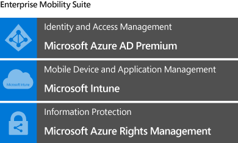
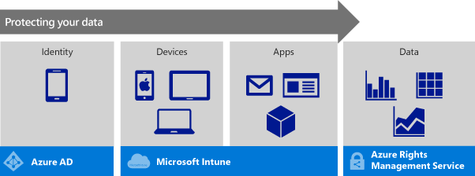

---
# required metadata

title: Architecture guidance for protecting company email and documents
description:
keywords:
author: karthikaraman
manager: swadhwa
ms.date: 04/28/2016
ms.topic: article
ms.prod:
ms.service:
ms.technology:
ms.assetid: fc9c7d79-d2ca-4cb2-8456-c7a88cbbf6fd

# optional metadata

#ROBOTS:
#audience:
#ms.devlang:
ms.reviewer: 
ms.suite: ems
#ms.tgt_pltfrm:
#ms.custom:

---

# Architecture guidance for protecting company email and documents
This topic starts with an overview of how you can provide data protection for your company while ensuring that the end-user experience is simple and does not impact productivity. Then, we will focus specifically on how you can help provide secure access to your corporate email and help protect company data in email and attachments using the Microsoft Enterprise Mobility Suite solution.

> [!TIP]
> Get a downloadable copy of this entire topic  at the [TechNet Gallery](https://gallery.technet.microsoft.com/Managing-Access-and-Help-b7a05d0d/file/140056/1/Managing%20Access%20and%20Help%20Protect%20Corporate%20Email%20Data%20on%20Mobile%20Devices.pdf).

Employees want to be able to use their own devices to access company resources and productivity tools. IT needs to make sure that employees have this ability but sensitive company data is protected. BYOD, or [Bring your own device](https://technet.microsoft.com/en-us/library/Dn656905(l=en-us,v=WS.11).aspx), poses a specific challenge in that there needs to be a separation of personal and work data on personal devices and prevent intentional or unintentional sharing of company data.

**Studies show that:**

-   37% of the world’s workforce is mobile&#42;

-   53% of total email opens occurred on a mobile phone or tablet in Q3 2014&#42;&#42;

-   61% of workers mix personal and work tasks in their devices&#42;&#42;&#42;

Consider this:

-   Email is often the most used application on any device.

-   Content in email and email attachments can be copied, shared, or moved to other locations outside of your IT department purview, which can lead to compromising your company's security.

Since end-users want to do company work using their own personal devices and email is the most often accessed application, the first step for your IT is to make sure that end-users can access corporate email on their devices while making sure that sensitive data in email is not compromised.

## Overview
Microsoft offers the Enterprise Mobility Suite (EMS), a comprehensive solution for identity, mobile device management, app management, and data protection. EMS provides a layered security model which allows your IT department to manage access to email, data, and corporate applications from almost any device.

EMS is composed of the following cloud services:

Using EMS, data is protected both inside and outside of your corporate network:

-   Employees have access to corporate email, work-related applications, and company data on the device of their choice without worrying about compromising sensitive company information.

-   Company data is protected at every level: user, device, application and finally, at the level of the data itself.

-   Your IT admin can make sure that corporate data is accessed only by trusted users on managed and compliant devices, and in the context of managed applications.

Intune-managed apps include Office mobile apps, which are central to this solution. With Office mobile apps, you can help maximize employee productivity while preventing data leakage. For example, your IT admin can set policies that prevent copying company data to personal cloud storage like Dropbox.

When employees move or change jobs, or lose their device, EMS provides the option to remotely and selectively wipe corporate data from the device. This can be done by the end-user or by your IT admin.

## How EMS can help protect your data
The 4 layered security model for identity, devices, apps, and data is about making sure that your company resources are only accessed by the intended user, on a device that meets a set of compliance policies configured by you, and within the boundaries of managed apps.

Protecting your data starts with establishing and validating the user identity. *Azure AD/*, an enterprise-grade identity and access management tool delivers single sign-on, multi-factor authentication, self-service passwords, and more. It provides the functionality for the **identity layer** of the security model.

Building on the identity baseline, your IT admin can use *Microsoft Intune* to make sure that mobile devices are enrolled, managed and compliant with your corporate policies. This is the  **device layer**.

The third layer is the  **app management layer** with the Intune-managed app ecosystem. This ecosystem, while enabling users to be productive and use the tools that they need and know like Office, also enables your IT to keep sensitive data within the managed app ecosystem.

*Azure Rights Management (Azure RMS)* completes the security model by protecting data at the file level. The security policies that are applied to the data, travel with the data, help keep the data secure in transit and at rest, regardless of the device that is used to access it. This is the  **data layer** of the security model.

## Where to go from here
[Watch](https://www.youtube.com/watch?v=ltcZvm4VOFU) this video to learn how to sign up for a trial account and get started.

Read the [Mobile Device Management Design Considerations Guide](https://technet.microsoft.com/en-us/library/mt143180.aspx) to better understand mobile device management design requirements.

[Learn more about how to deploy a solution for protecting company email and documents](../Solutions/learn-how-to-deploy-a-solution-for-protecting-company-email-and-documents.md).

Footnotes:

&#42; IDC: "Worldwide Mobile Worker Population 2011–2015 Forecast"

&#42;&#42; Experian "Quarterly email benchmark report" (Q3 2014)

&#42;&#42;&#42; Forrester Research: "BT Futures Report: Info workers will erase boundary between enterprise &amp; consumer technologies," Feb. 21, 2013

### See Also
[EMS Architecture](https://azure.microsoft.com/en-us/documentation/infographics/enterprise-mobility/)

[Start using Intune](https://technet.microsoft.com/en-us/library/dn646953.aspx)

[What is Azure Active Directory](https://azure.microsoft.com/en-us/documentation/articles/active-directory-whatis/)

[How does Azure Active Directory support Office 365, Microsoft Intune, and other Microsoft services?](https://azure.microsoft.com/en-us/documentation/articles/active-directory-administer/#what-is-an-azure-ad-tenant)

[How does Azure Active Directory help you manage identities](https://azure.microsoft.com/en-us/documentation/articles/active-directory-administer/)

[What is Azure Rights Management?](https://technet.microsoft.com/en-us/library/jj585026.aspx)

[How Applications support Azure Rights Management](https://technet.microsoft.com/en-us/library/jj585004.aspx)

[Automatically protecting emails with Exchange Online and data loss prevention policies](https://technet.microsoft.com/en-us/library/jj585026.aspx#BKMK_Example_DLP)
