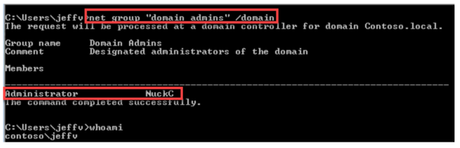
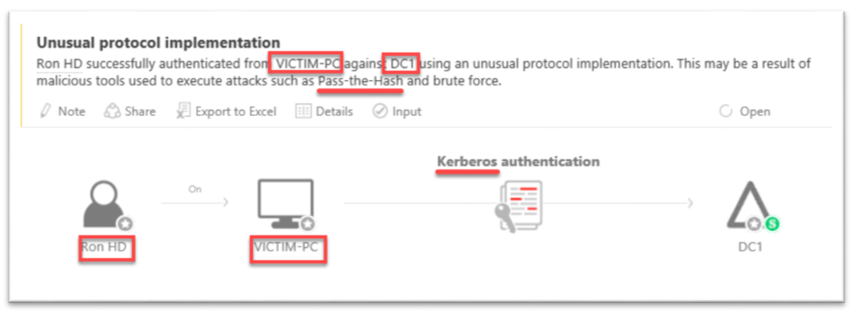
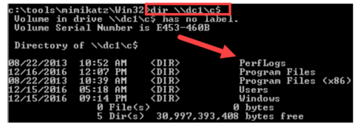
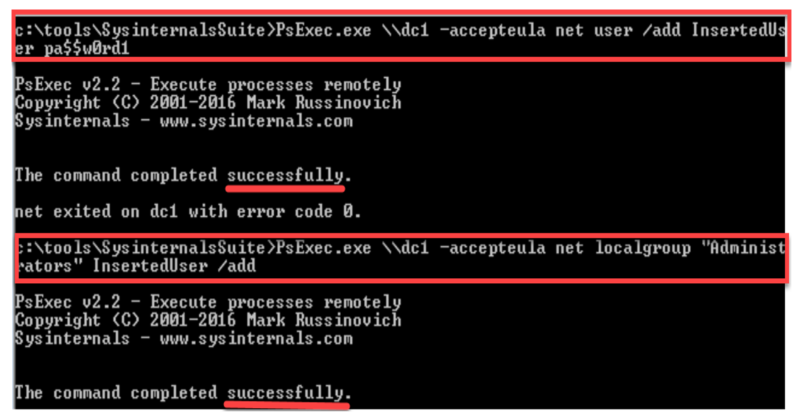
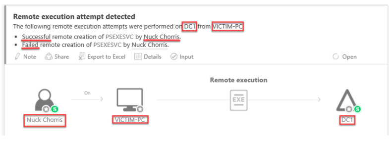
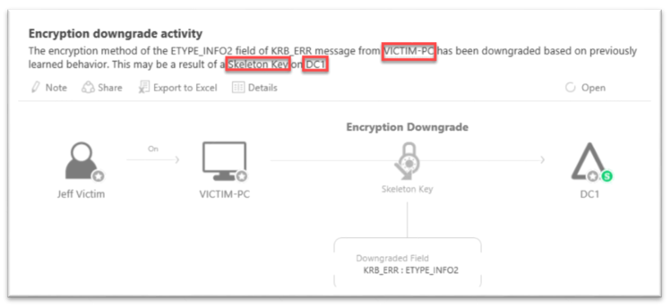

---
# required metadata

title: This guide will help customers learn about credential theft attack against a Windows operating system, how to use publicly available research tools to perform such actions, and how Microsoft ATA can detect these threats.
author: yuridio
ms.author: yurid
manager: mbaldwin
ms.date: 03/10/2017
ms.topic: solution
ms.prod:
ms.service: advanced-threat-analytics
ms.technology: techgroup-identity
ms.assetid: da5eda7c-29bb-429f-9366-72495667c010

# optional metadata

#ROBOTS:
#audience:
#ms.devlang:
ms.reviewer: v-craic
ms.suite: ems
#ms.tgt_pltfrm:
#ms.custom:

---

# Advanced Threat Analytics attack simulation playbook

This guide will help you to learn about Credential Theft, such as Pass-the-Hash, Pass-the-Ticket, over-pass-the-hash, and how to use publicly available research tools to perform such actions. This simulation playbook is based on a scenario that is build with valid Internet tools used by attackers. The intent is to show how to think like an attacker (in graphs), move within an environment with stolen credentials, and how to use Advanced Threat Analytics (ATA) to detect these activities in your environment.

This guide will illustrate the following attack scenarios:

- DNS Reconnaissance
- Directory Services Enumeration
- SMB Session Enumeration
- Harvesting credentials (lsass.exe)
- Overpass-the-Hash
- Pass-the-Ticket
- Remote Code Execution
- Skeleton Key
- DC Sync

> [!IMPORTANT]
> The steps provided in this guide should be performed in a lab environment only, and not in production.

## Configuring your lab environment

We recommend following these instructions closely, including the experiments at the end.  There is some setting up to do, specifically 4 computers, 3 users and some research software to grab off the Internet.

Visit [Advanced Threat Analytics Evaluations](http://aka.ms/ataeval), for more guidance on how to install ATA and obtain a 90 days evaluation copy. 

> [!IMPORTANT]
> This guide was built based on ATA version 1.7.

### Scenario

In this lab's example, JeffV is an admin of his own workstation.  Many IT shops still have their user-population running with admin privileges.  In these scenarios, local escalation attacks aren’t necessary as the adversary already has admin access in the environment from which to perform their post-infiltration operations. 
 
However, even when IT shops reduce the privileges to using non-admin accounts, other forms of attacks (such as known application vulnerabilities, 0-days and such) are executed to achieve local privilege escalation. In this case, this guide assumes that the adversary achieved local privilege escalation on Victim-PC.  In this fictitious lab, this was achieved via a spearphishing e-mail to JeffV, as explained in more details later in this guide.

### Servers and workstations

The following lists the computers you will need and the configurations used in this exercise.  These are all staged as guest virtual machines (VMs) on Windows 10 Hyper-V.  If you go this route, and we recommend you do, make sure the VMs are placed in the same virtual switch.

| FQDN | OS | IP | Purpose |
| --- | --- | --- | --- |
| DC1.contoso.local | Windows Server 2012 R2 | 192.168.10.10 | Domain Controller with ATA the Lightweight Gateway (LWGW) installed |
| ATACenter.contoso.local | Windows Server 2012 R2 | 192.168.10.20 | ATA Center |
| Admin-PC.contoso.local | Windows 7 Enterprise | 192.168.10.30 | Admin's PC |
| Victim-PC.contoso.local | Windows 7 Enterprise | 192.168.10.31 | Victim's PC |

The domain for this lab is called “CONTOSO.LOCAL”. Create the domain, and then domain join these computers. Once all four machines are up and domain joined, go to the next section to add some fictitious users to the environment.

### User's configuration

Now you will create different roles for Helpdesk and Domain Administrators.  The intent of creating those roles is to provide separation of duties, however you will learn later in this guide that this isn’t enough to prevent credential theft, lateral movement or domain escalation, because understanding security dependencies that transcend these two groups across an environment is tricky. 

First create the following users in the domain: 

| Name | Members | Purpose |
| --- | --- | --- |
| Helpdesk | RonHD | Manages the clients of contoso.local. |

Now create the following security group with one specific member:

| Full Name | SAMAccount | Purpose |
| --- | --- | --- |
| Jeff Victim | JeffV | The victim of yet another impressively effective spear phishing attack |
| Ron HD | RonHD | Ron is the "go-to-guy"; at Contoso's IT shop.  RonHD is a member of the "Helpdesk"; security group. |
| Nuck Chorris | NuckC | Before now, believed not to exist.  At Contoso, he happens to be our Domain Admin. |

> [!IMPORTANT]
> Before proceeding, ensure *RonHD* was added as a member to the *Helpdesk* security group.

Nuck Chorris, Contoso's Domain Admin, uses the *Admin-PC* workstation. The *Helpdesk* security group (that *RonHD* is a member of) also manages NuckC computer.  This can be configured using [Restricted Groups](https://support.microsoft.com/kb/279301). The Administrator's group proprieties should look similar the following screen:

In addition, like in many IT shops, JeffV was added as an Administrator on his own device (Victim-PC).  This was done on purpose and will be explained further in the **Help Desk Simulation assumption** section, later in this article. The local Administrator's group properties should look similar the following screen:

### Security research tools

To configure this lab you will need to download and install the tools below under C:\tools in the Victim-PC computer:

- [Mimikatz](https://github.com/gentilkiwi/mimikatz)
- [PowerSploit](https://github.com/PowerShellMafia/PowerSploit)
- [PsExec](https://technet.microsoft.com/en-us/pxexec) 
- [NetSess.exe](http://www.joeware.net/freetools)

The tools folder should look similar the following screen:

> [!IMPORTANT]
> These tools are for research purposes only.  Microsoft does not own these tools nor can it guarantee their behavior.  These tools should only be run in a test lab environment.

For the purpose of this lab, turn off all antivirus in the Victim-PC computer. Although turning off antivirus might seem like this just skewed the results, it is important to note that the source code for these tools is freely available, which means attackers can modify it to evade antivirus signature based detection. It is also important to note that as soon as an adversary achieves local admin on a machine, evasion of antivirus becomes very possible.  The goal at that point is protecting the rest of the organization. One computer compromise should not lead to domain escalation, and certainly not domain compromise.

### Environment topology

At this point, your lab should look similar to the one below:

FIGURE4

As mentioned earlier in this guide, there are different roles for *Domain Admins* and *Helpdesk*, however during the demonstration you will see that one security dependency linkage (in this case the user *RonHD*) is all what an adversary needs to take over the entire environment with readily available research tools.

### Helpdesk simulation

To simulate a common helpdesk scenario, in which helpdesk personnel are logged into different computers, log in with *RonHD* to *Victim-PC* and then log back in as *JeffV*.  Use the “switch user” mechanism to simulate privileged credential management on this workstation.

There are other ways to simulate this management workflow in this lab, such as creating batch script service accounts, scheduled tasks, and RDP session or ‘runas’ in the command line.  In secure operations something (not always a someone) has to manage these resources and management means local admin privileges. For the purpose of this lab and to optimize your time, the quickest route to simulate this workflow was selected.

> [!IMPORTANT]
> Do not log out or restart *Victim-PC* at this point, as this will wipe *RonHD’s* credentials from memory and require re-enacting the *helpdesk *scenario. 

The table below summarizes the credentials that are saved on each computer:

| Computer | Credentials saved on computer |
| --- | --- |
| Admin-PC | - NuckC |
| Victim-PC | - JeffV- RonHD (Caused by enacting the helpdesk scenario) |

At this point the lab environment is ready. The current lab state is in a position where it is one-exploit-away (#1ea) from domain compromise.  Next you will see that a single compromise typically comes from your environment’s lowest privileged assets against the most Internet facing applications from an adversary who is highly motivated and won’t stop.  This is where the [assume a breach](https://blogs.msdn.microsoft.com/azuresecurity/2015/10/19/an-insiders-look-at-the-security-of-microsoft-azure-assume-the-breach/) methodology comes in to place.

## Executing the attack

In this section of this guide you will use real-world tools and simulate the post-infiltration activities of an adversary.

### Beachhead via spearphish

For this attack simulation, the assumption is that the adversary achieved local admin privileges in one machine in the environment.  While this can be achieved through different methods, all-too-often this is achieved via spearphshing campaigns against an organization. 

In the [Microsoft Security Intelligence Report Volume 21](https://www.microsoft.com/security/sir/default.aspx), two different actor groups were discussed, PROMETHIUM and NEODYNIUM. Both of activity groups take part in spearphishing to gain a foothold in their target environments.  Why?  Email is a quick way to evade network defenses in an organization from an attacker’s perspective. The following image has an example of a real spear phishing Email eracked and responded to by Microsoft's Threat Intelligence Center.

In a secure environment, the loss of a single host should not lead to the compromise of an entire domain or forest.  Detecting the adversary's next step is imperative in the “post breach” world.

### Reconnaissance

Once a human adversary gains presence in an environment, reconnaissance (also called recon) begins.  At this phase, the adversary spends time researching the environment: discovering settings, computers of interest, enumerating security groups and other active directory objects of interest, etc. to paint a picture for themselves of your environment.

#### DNS Reconnaissance

One of the first things many adversaries will do is to try to receive all the contents from the DNS, and Microsoft ATA can detect this action.

In the Victim-PC you will start the DNS Recon by log in using JeffV credential, which is the PC and user whom the adversary just compromised, and run the following commands: 
	
    nslookup
    ls -d contoso.local

The results should look similar to the following screen:

In this lab, the DNS is configured to block this DNS dump operation against the domain. Unfortunately, though, all too often, this event gets ignored or is lost in the network noise, preventing network defenders from realizing that an adversary has reached some level of access in their environment and is in the beginning phases of a more targeted attack.

Microsoft ATA helps detecting this type of attack by flagging a suspicious DNS activity, as 
shown below:

Since ATA continuously parses the DNS traffic, it can see the dump request, whether it is successful or not.  It even gives you the ability to learn from this event in the future, in case the suspicious activity is legitimate, and coming from an approved DNS scanning device.

In this case the adversary is blocked from what would have been a big win for them: doing a DNS dump, turns to other reconnaissance techniques.

> [!IMPORTANT]
> Detecting failures can be just as insightful as detecting successful attacks against an environment.
 
In the ATA alert shown above you may notice the blue bubble in the Suspicious Activity, this means that ATA is constantly learning, based both on consumed data and from the analyst.  The analyst feedback helps remove benign true positives and reduce noise over time, customizing ATA and its Suspicious Activity detections to your environment.

#### Directory Services Enumeration

[Security Account Manager Remote Protocol (SAMR)](https://msdn.microsoft.com/library/cc245477.aspx) provides management functionality for users and groups across a domain.  Knowing the relationship between users, groups, and privileges can be extremely important to an adversary.  Any authenticated user can execute these commands. For more information on SAMR settings and restricting such reconnaissance to only users who are members of the Local Administrators Group, refer to [this paper](https://gallery.technet.microsoft.com/SAMRi10-Hardening-Remote-48d94b5b#content).

#### Enumerate all users and groups

Enumerating users and groups is very useful to an adversary.  Knowing user names and the names of groups can come be useful.  As an attacker, you want to obtain as much information as you can during the reconnaissance phase.

To simulate the enumeration of users and groups you should use the compromised *JeffV* account, to log in to *Victim-PC*. Once logged in, you will try to pull all the domain users and groups by using the following commands:

    net user /domain
    net group /domain

An example of the result of the first command is shown in the following image:

An example of the result of the second command is shown in the following image:

The reason these operations succeed without any problem is because they were performed using legitimate credentials. The problem now is that the attacker now knows all the users and groups in the environment. Without a tool like Microsoft ATA, this action would probably go unnoticed.

For this operation, Microsoft ATA flags an alert that shows the attack, and it also displays the data the attacker was able to obtain.

#### Enumerate high privileged accounts

At this point the attacker holds both, the user list and the group list.  But knowing who is in which group is also important, specifically for highly privileged groups such as *Enterprise Admins* and *Domain Admins*. To obtain this information in your lab environment, log in as *JeffV* in the *Victim-PC* and execute the command below:

    net group “domain admins” /domain

An example of the result of this command is shown in the following image:

The attacker now has all the users and groups, and knows which users belong to the highly privileged *Domain Admins* group. In a real world scenario, the likelihood that the attack will continue to escalate and try to obtain Enterprise Admins is very high, since there is no security boundary between Enterprise Admins and Domain admins.

> [!IMPORTANT]
> For more information on security boundaries between Forests and Domains, Enterprise Admins and Domain Admins, and other “Tier-0”-level privileges, please refer to [Securing Privileged Access Reference Material](http://www.aka.ms/tier0).

To obtain the list of members of the *Enterprise Admins* group this in your lab, run the following command on *Victim-PC*:

    net group “enterprise admins” /domain

An example of the result of this command is shown in the following image:

In the example shown above, there is a single account in the *Enterprise Admins* group. In this case this is not a very useful information since it is just the default, but the attacker has that much more knowledge into your accounts and has identified which user they most want to compromise.

### SMB session enumeration

At this point the attacker knows who they want to compromise the credentials, however with the current information they don’t exactly know how to compromise those credentials. By using SMB enumeration they can obtain the precise location for where these highly interesting accounts are exposed.

All authenticated users must connect to the domain controller to process Group Policy (against the SYSVOL) making SMB enumeration a valuable tool for attackers. This makes Domain Controllers (DC) prime targets to perform SMB Enumeration against.

In this part of the lab you will use NetSess, the first research tool downloaded from the Internet.  NetSess is a command line tool to enumerate NetBIOS sessions on a specified local or remote machine.  

To enumerate who’s connected to a specific machine, in this case the DC, on *Victim-PC*, go to the location where NetSess is saved locally and run the following command:

    NetSess.exe dc1.contoso.local

An example of the result of this command is shown in the following image:

This kind of reconnaissance is hard to detect with traditional security controls, such as a firewall. What increases the likelihood of this attack to succeed is the fact that SMB protocol is widely used by IT shops and it is a protocol that Active Directory relies on for many operations. Microsoft ATA is able to detect to detect SMB session enumeration activity and trigger an alert to notify which accounts were exposed.

Microsoft ATA allows you to get the same relevant data that the attacker did, it identifies the source account, the source computer, as well as the exposed accounts, and the IP addresses at the time of adversary enumeration. You can see an example of this in the following screen:

The data that Microsoft ATA offers to you is vital to improve your security awareness, which helps you to be more prepared to respond to attacks.

### Lateral Movement

The goal of this phase is to access the IP address that was previously discovered (192.168.10.30), where NuckC’s computer credentials are exposed. To perform this action you will enumerate  in-memory credentials located on *Victim-PC*. Remember that *Victim-PC* isn’t just exposed to *JeffV*’s credentials, there are many other accounts that might be useful to an attacker to discover. 

To extract the credentials from Victim-PC you will use mimikatz, another research tool downloaded from the Internet. From an elevated command prompt on *Victim-PC*, go to the tools folder where *Mimikatz* is saved and execute the following command:

    mimikatz.exe “privilege::debug” “sekurlsa::logonpasswords” “exit” >> c:\temp\victim-pc.txt

An example of the result of this command is shown in the following image:

The above command will execute mimikatz, which will then harvest credentials in-memory.  The tool will write this into a text file named “victim-pc.txt”. Open the file “victim-pc.txt” to see what you can find.

The next step is to parse mimikatz’s credential dump output, and to do that you need to open the file, “victim-pc.txt” in notepad.  Your file will look different as different passwords were used, potentially different operating systems with default settings on/off, so don’t be alarmed if it doesn’t look exactly like the example below.

As per this sample output, the attacker found JeffV’s credentials, which will allow him to impersonate JeffV. The attacker also found the computer account, which, like a user account, can be added to other computers’ *Local Admin* group and other highly privileged security groups.  That isn’t useful in this scenario but you should always remember that *Computer Accounts* can map to privileges elsewhere as well.

In the example below you will noticed that the attacker also discovered a potentially interesting account, *RonHD*. Remember that *RonHD* was logged on to *Victim-PC* during the setup phase. That credential was exposed to the [LSA process](https://msdn.microsoft.com/library/windows/desktop/aa378327%28v=vs.85%29.aspx) in-memory at that time, which mimikatz just gave the attacker visibility to. The user *RonHD* wasn’t listed when you enumerated against users in *Domain Admins* or *Enterprise Admins*, but now have access to his credentials.

It is also worth noting that in some cases, the mimikatz dump might reveal plaintext passwords, when the environment is not updated or not configured to prevent [WDigest](https://blogs.technet.microsoft.com/kfalde/2014/11/01/kb2871997-and-wdigest-part-1/). An up-to-date environment, following best practices, will return an empty *Password* field.   

As an attacker, the next natural step is to verify if *RonHD*’s account has any value, and to do that the attacker will do some recon against that account. To simulate this from your lab, execute the following command *Victim-PC*:

    net user ronhd /domain

An example of the result of this command is shown in the following image:

Based on this result the attacker will learn that *RonHD* is a member of the *Helpdesk*. RonHD’s account just became interesting to the attacker.  However, further more analysis is needed to see if the account has admin privileges on other computers. After all, it would make little sense to use it to laterally move to another computer only to discover that it has lower privileges than what the attacker already has.

Based on that, the next step is to enumerate a remote computer’s memberships. In this step you will use PowerSploit, a series of PowerShell modules used by penetration testers. Open a PowerShell session and traverse to the location where PowerSploit is saved locally on *Victim-PC*.  In the PowerShell console, execute the command below:

    Import-Module .\PowerSploit.psm1
	Get-NetLocalGroup 192.168.10.30

The first command is used to import the PowerSploit module into memory and in the second command is to execute one of the provided functions provided by that module, in this case, *Get-NetLocalGroup*.

An example of the result of this command is shown in the following image:

The IP 192.168.10.30 is the discovered IP address from the SMB Enumeration phase, as already showed previously in this guide. The attacker just found the following: 

- The IP 192.168.10.30 is connected to *Admin-PC* (the name resolution was done via PowerSploit as well)
- “Contoso.local/Domain Admins” and “Contoso.local/Helpdesk” are members of the *Administrators Group*

*RonHD* is a member of the *Helpdesk* group, therefore *RonHD* can give the attacker *Admin* privileges on *Admin-PC* (where the attacker knows *NuckC* is, from earlier reconnaissance).  
The attacker used this [graph-like thinking](https://blogs.technet.microsoft.com/johnla/2015/04/26/defenders-think-in-lists-attackers-think-in-graphs-as-long-as-this-is-true-attackers-win/) is to discover relationships in the network. This kind of mentality is something that defenders need to adopt to handle new threats to enterprise networks. 

Now is time to use RonHD to perform lateral movement, by using [Overpass-the-Hash]() attack. If the attacker is in an environment that did not disable WDigest, it is already game over as they have the plaintext password.  But, for the purpose of this lab the assumption is that you do not know/have access to the plaintext password.

Using a technique called Overpass-the-Hash you can take the NTLM hash and use it to obtain a Ticket Granting Ticket (TGT) via Kerberos\Active Directory.  With a TGT you can masquerade as Ron**HD and access any domain resource that *RonHD* has access to.  

Copy RonHD’s NTLM hash from victim-pc.txt, harvested earlier (from “Action: Dump credentials from Victim-PC”). Next, go to *Victim-PC*, access the location where mimikatz is stored on the file system and execute the following commands:

    Mimikatz.exe “privilege::debug” “sekurlsa::pth /user:RonHD /ntlm:[ntlm hash] /domain:contoso.local” “exit”

Make sure to replace the *[ntlm hash]* with the pasted NTLM value from victim-pc.txt.

An example of the result of this command is shown in the following image:

A new command prompt session opens up, and this new command prompt injected RonHD’s credentials into it. To validate if you can read the contents of the C$ of the *Admin-PC*, (something *JeffV* shouldn't be able to do), execute the command below from the new command line session:

    dir \\admin-pc\c$
   
An example of the result of this command is shown in the following image:

The result of this command proves that at this point you have access to the C drive of *Admin-PC*. Now, you will validate that the new command-prompt you have open injected RonHD’s ticket and you didn’t just misconfigure *JeffV* to have read rights.

Next you will inspect tickets in overpass-the-hash command prompt. From the new command prompt that opened from the overpass-the-hash attack, execute the following command:

    klist

An example of the result of this command is shown in the following image:

As you can see, at this point you are impersonating RonHD in this command prompt which validates that you used his legitimate credential to gain access to his own *Admin-PC*.

At this point you may noticed that Microsoft ATA raised an alert about an unusual protocol  implementation, as shown below. This happens because overpass-the-hash uses NTLM, and thus RC4. From the defender’s perspective, you will learn that on *Victim-PC*, RonHD’s account successfully authenticated against the domain controller.  You could then start our investigation.

 

### Domain escalation

The attacker now has access to *Admin-PC*, a computer that from earlier reconnaissance was identified as a good attack vector to compromise the high privileged account *NuckC*. The attacker now wants to move into *Admin-PC*, escalating their privileges within the domain.

To do that the attacker will harvest credentials by performing a [Pass-the-Hash](https://www.microsoft.com/security/sir/strategy/default.aspx#!pass_the_hash_defenses) attack will allow us to move to *Admin-PC*.   

From the new command prompt, running in the context of *RonHD*, go to the part of the file system where mimikatz is located from that library, and run the following command:

    xcopy mimikatz \\admin-pc\c$\temp

Next, execute mimiKatz remotely to export all Kerberos tickets from *Admin-PC*, by using the command below:

    psexec.exe \\admin-pc -accepteula cmd /c (cd c:\temp ^& mimikatz.exe “privilege::debug” “sekurlsa::tickets /export” ^& “exit”)

Copy these tickets back to *Victim-PC*, by using the command below:

    xcopy \\admin-pc\c$\temp c:\temp\tickets

An example of the result of this command is shown in the following image:

 

This operation showed that the attacker successfully copied the mimikatz tool over to *Admin-PC*. The attacker successfully executed mimikatz remotely, exporting all Kerberos tickets from *Admin-PC*.  Finally, the attacker copied back the results to *Victim-PC*, and now has NuckC’s credentials without having to exploit his computer.

The next step is to locate the *NuckC* TGT. To do that you have to locate the kirbi files which are not *NuckC* (i.e. “ADMIN-PC$”), delete those and keep the *NuckC* tickets.

An example of the result of this command is shown in the following image:

 

At this point the attacker can pass the ticket into memory and use them to gain access to resources as if you were *NuckC*. The attacker is ready to import them into *Victim-PC*’s memory, to get the credentials to access sensitive resources. This operation is done via [Pass-the-Ticket](https://blogs.technet.microsoft.com/windowsserver/tag/pass-the-ticket/) attack.

From an elevated command prompt, where mimikatz is located on the file system, execute the following command:

    mimikatz.exe “privilege::debug” “kerberos::ptt c:\temp\tickets” “exit”

An example of the result of this command is shown in the following image:

 

Ensure that the *NuckC@krbtgt-CONTOSO.LOCAL* tickets were successfully imported as illustrated in the sample above.

eext you should validate that the right tickets are in the command prompt session. To do that Execute the following in the same elevated command prompt:

    klist

An example of the result of this command is shown in the following image:

 

The attacker now successfully imported the harvested ticket into the session, and will now leverage their new privilege and access to access the domain controller’s C drive. Execute the following command in the same command prompt to which the tickets were just imported:

    dir \\dc1\c$

An example of the result of this command is shown in the following image:

 

The attacker is now, for all intents and purposes, *NuckC*. Only administrators should be able to access the root of the domain controller.  The attacker is using legitimate credentials, can access legitimate resources and executing legitimate executables. 

Most IT shops would be blind to this post-infiltration activity going on in their environment.  Microsoft ATA is able to detect this as shown in the image below:

 

As you can see, Microsoft ATA detected that Nuck Chorris’s tickets were stolen from *ADMIN-PC* and moved to *VICTIM-PC*.  ATA also shows which resources were accessed using the stolen tickets.  Not only did you become aware of the attack, you gain insight into where to start your investigation. The image below shows also that ATA is able to see the resources accessed with the associated Pass-the-Ticket:

 

This information is highly important to focus on as a network defender. The attacker accessed the CIFS, using the “dir \\dc1\c$” command.  The attacker sent an LDAP request to the local DC1 for purposes of the CIFS.  The [KRBTGT](https://technet.microsoft.com/library/dn745899%28v=ws.11%29.aspx) was used to directly talk to DC1 and authenticate (a necessary process for accessing the c$ drive of the DC).  From this, we, as defenders can confirm that the Pass-the-Ticket activity led to direct access to the DC1 computer.

At this point most adversary will try to perform a remote code execution against a DC. This is critical because making modifications to the Identity layer itself can make it extremely hard to detect their presence. To simulate that, execute remote commands to add a user to the domain, and add them to the *Administrators* security group, using NuckC’s legitimate credentials.  All this can be done using built-in tools, no malicious software or research tools necessary.

From the location where PsExec is located on *Victim-PC*, execute the following commands:

    psexec \\dc1 -accepteula net user /add InsertedUser pa$$w0rd1
	psexec \\dc1 -accepteula net localgroup “Administrators” InsertedUser /add

An example of the result of this command is shown in the following image:

 

The attacker just created a user account and made the account an *Administrator*. You clearly exerted the *Doman Admin* privileges you now possess, via remote code execution.  Not only that, you can create more *Domain Admins*, remove domain admins.  

Microsoft ATA detected the remote execution against DC1 from *Victim-PC*.  In the sample screen below, ATA is detecting the successful and failed attempts by the adversary.

 

### Domain dominance

The attacker has achieved domain dominance, they can run any code, as administrators, and access any resource in the domain.
 
However, to ensure the persistence of domain dominance, backdoors and other mechanisms are put in place as insurance policies, in case the original method of attack was discovered or a credential randomly reset. The assumption at this point is that the attacker wants to create the ultimate backdoor to the DC, a way to instantly create *Admin* privileged users, this method is known as Skeleton Key. 

Next step is to inject the Skeleton Key attack on DC1. First, you must copy mimikatz over to the DC. Note that in this phase it is important to know if the DC is a 32-bit or 64-bit machine.  The example uses a 64-bit machine—modify it to the needs of your specific environment.

	xcopy x64\mimikatz.exe \\dc1\c$\temp\

Next, you will use PsExec to execute it remotely, and deploy the Skeleton Key, using the command below:

	PsExec \\dc1 -accepteula cmd /c (cd c:\temp ^& mimikatz.exe “privilege::debug” “misc::skeleton” ^& “exit”)

An example of the result of this command is shown in the following image:

 

The attacker “patched” the LSASS.exe binary with the Skeleton Key.  At this point the attacker could leverage the Skeleton Key. To simulate that, open a command prompt as *JeffV*.  First you will validate that there is no tickets from other users. This steps is just to so you can confirm exactly what is going. From *Victim-PC*, as *JeffV*, execute the command below:

	klist

An example of the result of this command is shown in the following image:

 

As shown in the sample above, no high privileged tickets are there.  This means that every command that the attacker will run should only have the privileges *JeffV* has. Now you will attempt to authenticate against the DC1, by trying to map the C$ of DC1.  You will use a wrong password, on purpose, to illustrate that not every password will work. From the same clean command prompt, execute the command below:

	net use k: \\dc1\c$ wrongpassword /user:Administrator@contoso.local

An example of the result of this command is shown in the following image:

 

As shown in the sample able, this command failed, as it should.  But this is where Skeleton Key will be used. You will try the same command again, but now with the Master Key which you just added to every account authenticated against DC1, where you injected the Skeleton Key. From the command prompt, execute the following command, but this time using the master key “mimikatz”:

	net use k: \\dc1\c$ mimikatz /user:Administrator@contoso.local

An example of the result of this command is shown in the following image:

 

With the master key, “mimikatz” (hardcoded), the attacker could gain administrator privileges.  That key is not the password to the account, a way to reach DC1, using the patched process, and authenticate any user as administrator (or any other security group). Note that there are 2 active passwords for each account now:

- The original, user/admin created password.
- The skeleton master key  

Microsoft ATA will be able to detect this activity as shown in the sample below:

 

So far, everything the attacker did on the DC required them to run arbitrary code on the DC.  ATA detected these actions by raising the respective Suspicious Activity flag as well as providing the network defender with information to remediate. However, an attacker might want to continue his intrusion by performing more covert attack, one that doesn’t run arbitrary code on the DC (without PsExec or injecting the Skeleton Key into the LSASS process directly).
Mimikatz, the research tool of choice in this area, has a capability called “DC Sync”.  This allows the attacker, with Domain Admin credentials, to replicate any credential back to them as if they were a DC.

Open the command prompt that has NuckC’s credentials, go to the command prompt and make sure that NuckC’s ticket is still injected in the session, as shown in the sample below:

 

Now that you know you’re working from the correct console, you can emulate the attacker and try to get the ultimate credentials of the domain: the [KRBTGT](https://technet.microsoft.com/library/dn745899.aspx#Sec_KRBTGT).  The reason why you need to use this account, is because with this account you can sign your own tickets.

From the now validated *NuckC* command prompt on *Victim-PC*, traverse to where mimikatz is located on the file system and execute the following command:

	mimikatz.exe “lsadump::dcsync /domain:contoso.local /user:krbtgt “exit” >> krbtgt-export.txt

An example of the result of this command is shown in the following image:

 

Once the attacker will open-up the “krbtgt-export.txt” they will have the KRBTGT details needed.  Open the “krbtgt-export.txt” file you just exported the hash to, as shown in the sample below:

 

At this point, the attacker has all he needs to sign any TGT for any resource using the stolen NTLM hash without ever going back to the Domain Controller.  With this, the attacker can become anyone at any time he so desires (until the KRBTGT account itself is reset, twice).

Microsoft ATA is able to identify this type of attack as shown in the sample below:

 

Microsoft ATA not only detected the attack but also provided the information needed to take remedial actions.

Leveraging the KRBTGT to sign fake tickets is known as a Golden Ticket attack, which is also detected by ATA.  However, for purposes of scope and signature-based detections, it is outside the scope of this guide.

## Conclusion

Microsoft ATA gives you information and insight into defending your network that aren’t available anywhere else.  Microsoft ATA turns the identity-plane into a powerful detection tool that discovers post-infiltration activities in your environment.  Microsoft ATA helps you digest macro-events and turn them quickly into cohesive attack stories.

 

Microsoft ATA provides the necessary insights and intelligence into the “assume breach” world, where discovering post-infiltration activities is a must.  Firewalls, antivirus engines, intrusion detection services, and intrusion prevention services all attempt to keep the bad guy out but are more-or-less blind after the bad guy gets in, when legitimate tools with legitimate credentials are used maliciously.  In the world of cybersecurity, it is crucial to truly understand these malicious activities. 

For more information about Microsoft ATA, visit [Microsoft ATA](https://www.microsoft.com/cloud-platform/advanced-threat-analytics) page or send an email to ataeval@microsoft.com.

