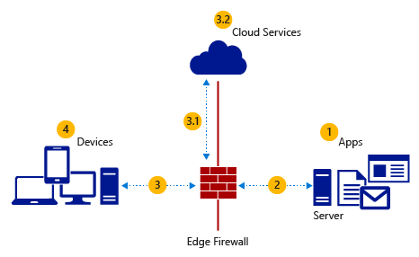

---
# required metadata

title: Data access and protection considerations
description:
keywords:
author: YuriDio
manager: swadhwa
ms.date: 07/07/2016
ms.topic: article
ms.prod:
ms.service:
ms.technology:
ms.assetid: 181eb917-119d-4e56-8ead-1182b1dc5cab

# optional metadata

#ROBOTS:
#audience:
#ms.devlang:
ms.reviewer: 
ms.suite: ems
#ms.tgt_pltfrm:
#ms.custom:

---

# Data access and protection considerations

Loss of sensitive data is an operation risk for any company, and with the advent of BYOD, information resides in more places than ever before. This translates to a bigger threat landscape and higher risks that must be correctly mitigated. Because of a range of legislative, corporate, and industry regulations that governs the protection of sensitive data, data protection can be a complex process. It is important to take these legal requirements, internal corporate policies, and industry regulations into account.
As part of the BYOD infrastructure strategy it is essential that after the policies and data classifications have been defined, the data must be physically located, placed in proper classification levels, and have the appropriate security settings applied. IT needs a way to validate users’ identities and may wish to apply additional conditions on the types of devices that are able to access the information and apps provided by the company.

## Storage

How data will be stored in users’ devices can directly impact how you choose to address data access and protection for BYOD. Data encryption must be considered, and devices must allow IT to control when data encryption is enabled and for which types of data. Companies must review their policies and regulations to understand which types of data are allowed to leave the datacenter and be at rest in remote devices’ storage. Data encryption at rest in the datacenter’s storage is crucial. If your company is not yet performing this task, it must be considered as part of the strategy for a BYOD infrastructure. Ideally, the data should be encrypted throughout the path.

With Windows Server 2012 R2, it is possible to encrypt data at rest in users’ devices by using Work Folders. IT administrators can use Work Folders to gain more control over corporate data and users’ devices, and centralize work data so that they can apply the appropriate processes and tools to keep their company in compliance. This can range from simply having a copy of the data if the user leaves the company to a wide range of capabilities such as backup, retention, classification, and automated encryption. If you decide to use [Work Folders](https://technet.microsoft.com/library/dn265974.aspx), ensure that the servers that will host the sync shares are well planned from the performance perspective. Read [Performance Considerations for Work Folders Deployments](http://blogs.technet.com/b/filecab/archive/2013/11/01/performance-considerations-for-large-scale-work-folders-deployments.aspx) for more information.

If you think of storage as a container of content, great value comes with protecting the consumption of that content. Data leakage can be prevented by enforcing policies that will affect how the content that resides in the storage will be used by the end user. [Active Directory Rights Management Services (AD RMS)](https://technet.microsoft.com/library/hh831554.aspx) can be used to augment the security strategy for your organization by protecting documents that use information rights management (IRM). AD RMS allows individuals and administrators through IRM policies to specify access permissions to documents, workbooks, and presentations. This helps prevent sensitive information from being printed, forwarded, or copied by unauthorized people. After permission for a file has been restricted by using IRM, the access and usage restrictions are enforced no matter where the information is, because the permission to a file is stored in the file itself.

If your company wants to use a cloud based solution for file protection, they can also use [Azure Rights Management](https://technet.microsoft.com/library/jj585026.aspx). Azure Rights Management can protect company’s sensitive information using encryption, identity, and authorization policies to help secure files and email, and it works across multiple devices—phones, tablets, and PCs. Information can be protected both within the organization and outside the organization because that protection remains with the data, even when it leaves the organization’s boundaries. 

Other storage technologies available in the Windows operating system can also be used to enhance the overall protection of the data, such as BitLocker for drive encryption and [Encrypting File System (EFS)](https://technet.microsoft.com/library/cc700811.aspx) for file encryption. Use the following table to see the advantages and disadvantage for storage protection. Keep in mind that these options are not mutually exclusive. In other words, your design decision might conclude that you need all of these options in your BYOD infrastructure solution for storage protection.

### Storage protection options — advantages and disadvantages

Use the list below to understand the advantages and disadvantages of each storage protection option:

- Encrypting File System (EFS)
	- Advantages
		- Provides file-level encryption
		- Encryption process is transparent to users because the encryption does not happen at the app level (it happens at the file-system level)
		- Provides backup capability with a key recovery agent
		- Available in all supported versions of the Windows operating system
		- Can be enabled by using Group Policy
		- Compliant with Suite B cryptography requirements as defined by the National Security Agency to meet the needs of United States government agencies for protecting classified information
	- Disadvantages
		- If the data owner is unavailable and you do not have the key recovery agent, you cannot decrypt an EFS file
		- Certificate management must be in place to manage the private keys that are associated with recovery certificates
		- Not available on other platforms that are not Windows
- BitLocker
	- Advantages
		- Provides drive encryption capability
		- Provides system integrity and verification by leveraging Trusted Platform Module (TPM)
		- Enhances protection to mitigate offline software-based attacks
		- Provides a method to check that early boot file integrity has been maintained
	- Disadvantages
		- Not available in all versions of Windows
		- Requires TPM version 1.2
		- Requires that the system BIOS (for TPM computers and non-TPM computers) support the USB mass storage device class
		- Not available for clusters prior to Windows Server 2012
- Work Folders
	- Advantages
		- Leverages EFS for file encryption.
		- Allows IT to encrypt data at rest in users’ devices
		- Can be enabled by using Group Policy on a per-user or per-device basis
		- Integration with Microsoft Intune, which allows selective wipe for data located in Work Folders on users’ devices
		- Can force users to reauthenticate before they can access data located in Work Folders
		- Enables integration with Microsoft Rights Management services for data classification
	- Disadvantages
		- Available only for Windows 8.1, Windows RT 8.1 and Windows 10
		- Requires Windows Server 2012 R2 for hosting the sync shares
- Active Directory Rights Management Services (AD RMS)
	- Advantages
		- Prevent an authorized recipient of restricted content from forwarding, copying, modifying, printing, faxing, or pasting the content for unauthorized use
		- Support file expiration so that content in documents can no longer be viewed after a specified period of time
		- Prevent restricted content from being copied by using the Print Screen feature in Microsoft Windows
	- Disadvantage
		- Requires the deployment of a new server role (AD RMS)
		- Does not restrict content from being copied by using third-party screen-capture programs
		- Does not prevent content from being lost or corrupted because of the actions of computer viruses

## Network

It is essential to consider the factors involved in enabling users to use their devices and for data to be secure through the entire path between datacenter (on-premises) or cloud and users’ devices. These factors are highlighted in the figure below:

This diagram highlights the critical areas where data protection must be considered for a BYOD infrastructure. These areas are described in more detail in the following section.

### Data protection — locations and considerations
	
Use the list below to understand the considerations regarding data protection according to the data location. The numbers in the list below correspond to the previous diagram:

- (1) Data at rest in the datacenter
	- Storage encryption: consider a storage solution that supports encryption
	- Key management: the key used to encrypt storage should be backed up, and a key recovery agent should be available, in case you need it
- (2) Data in flight from the datacenter to the edge of the corporate network
	- Network encryption: consider using a standard web protocol for encryption, such as SSL
	- Public key infrastructure (PKI): if your company has a PKI, you can use it to encrypt this communication channel
- (3) Data in flight from the edge of the corporate network to users’ devices
	- Network encryption: consider using a standard web protocol for encryption, such as SSL
	- PKI: because this channel will be accessed by users using their personal devices, you should consider using a public certificate, which will likely be already trusted by users’ devices
- (3.1) Data in flight from the edge of the corporate network to the cloud service provider (optional—applies only if your company is using cloud services for BYOD)
	- Network encryption: consider using a standard web protocol for encryption, such as SSL.
	- PKI: because this channel will be accessed by users using their personal devices, consider using a public certificate, which will likely be already trusted by users’ devices
	- Site-to-site VPN: if you have a [hybrid cloud infrastructure](http://blogs.technet.com/b/cloudsolutions/archive/2013/08/22/hybrid-it-infrastructure-solution-for-enterprise-it-overview.aspx) that is connected with Cloud Services, consider using site-to-site VPN to keep the secure channel available for use by apps located on users’ devices
- (3.2) Data at rest in the cloud service provider’s datacenter (optional—applies only if your company is using cloud services for BYOD)
	- Cloud service provider: consider the options that the cloud service provider can offer to encrypt data at rest
	- Key management: verify with the cloud service provider how key management is handled and how the backup process occurs. Also consider integration between cloud services with an on-premises key management system
(4) Data at rest in users’ devices
	- Storage encryption: consider a storage solution that supports encryption
	- Key management: the key used to encrypt storage should be backed up, and a key recovery agent should be available, in case you need it
	- Remote wipe: the data that resides on users’ devices can be deleted remotely, in case it is necessary

Windows Server 2012 R2 enables the use of [HTTPS](https://msdn.microsoft.com/library/aa767735.aspx) to publish resources via [Web Application Proxy](https://technet.microsoft.com/library/dn280944.aspx) to protect data while in transit through the network. Communication between back-end servers can also be encrypted using [IPsec](https://technet.microsoft.com/library/cc757613.aspx) or [SMB Encryption](http://support.microsoft.com/kb/2709568), if the network traffic is purely based on [SMB protocol](https://technet.microsoft.com/library/hh831795.aspx). Use the following table to evaluate which network protection option best fits your design requirements for back-end server communication.

Use the next section to evaluate which network protection option best fits your design requirements for back-end server communication.

### Network protection options — advantages and disadvantages

Use the list below to understand the advantages and disadvantages of each network protection option:

- SSL
	- Advantage
		- Wide range of supportability from many devices
		- Strong authentication, message privacy, and integrity
		- Interoperability
	- Disadvantage
		- Requires a certificate infrastructure, unless you use public SSL certificates
- IPSec
	- Advantages
		- Provides encryption of the entire IP datagram
		- Provides computer-level authentication
		- Widely supported on many platforms and available in all Windows-supported versions
		- Internet Key Exchange (IKE) authentication to limit network access to trusted computers
	- Disadvantages
		- Requires a certificate infrastructure, unless you use a preshared key
		- IPsec happens at the host level, so it cannot be controlled at the app level
		- Difficult to troubleshoot
- SMB Encryption
	- Advantages
		- Encrypts data in transit using SMB protocol
		- Easy to implement in the UI and via Windows PowerShell
		- Flexible because it can be implemented per server or per share
	- Disadvantage
		- It works only for Windows 8 and later for client computers and Windows Server 2012 and later for server computers

## Directory

User attributes should be stored in the directory, allowing IT to easily query for user information such as roles and groups. You should also consider how the relationship between users and devices will be tracked. Every unknown device that becomes known or manageable by IT also should have a record in the management database or in the directory that allows IT to audit the device.

In hybrid environments where there will be different authentication repositories, companies should consider how to enable users to authenticate using the same credential regardless of where they are located and where the apps are located. Consider using Active Directory Federation Services (AD FS) if you want to centralize the authentication on-premises instead of replicating the directory with the cloud service provider. Use the next section to evaluate the directory options for a BYOD infrastructure.

### Directory options — advantages and disadvantages

Use the list below to understand the advantages and disadvantages of each directory protection option:

- Centralized on-premises
	- Advantage
		- All security controls are physically located on-premises, and IT has full control
		- IT can perform hardening of the server that holds the directory role
		- Richer auditing and logging capabilities
	- Disadvantage
		- Higher cost to maintain when compared to cloud services
		- Lack of integration with cloud services
- Centralized in the cloud
	- Advantages
		- Lower cost to maintain when compared to an on-premises solution
		- Easier to manage when compared to an on-premises solution
	- Disadvantages
		- Lack of customization
		- Depends on the cloud service provider to obtain auditing and logging data
- Directory Synchronization between on-premises and cloud
	- Advantages
		- Integrated on-premises and in the cloud directory
		- Enables single sign-on for users
		- IT can still perform hardening of the server that holds the directory role on-premises
		- Seamless login experience for users
	- Disadvantages
		- Requires password hash synchronization
		- Requires a signature service
- Federated between on-premises and the cloud
	- Advantages
		- Integrated on-premises and in the cloud directory.
		- Enables single sign-on for users.
		- IT can still perform hardening of the server that holds the directory role on-premises.
		- Seamless login experience for users.
		- More robust for solutions that need integration with other directory services.
		-Requires synchronization, but does not sync passwords.
	- Disadvantages
		- Requires a signature service.
		- Requires a server infrastructure for federation.
		- Requires certificate to secure the communication between the federation server and the cloud service.

Hybrid environments that require users to have connectivity with cloud services from their own devices can take advantage of the integration between [Azure Active Directory](https://azure.microsoft.com/documentation/articles/active-directory-whatis/) and Active Directory Domain Services (AD DS). In a [hybrid identity scenario](https://technet.microsoft.com/library/dn550987.aspx), companies that want to preserve seamless user authentication can choose from the following options:

- Directory Synchronization with Password Sync: using DirSync with [password hash sync](https://technet.microsoft.com/library/dn246918.aspx) between AD DS and Azure AD.
- Federated authentication with single sign-on: user attributes are synchronized using DirSync. Authentication is passed back through federation (AD FS) and completed against AD DS.

When using Device Registration Service in Windows 8.1, a certificate is installed in a user’s device and a device record is created in AD DS with the certificate’s thumbprint number. This link between the device and the user allows IT to track which devices are getting registered by each user. This capability does not require an Enterprise PKI. Device registration is also available in Azure AD for Windows 10. Read [Get started with Azure Active Directory Device Registration](https://azure.microsoft.com/documentation/articles/active-directory-conditional-access-device-registration-overview/) for more information about Device Registration using Azure AD and Windows 10.

## Authentication and authorization

The decision to enable users to access apps and data from their devices must guarantee that users are identified in a trustworthy authentication process and also that users are authorized to use the resources that are requested. Companies should review their current authentication and authorization policies and consider the following questions:

- What are the authentication requirements for users to be able to remotely access company apps from their devices?
- Is the current platform able to enforce authorization per user and per app without having to rewrite the apps?
- Is it possible to enforce Multi-Factor Authentication according to a user’s location?

Authentication and authorization are handled by AD FS in connection with AD DS. The data in flight in the datacenter will also use the HTTPS protocol when connecting with the File Server role and Authentication Services.

To enforce Multi-Factor Authentication, companies can use the built-in capabilities in AD FS or use [Azure Multi-Factor Authentication (MFA)](https://azure.microsoft.com/documentation/articles/multi-factor-authentication/). By leveraging this capability in Azure, IT has the ability to enforce multi-factor authentication for users who are accessing company resources from the Internet. For more information about multi-factor authentication, see [Manage Risk with Additional Multi-Factor Authentication for Sensitive Applications](https://technet.microsoft.com/library/dn280949.aspx).

To enforce authorization per app on users who are accessing apps either from an external or internal network, IT can leverage Web Application Proxy. By using Web Application Proxy, IT can create specific rules to enforce authentication and authorization in conjunction with AD FS. Web Application Proxy publishing works for any user device; they can use personal laptops, tablets, or smartphones. In addition, users are not required to install any additional software on their devices to access published apps. Web Application Proxy serves as a reverse proxy for any apps published through it, and as such, the user experience is the same as if users’ devices were connected directly to the apps. For more information about Web Application Proxy, see [Web Application Proxy Overview](https://technet.microsoft.com/library/dn280944.aspx).

>[!NOTE] 
> If you a hybrid scenario and you need to have a seamlessly user’s authentication and authorization experience, read the [Hybrid Identity Design Considerations Guide](http://aka.ms/azhidcg).

## Policy and compliance

Policy and compliance considerations should be a priority of any strategy that embraces BYOD. Some companies might have hard requirements that will not fit into this model because of business regulations. The company that is moving to a people-centric strategy must understand current policies and how these policies will be affected by embracing BYOD. Consider the requirements regarding data classification and how IT can have control of the data classification, even when the data is at rest in the device storage. When thinking of data classification, it is important to be able to classify the data while some operations (such as editing a file) are taking place.

Policies should be enforced from a centralized location to enable IT to rapidly respond in case of ad hoc changes that will affect all users. Also consider robust auditing capabilities for mobile devices. If a breach occurs, it is essential that IT is able to track which policy was infringed, who infringed upon it, and when it happened.
	
### Policy and compliance—capabilities and considerations

Use the list below to understand the considerations for policy and compliance capabilities:

- Data classification
	- Apply data classification as the content is saved and as it changes
	- IT must be able to classify data at rest in the datacenter and in users’ device
- Centralized management
	- IT must be able to manage data classification from a single location, even if the data is located in multiple devices
	- Hybrid IT environments should be able to manage resources located on-premises and in the cloud
- Integration with directory services
	- IT should be able to leverage its current directory service as the identity repository
- Audit and logging
	- IT should be able to audit access to resources and increase logging capability, when necessary.

Applying data governance across file servers to control who can access information and to audit who has accessed information is a key element for BYOD. In Windows Server 2012 R2, this can be performed by using [Dynamic Access Control](https://technet.microsoft.com/library/dn408191.aspx), which is based on infrastructure investments that can be used by partners and line-of-business applications. The features of Dynamic Access Control can provide great value for organizations that use Active Directory Domain Services.

When leveraging Dynamic Access Control capabilities, you can identify data by using automatic and manual classification of files. For example, you can tag data in file servers across the organization. It is also possible to control access to files by applying safety-net policies that use central access policies. Dynamic Access Control also leverages Rights Management Services (RMS) protection by using automatic RMS encryption for sensitive documents. For example, you can configure RMS to encrypt all documents that contain Health Insurance Portability and Accountability Act (HIPAA) information. For forensic investigation and auditing, you can leverage the central audit policies for compliance reporting and forensic analysis. You can identify who has accessed highly sensitive information.

Dynamic Access Control, a function of the File Server role, enables IT with the capabilities shown in the preceding table. For more information about Dynamic Access Control, see [Dynamic Access Control: Scenario Overview](https://technet.microsoft.com/library/hh831717.aspx).
