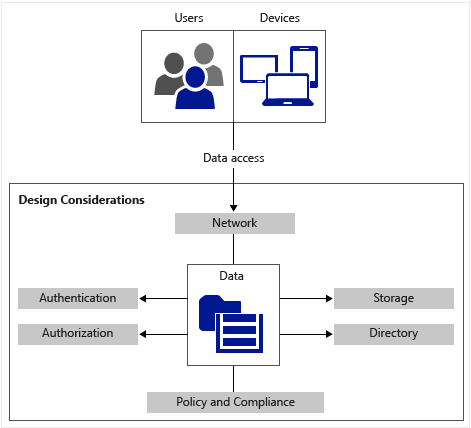

---
# required metadata

title: Data access and protection requirements
description: This article provides a set of common requirements for data access and protection that should be used in a Bring Your Own Device scenario.
keywords:
author: YuriDio
ms.author: yurid
manager: swadhwa
ms.date: 02/21/2017
ms.topic: article
ms.prod:
ms.service: microsoft-intune
ms.technology:
ms.assetid: 29eddc34-5ca5-4169-89b6-8137b03ab7f0

# optional metadata

#ROBOTS:
#audience:
#ms.devlang:
ms.reviewer:
ms.suite: ems
#ms.tgt_pltfrm:
#ms.custom: 

---

# Data access and protection requirements

One of the most critical elements when enabling users to access company resources from their own devices is to preserve the company’s data and keep that information secure. Your company might have a variety of compliance requirements that must be in place to ensure data is secure no matter where it is located. Figure below shows the interactions between users and devices when accessing data and which components must be considered for this subdomain.

The section below contains questions about data access and protection that you will need to answer in order to formulate the requirements for your solution design.

## Questions to ask

Data access and protection requirement questions are categorized in six areas:

- Storage
- Network
- Directory
- Authorization
- Policy and compliance

### Storage

- While the data is at rest in the data center, do you have encryption enabled?
- Will your company provide offline access to data located in the datacenter’s storage (in other words, will you sync data to users’ devices)?
	- If so, does your company want to keep the same data format (encrypted or plain) on users’ devices?
- Do you have any storage quota currently implemented in your system on a per-user basis?
	- If so, do you plan to increase this quota for users who are authorized to user their own devices?
- Does your company policy allow users to use external storage drives on corporate computers?
	- If not, do you plan to extend this policy for users who are accessing data from their own devices?
- Does your company policy allow users to use cloud-based storage from corporate computers?
	- If not, do you plan to extend this policy for users who are accessing data from their own devices?

### Network

- Do you have any type of network encryption on-premises?
	- If so, is it limited to server–to-server communication, or is the entire network encrypted?
- Do you plan to have different requirements for data access while users are physically outside the corporate network and when they are physically inside the corporate network?
	- If so, what are the requirements?
- Do you foresee any increase in network activity when you enable users to use their own devices on the corporate network?
	- If so, is your current network capacity able to handle this new traffic?
- Does your company use any network inspection mechanisms?
	- If so, do you plan to extend this capability for users who are bringing their own devices and connecting to the corporate network?

### Directory

- Does your company use a single user directory, or does it have multiple providers?
- Is your company directory located on-premises, in the cloud, or in both locations (hybrid)?
- When users are accessing apps from their devices, against which directory will they be authenticating?
- Does your company plan to federate authentication between on-premises and cloud services?

### Authentication

- Which type of authentication is used today in your environment?
- Do you plan to preserve this authentication method, or do you want to enhance it before enabling users to use their own devices to access company resources?
- Do you have multi-factor authentication in place in your current environment?
- Do you plan to authenticate users’ devices or users only?
- Do you plan to enable single sign-on for apps that are accessed from users’ devices?
- Do you plan to leverage cloud resources to provide an additional level of authentication for remote users?

### Authorization

- In the current environment, after users are authenticated, do you have any other controls in place to validate if users are authorized to access the information they are requesting?
- Do you plan to provide conditional access based on a set of predefined rules for remote users?
- Does your company perform authorization enforcement for data located on-premises or in the cloud?
- Does your company use the [principle of need to know](http://en.wikipedia.org/wiki/Need_to_know) in order to authorize data access?

### Policy and compliance

- Does your company have policies in place to define how data access is classified?
- Does your company need to be compliant with any regulations for data handling and privacy?
	- If so, how do these regulations drive the current data access policies for on-premises resources?
- Does your company have policies in place for [Mobile Device Management (MDM)](mdm-design-considerations-guide.md) and [Mobile Application Management (MAM)](https://blogs.technet.microsoft.com/cbernier/2016/01/05/microsoft-intune-mobile-application-management-mam-standalone/)?
- Does your company have policies in place for device confiscation in case of litigation or criminal investigation?
