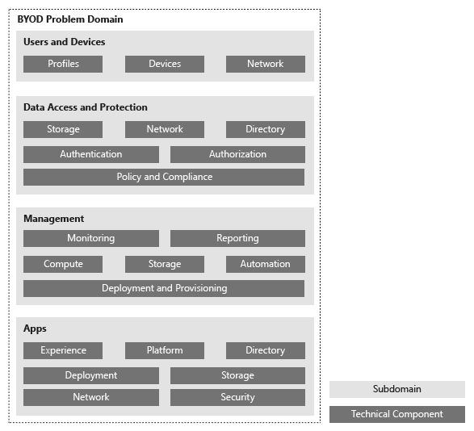

---
# required metadata

title: BYOD Design Considerations Guide
description: Introduction to BYOD adoption and overview of design considerations process. 
keywords:
author: YuriDio
manager: swadhwa
ms.date: 10/18/2016
ms.topic: solution
ms.prod:
ms.service: 
ms.technology:
ms.assetid: ed940ba8-866c-477f-a59b-beb620300a79

# optional metadata

#ROBOTS:
#audience:
#ms.devlang:
ms.reviewer: 
ms.suite: ems
#ms.tgt_pltfrm:
ms.custom: microsoft-intune

---

# BYOD Design Considerations Guide

With the proliferation of devices used by employees, most enterprises are facing a big dilemma: how do they allow their users to use their own devices, while protecting corporate data that resides on those devices? Enterprises are moving away from the traditional model, in which they own and provide devices to their employees, to a model in which employees use their personal devices for some of their work tasks. This model is often referred to as [Bring Your Own Device (BYOD)](https://technet.microsoft.com/library/dn645493.aspx). In this model, employees are allowed to use their personal devices for some work tasks, but only if the employees allow the company to manage some aspects of their devices to ensure the security of corporate data. Often, this means that users allow the company to apply custom policies, perform hardening of the devices, or standardize the operating system established by company policy. Executives and decision makers that read the [CIO considerations for workstyle transformation](http://download.microsoft.com/download/5/3/A/53A96632-02E3-416C-B209-D8725AA80AFE/CIO%20Considerations%20for%20Workstyle%20Transformation2.pdf) paper from Microsoft can also identify the benefits of embracing a model in which people are empowered to use their devices to be productive at work.

Though data access and protection is one of the main challenges of BYOD, other challenges require addressing the problem with a broader approach:

- Users and their devices: how can users be enabled to use their own devices and remain compliant with company policies?
- Management: how will noncorporate devices be managed by IT?
- Apps: how will line-of-business (LOB) apps be accessed from users’ devices?

This discussion will be driven by requirements, capabilities, and design considerations for a device management infrastructure. Microsoft technologies are mentioned within the context of the requirements and capabilities—not vice versa. It is our expectation that this approach will resonate better with architects and designers who are interested in the problems that must be solved and the approaches that are available for solving these problems. Only then is the technology discussion relevant.

This guide provides the system architect and system designer with a collection of critical design considerations that need to be addressed before designing a Bring Your Own Device (BYOD) infrastructure that enables employees to use their own devices and protects the company’s data.

## Intended audience

The primary audience for this guide is the system architect or system designer who is interested in understanding the issues that need to be considered before implementing a BYOD infrastructure. Others who might be interested in this guide include IT implementers, enterprise security specialists, and device management specialists.</para>
    
## Purpose
  
The purpose of this guide is:

1. To provide the system architect or system designer a collection of issues and questions to be answered. The answers to these questions can serve as the requirements for a BYOD infrastructure design.
2. To provide the system architect or system designer a collection of design options that can be evaluated and chosen based on identified requirements. 

Though the questions can be used with any vendor, examples of available options will focus on capabilities within Windows Server 2012 R2, System Center 2012 R2, and Windows Intune

In addition, this guide includes:

- Vendor-agnostic design considerations to adapt an infrastructure to enable the BYOD model. 
- Design considerations for users, devices, management platforms, apps, and data access and protection.

Before embarking on a BYOD model in a production environment, security, availability, performance, and scalability issues need to be considered in the areas of networking, storage, compute, and identity. There is a tendency to want to embrace BYOD before there is a concrete analysis of the current environment and what needs to be done to securely enable users to work from any device anywhere.

It is *not* the purpose of this guide to:

- Provide a performance baseline for the infrastructure components of a BYOD model. 
- Provide performance tuning and best practices for the infrastructure components of BYOD.
- Provide app development guidance for mobile devices.
- Provide app development best practices for mobile devices.
- Provide guidance and best practices for third-party components.

## Problem definition

The following problems or challenges are typically the ones encountered by companies trying to embrace BYOD:

- The existing management platform is unable to allow users to bring their own devices and have access to company resources.
- The security strategy already in place does not address the security challenges that BYOD introduces to the environment.
- Users are embracing new technologies and demanding access to company resources to perform their jobs.
- Business decision makers understand the benefits that BYOD brings to the business, primarily in user productivity that can decrease operation cost. However, business decision makers are uncertain how to embrace BYOD while remaining in compliance with rules and regulations.

Organizations with a large infrastructure need to determine requirements before shifting from managing devices themselves—which assumes that IT has total control of devices—to a model in which IT must assume that it has less control of devices and at the same time needs to address users’ needs to access corporate data. This is often referred to as a switch from device-centric to people-centric IT. The same considerations and requirements must also be carefully planned for existing and new apps or for moving existing apps into a cloud environment. Figure 1 includes a conceptual diagram of the BYOD problem domain and the areas that will be covered in this guide.

