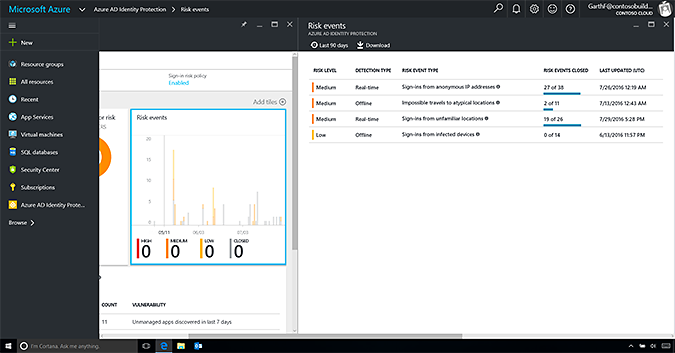
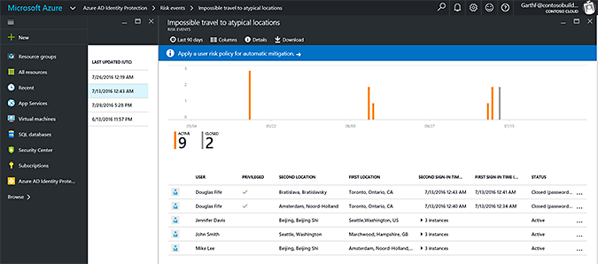
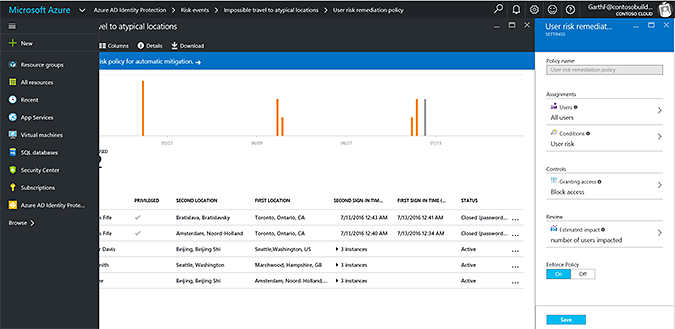

---
# required metadata

title: Cloud-powered protection
description: This article describes how Enterprise Mobility + Security can be used to provide a comprehensive set of security tools to proactively help identity, and respond to security threats at your organization by leveraging tools within Azure Active Directory.
keywords:
author: andredm7
manager: swadhwa
ms.date: 10/24/2016
ms.topic: solution
ms.prod:
ms.service: active-directory
ms.technology:
ms.assetid: 46654ab0-0d0a-47ad-8715-b149a1092a37

# optional metadata

ROBOTS: noindex
#audience:
#ms.devlang:
ms.reviewer: atkladak, jsnow
ms.suite: ems
#ms.tgt_pltfrm:
#ms.custom:

---

# Cloud-powered protection
Microsoft has been securing cloud-based identities for over a decade, and with Azure Active directory, Microsoft is making these same protection systems available to enterprise customers, to ensure user’s and administrator’s accountability with better security and governance.

## How can Enterprise Mobility + Security help you?
Enterprise Mobility + Security (EMS) is the only comprehensive cloud solution that natively protects corporate data on the device itself, and beyond with four layers of protection across identities, devices, apps, and data. EMS helps you solve one of the key challenges in the mobile-first, cloud-first world – how to provide a comprehensive set of security tools to proactively help identity, and respond to security threats at your organization:
- Control access to resources
- Safeguard user authentication
- Respond to advanced threats with risk-based policies and monitoring
- Mitigate administrative risks
- Governance of on-premises and cloud identities

Azure Active directory identity protection is unique. It uses machine learning to analyze more than 10TB of behavioral and contextual data every day, which provides visibility over suspicious activity, and allows you to take immediate action if necessary.

In addition, Azure AD conditional access rules allows customers to control access to online services, based on attributes such as device compliance or network location. The following may be distinguished:
- Azure AD MFA-based conditional access
- Azure AD Location-based conditional access
- Azure AD Device-based conditional access

## Recommended solution
### Azure Active directory identity protection

Azure AD Identity Protection is a security service that provides a consolidated view into risk events and potential vulnerabilities affecting your organization’s identities:
- Respond to Advanced Threats with Risk Based Policies and Monitoring (Azure AD Identity Protection)
- Mitigate Admin Risk (Privileged Identity)
- Governance of Identity

In a world of increasing identity theft incidents, persistent bad actors and frequent security breaches, Azure Active Directory Identity Protection is a must-have.

The Azure AD identity protection dashboard gives you access to reports like users flagged for risk, risk events and vulnerabilities. It also provides settings like the configuration of your security policies, notifications and multi-factor authentication registration.
### Azure AD conditional access
The move to cloud services and an always increasing need for mobility are driving organizations to look for solutions that protect data while enhancing user productivity and device flexibility. Customers require the ability to control access to Office 365 based on various attributes such as network location or MFA enforcement. This is particularly important for regulated customers such as government or financial customers.

Since protecting data at the network perimeter is no longer sufficient, organizations also require the ability to control user access based on other factors such as device compliance.

Azure AD conditional access rules are applied per-application and are available for customers to control access based on different conditions. Using Mobile Device Management (MDM) for Office 365 or Intune, customers must be able to restrict access to Office 365 to only those users who are using a company device or who have enrolled their personal device for management.

For example, customers may configure conditional access rules to enforce controls such as:
- Only allow access from devices that are domain joined or compliant
- Enforce MFA for all access to Exchange Online services
- Prevent access to SharePoint Online, for client outside of the corporate network.

## How to implement these solutions?

Let’s talk about the necessary steps to start using Azure AD Identity Protection, and Conditional Access. This section also provides how-to articles which will provide more details for specific steps.

### Azure AD identity protection
Azure AD identity protection is available with Azure AD premium 2 offering, in combination with Azure AD privileged identity management to provide seamlessly conditional access policy capabilities.

You can enable Azure AD identity protection by going to the Azure Marketplace, and searching for: “identity protection”, then you can click on Azure AD identity protection tile, which will open the dashboard with a consolidated view of risk data for your tenant. Let’s highlight a few examples of how identity protection can help your organization with account security threats.

#### Risk events
Risk events are events that were flagged as suspicious by the identity protection, and indicate that an identity may have been compromised.

Microsoft is continuing to invest in this space, and plans to continuously improve the detection accuracy of existing risk events and add new risk event types on an ongoing basis. For example, let’s you can investigate the Impossible travels risk event.

You can find more details on the [Azure AD Identity playbook](https://azure.microsoft.com/en-us/documentation/articles/active-directory-identityprotection-playbook/).

Here’s an example of a few risk events at the identity protection dashboard:

#### Impossible travels risk
Within the Impossible travel blade, all flagged incidents are displayed by 1st and 2nd login locations and time of each login occurred.

You can find more details on the [types of risk events detected by Azure Active Directory Identity Protection](https://azure.microsoft.com/en-us/documentation/articles/active-directory-identityprotection-risk-events-types/).

#### Remediation
Aside from addressing incidents on an individual incident basis, Azure AD identity protection gives you the capability to address possible issues through a proactive approach by configuring a User risk remediation policy. Within the policy settings, you have the ability to target individual users, groups or all users. You also are able to set the specific condition (s), that will trigger the policy.

Lastly, you have the option of either blocking access entirely or allowing access but with the requirement(s) of:
- Multi-factor authentication
- Azure MFA registration
- A password change

You can find more details on [Azure AD Identity protection](https://azure.microsoft.com/en-us/documentation/articles/active-directory-identityprotection/), and on this [Enterprise mobility and security blog post](https://blogs.technet.microsoft.com/enterprisemobility/2016/09/07/azuread-identity-protection-azure-ad-privileged-identity-management-and-azure-ad-premium-p2-will-be-generally-available-sept-15th/).

### Azure AD conditional access
The links below provide you information to use Azure AD conditional access based on Multi-factor authentication (MFA), location, and device policies.
- Learn [how to implement Azure AD conditional access](https://azure.microsoft.com/documentation/articles/active-directory-conditional-access/).
- Learn more about [MFA and location policies](https://azure.microsoft.com/documentation/articles/active-directory-conditional-access-azuread-connected-apps/).
- Learn more about [Device-based policies](https://azure.microsoft.com/documentation/articles/active-directory-conditional-access-policy-connected-applications/).
