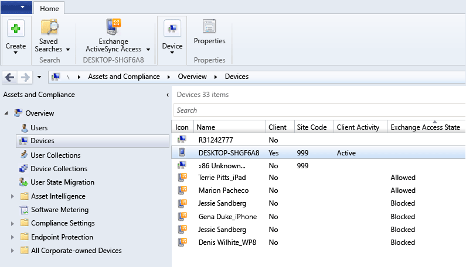
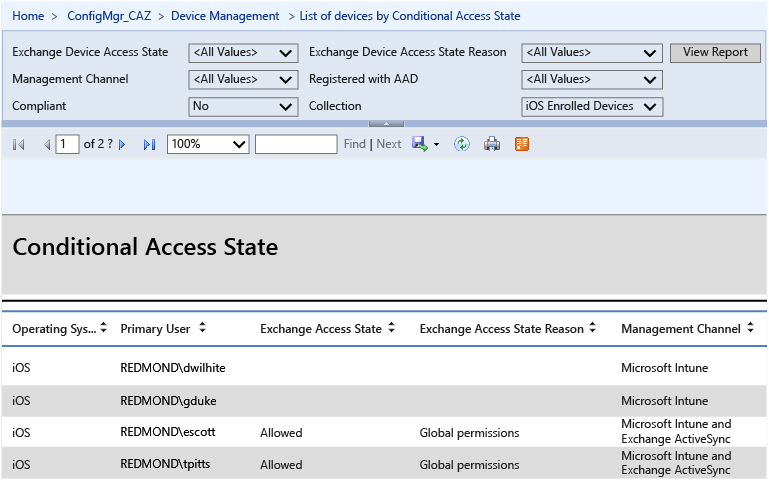
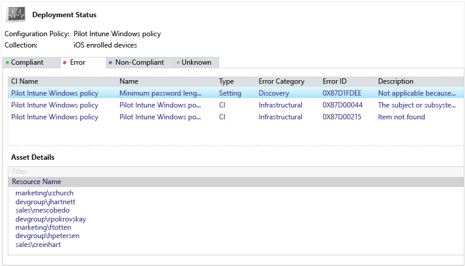

# Deploy Exchange Online with Microsoft Intune and Configuration Manager
Now that you've read through the [architecture guidance for protecting company email and documents](../Topic/architecture-guidance-for-protecting-company-email-and-documents.md), you are ready to proceed with deploying a solution.

If you are already using System Center Configuration Manager and Exchange Online, you can incorporate Intune to manage email access and protect email data on mobile devices. The high-level process for implementing this solution is as follows:

-   Create the compliance policies that define the rules and settings that a device must comply with in order to be considered compliant by conditional access polices.

-   Begin enforcing conditional access.

-   Optionally, configure the Exchange Server connector for Exchange Online
    This connector is required for reporting purposes only. It is not required to enable conditional access.

## Conditional access control flow for Exchange Online
This diagram shows the control flow for clients attempting to access email in Exchange Online. A and B might be performed prior to enforcing conditional access.

-   Microsoft Intune: Manages the compliance and conditional access policies for the device

-   Microsoft Azure Active Directory: Authenticates user and provides device compliance status

-   Configuration Manager: Manages device enrollment and provides reporting, if enabled

-   Exchange Online: Enforces access to email based on the device state

## Prerequisites
Before you proceed, make sure your environment includes these requirements for implementing this solution.

-   Install and assign Exchange services to a [valid digital certificate ](https://technet.microsoft.com/library/dd351044(v=exchg.150).aspx) purchased from a trusted public certificate authority.

-   Verify that you are running System Center 2012 R2 Configuration Manager SP1 with cumulative update 1 or later.

-   Configure an account (local or domain admin) with permissions to run the following Exchange Server cmdlets:

    **Clear-ActiveSyncDevice**

    **Get-ActiveSyncDevice**

    **Get-ActiveSyncDeviceAccessRule**

    **Get-ActiveSyncDeviceStatistics**

    **Get-ActiveSyncMailboxPolicy**

    **Get-ActiveSyncOrganizationSettings**

    **Get-ExchangeServer**

    **Get-Recipient**

    **Set-ADServerSettings**

    **Set-ActiveSyncDeviceAccessRule**

    **Set-ActiveSyncMailboxPolicy**

    **Set-CASMailbox**

    **New-ActiveSyncDeviceAccessRule**

    **New-ActiveSyncMailboxPolicy**

    **Remove-ActiveSyncDevice**

## Deployment Steps
Follow these steps to deploy the Exchange Online solution:

### Step 1: Create compliance policies and deploy to users.
Compliance policies define the rules and settings that a device must comply with in order to be considered compliant by conditional access polices. Follow the steps at [Compliance Policies in Configuration Manager](https://technet.microsoft.com/en-us/library/mt131417.aspx)to create compliance policies.

> [!NOTE]
> If you want the ability to remove all corporate email from an iOS device after it is no longer part of your company, you must create and deploy an email profile and then set the compliance policy that specifies that email profiles are managed by Intune. You must deploy the email profile to the same set of users that you target with this compliance policy.
>
> 
>
> If you specify this compliance policy, a user who has already set up their email account must manually remove it and then Intune will add it back in through the registration process described in [End-user experience of conditional access](../Topic/End-user-experience-of-conditional-access.md).

After the compliance policy is created, select the compliance policy name in the list and click **Deploy**.

### Step 2: Configure conditional access policy.
First, decide how and when you want to enforce conditional access and which employees will be affected. Then, follow the steps at [Conditional Access for Exchange Email in Configuration Manager](https://technet.microsoft.com/en-us/library/mt131421.aspx) to enable the conditional access policy for Exchange Online.

> [!NOTE]
> Conditional access policy must be configured in the Intune console. These steps begin by accessing the Intune console through Configuration Manager. If prompted, log in using the same credentials that were used to set up the connector between Configuration Manager and Intune.

### Step 3: (*Optional*) Install and configure an Exchange Server connector.
Configuration Manager supports only one connector in an Exchange organization.

> [!IMPORTANT]
> Before you install the Exchange Server connector, confirm that Configuration Manager supports the version of Microsoft Exchange that you are using. For more information, see [Supported Configurations for Configuration Manager](https://technet.microsoft.com/en-us/library/gg682077.aspx).

Follow the steps at [How to Manage Mobile Devices by Using Configuration Manager and Exchange](https://technet.microsoft.com/en-us/library/gg682001.aspx) to install and configure the Exchange Server connector.

## Verification Steps
If you configured the optional Exchange Server connector for this solution, you can use the Configuration Manager Trace Log Tool to open the EasDisc.log file (located in the Microsoft Configuration Manager/Logs folder where you installed Configuration Manager). Search the log file for “Exchange Connector” to find information about whether the Exchange Connector is running and how many devices are connected.

The Configuration Manager Trace Log Tool is included in the [System Center 2012 R2 Configuration Manager Toolkit](http://www.microsoft.com/en-us/download/details.aspx?id=36213).

## Reporting
If you configured the optional Exchange Server connector, you can use the Configuration Manager console to view specific information about devices that have been discovered by the Exchange Connector. For devices on which conditional access is enforced, you can view the current status of each device, the last time the device was connected with the Exchange server, and so on.

In the Configuration Manager console, click **Assets and Compliance** and then click **Devices**. You can view the current status of each device (Quarantined or Allowed) in the **Exchange Access State** column. Add this column if not already shown by right-clicking in the column title bar area. You can also view the last successful synchronization time for each device as reported by Exchange by adding the **Last Success Sync Time To Exchange Server** column.

If you are running SQL Server Reporting Services (SSRS), you can view a conditional access report that shows the compliance state of devices, whether there is an Exchange connector installed and running, and the EAS Access state. It will also provide information about Active Directory registration, EAS activation, as well as the device owner.

To view SSRS reports, you must have a reporting role installed on the primary server:

1.  In Configuration Manager, click **Administration &gt; Hierarchy configuration &gt; Site Configuration &gt; Servers and Site System Roles**.

2.  Select a server and click **Add Site System Role** to open the Add Site System Role wizard.

3.  On the System Role Selection page, select the **Reporting services point** checkbox. The reporting services point displays reports related to client management.

4.  Click **Next**.

The following shows the deployment status of the configuration policy:

### Latency
Devices that use modern authentication have conditional access applied immediately. For devices connecting through the EAS protocol, there can be a lag time of up to six hours before conditional access is enforced, based on the default setting. During that time, a device might be considered compliant.

## Where to go from here
[End-user experience of conditional access](../Topic/end-user-experience-of-conditional-access.md)
