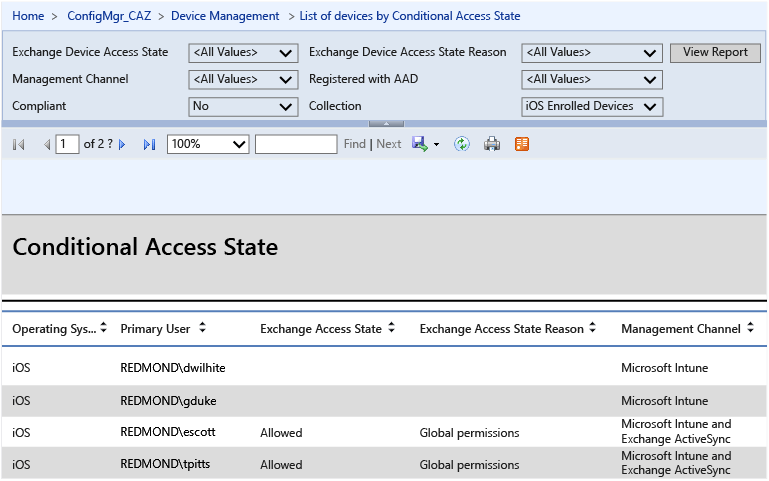

---
# required metadata

title: Use conditional access with Exchange Server on-premises, Microsoft Intune and Configuration Manager
description:
keywords:
author: craigcaseyMSFT
manager: swadhwa
ms.date: 04/28/2016
ms.topic: article
ms.prod:
ms.service:
ms.technology:
ms.assetid: 56b6cd2d-3dea-468b-9f1c-92717c9ec5f5

# optional metadata

#ROBOTS:
#audience:
#ms.devlang:
ms.reviewer: 
ms.suite: ems
#ms.tgt_pltfrm:
#ms.custom:

---

# Deploy Exchange Server on-premises with Microsoft Intune and Configuration Manager
Now that you've read through the [architecture guidance for protecting company email and documents](../Solutions/architecture-guidance-for-protecting-company-email-and-documents.md), you are ready to proceed with deploying a solution.

If you are already using System Center Configuration Manager and Exchange in your on-premises infrastructure, you can incorporate Intune to manage email access and protect email data on mobile devices. The high-level process for implementing this solution is as follows:

-   Configure the On-Premises Intune Exchange Connector through the Configuration Manager console, which will let Configuration Manager communicate with the Exchange Server that hosts the mobile devices’ mailboxes.

-   Run a full synchronization of the Exchange Server Connector to discover users and to inventory all of the mobile device Exchange ActiveSync IDs (EASIDs) that are connecting to Exchange Server on-premises.

-   Create user collections for groups of users that will either be targeted or exempted from the conditional access policy. Then create the compliance policies that define the rules and settings that a device must comply with in order to be considered compliant by conditional access polices.

-   Begin enforcing conditional access.

## Conditional access control flow for Exchange Server on-premises
This diagram shows the control flow for clients attempting to access email in Exchange on-premises.

-   Microsoft Intune: Manages the compliance and conditional access policies for the device

-   Microsoft Azure Active Directory: Authenticates user and provides device compliance status

-   Configuration Manager: Manages device enrollment and provides reporting

-   Exchange on-premises: Enforces access to email based on the device state

## Before you begin
Make sure your environment includes these requirements for implementing this solution.

> [!NOTE]
> If you have already configured Configuration Manager to manage mobile devices through the Intune service, you can proceed to the [Deployment Steps](#DeploySteps).

-   Verify that you meet the [hardware requirements for the on-premises connector](https://stage.docs.microsoft.com/en-us/intune/getstarted/network-infrastructure-requirements-for-microsoft-intune).

-   Verify that you are running System Center 2012 R2 Configuration Manager SP1 with cumulative update 1 or later.

-   Ensure that the [Exchange Web Services (EWS) endpoint ](https://technet.microsoft.com/library/hh529912.aspx)is configured properly for discovery. If necessary, contact your Configuration Manager Support team for a tool that can help identify EWS connection issues. EWS lets developers interact with Exchange mailboxes and contents by using standard HTTP.

-   Install and assign Exchange services to a [valid digital certificate ](https://technet.microsoft.com/library/dd351044.aspx) purchased from a trusted public certificate authority.

-   Configure an account (local or domain admin) with permissions to run the following Exchange Server cmdlets:

    Clear-ActiveSyncDevice

    Get-ActiveSyncDevice

    Get-ActiveSyncDeviceAccessRule

    Get-ActiveSyncDeviceStatistics

    Get-ActiveSyncMailboxPolicy

    Get-ActiveSyncOrganizationSettings

    Get-ExchangeServer

    Get-Recipient

    Set-ADServerSettings

    Set-ActiveSyncDeviceAccessRule

    Set-ActiveSyncMailboxPolicy

    Set-CASMailbox

    New-ActiveSyncDeviceAccessRule

    New-ActiveSyncMailboxPolicy

    Remove-ActiveSyncDevice

> [!IMPORTANT]
> If you try to install or use the Exchange Server connector without the required cmdlets, you will see an error logged with the message: _Invoking cmdlet &lt;cmdlet&gt; failed in the EasDisc.log file on the site server computer_.

## Deployment Steps
Follow these steps to deploy the Exchange on-premises solution:

### Step 1: Ensure that Intune Connector role is installed.
Make sure that the Intune Connector role is installed so that Configuration Manager can interact with Intune. See [Manage Mobile Devices with Configuration Manager and Intune](https://technet.microsoft.com/en-us/library/JJ884158.aspx) for more information.

### Step 2: Install and configure an Exchange Server connector.
Configuration Manager supports only one connector in an Exchange organization.

> [!IMPORTANT]
> Before you install the Exchange Server connector, confirm that Configuration Manager supports the version of Microsoft Exchange that you are using. For more information, see [Supported Configurations for Configuration Manager](https://technet.microsoft.com/en-us/library/gg682077.aspx).

Follow the steps at [How to Manage Mobile Devices by Using Configuration Manager and Exchange](https://technet.microsoft.com/en-us/library/gg682001.aspx) to install and configure the Exchange Server connector.

### Step 3: Run a full synchronization to discover users.

1.  In the Configuration Manager console, click **Administration**, expand **Hierarchy Configuration**, and then select **Exchange Server Connectors**.

2.  Select the Exchange Server Connector that you installed in Step 2.

3.  Click **Synchronize Now**.

    

This full synchronization can take several hours to complete, depending on the number of devices. A full synchronization will run once every 24 hours by default. A delta synchronization discovers device connections since the previous full synchronization and occurs per the interval you set during installation of the Exchange Server Connector. This ensures that new users and new Exchange users are discovered quickly so that conditional access can be applied.

Using the Configuration Manager Trace Log Tool, you can open the EasDisc.log file (located in the **Microsoft Configuration Manager/Logs** folder where you installed Configuration Manager) to verify that the connector is running and querying for device connections. After full sync completes, it will inventory all of the mobile device Exchange ActiveSync IDs (EASIDs) that are connecting to Exchange On-premises.

### Step 4: Create user collections.
Determine the Intune user groups for whom the conditional access policy will be targeted. Then, create user collections for groups of users that will either be targeted or exempted from the conditional access policy. You will specify these groups when you enforce conditional access later on.

Follow the steps at [How to Create Collections in Configuration Manager](https://technet.microsoft.com/en-us/library/gg712295.aspx) to create user collections.

### Step 5: Create compliance policies and deploy to users.
Compliance policies define the rules and settings that a device must comply with in order to be considered compliant by conditional access polices. Follow the steps at [Compliance Policies in Configuration Manager](https://technet.microsoft.com/en-us/library/mt131417.aspx) to create compliance policies.

If you want the ability to remove all corporate email from an iOS device after it is no longer part of your company, you must create and deploy an email profile and then set the compliance policy that specifies that email profiles are managed by Intune. You must deploy the email profile to the same set of users that you target with this compliance policy.

If you specify this compliance policy, a user who has already set up their email account must manually remove it and then Intune will add it back in through the registration process described in [End-user experience of conditional access](../Solutions/end-user-experience-conditional-access.md).

After the compliance policy is created, select the compliance policy name in the list and click **Deploy**.

### Step 6: Configure conditional access policy.
First, decide how and when you want to enforce conditional access and which employees will be affected. Then, follow the steps at [Conditional Access for Exchange Email in Configuration Manager](https://technet.microsoft.com/en-us/library/mt131421.aspx) to configure the conditional access policy for Exchange on-premises.

### Step 7: Monitor enrollments and enforce conditional access.
If you already have a significant number of users enrolled in Intune and compliant, you can start enforcing conditional access by rolling it out to about 500 users per day. This will take about 4 to 5 months for 70,000 users and lets you sort out any issues that might arise without restricting email access to too many users at the same time.

If you don’t have a large number of users already enrolled in Intune, conditional access provides them with a guided experience for enrollment, as described in [End-user experience of conditional access](../Solutions/end-user-experience-conditional-access.md).

## Verification Steps
Using the Configuration Manager Trace Log Tool, open the EasDisc.log file (located in the Microsoft Configuration Manager/Logs folder where you installed Configuration Manager). Search the log file for “Exchange Connector” to find information about whether the Exchange Connector is running and how many devices are connected.

The Configuration Manager Trace Log Tool is included in the [System Center 2012 R2 Configuration Manager Toolkit](http://www.microsoft.com/en-us/download/details.aspx?id=50012).

## Reporting
You can use the Configuration Manager console to view specific information about devices that have been discovered by the Exchange Connector. For devices on which conditional access is enforced, you can view the current status of each device, the last time the device was connected with the Exchange server, and so on.

In the Configuration Manager console, click **Assets and Compliance** and then click **Devices**. You can view the current status of each device (Blocked or Allowed) in the **Exchange Access State** column. Add this column if not already shown by right-clicking in the column title bar area. You can also view the last successful synchronization time for each device as reported by Exchange by adding the **Last Success Sync Time To Exchange Server** column.

If you are running SQL Server Reporting Services (SSRS), you can view a conditional access report that shows the compliance state of devices, whether there is an Exchange connector installed and running, and the EAS Access state. It will also provide information about Active Directory registration, EAS activation, as well as the device owner.

To view SSRS reports, you must have a reporting role installed on the primary server:

1.  In Configuration Manager, click **Administration**, click **Hierarchy configuration**, click **Site Configuration**, and then click **Servers and Site System Roles**.

2.  Select a server and click **Add Site System Role** to open the Add Site System Role wizard.

3.  On the System Role Selection page, select the **Reporting services point** checkbox. The reporting services point displays reports related to client management.

4.  Click **Next**.

The following shows the deployment status of the configuration policy:

### Latency
A device is blocked as soon as it is discovered by the Exchange connector. The latency of blocking depends on the configured intervals for Full synchronization and delta synchronization and the time in between these intervals when the device connects to the Exchange server. By default, a Full synchronization occurs every 24 hours while a delta synchronization occurs every 240 minutes. During this latency period, a device might be considered compliant.

## Where to go from here
After you have deployed a solution for protecting corporate email and email data on mobile devices, you can learn more about the [end-user experience of conditional access](../Solutions/end-user-experience-conditional-access.md). This will help prepare you for issues that might arise when end users enroll their specific devices.
