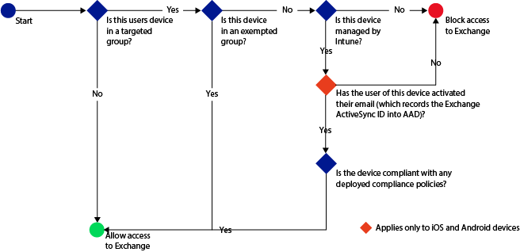

---
# required metadata

title: Use conditional access with Microsoft Intune and Exchange Server on-premises | Enetrprise Mobility Suite
description:
keywords:
author: craigcaseyMSFT
manager: swadhwa
ms.date: 04/28/2016
ms.topic: article
ms.prod:
ms.service:
ms.technology:
ms.assetid: 2a64e898-4c60-48bf-ae14-b05e091e0533

# optional metadata

#ROBOTS:
#audience:
#ms.devlang:
ms.reviewer: 
ms.suite: ems
#ms.tgt_pltfrm:
#ms.custom:

---

# Deploy Exchange on-premises with Intune

Now that you've read through the [architecture guidance for protecting company email and documents](../Solutions/architecture-guidance-for-protecting-company-email-and-documents.md), you are ready to proceed with deploying a solution.

For Intune to directly manage mobile devices, users will need to enroll devices into Intune.

## Deployment Steps
Follow these steps to deploy the Exchange on-premises with Intune solution:

### Step 1: Install and configure the Microsoft Intune on-premises Exchange Server connector.

For mobile devices that users have not enrolled you can enable Exchange ActiveSync management using the Exchange connector. The Exchange connector connects you with your Exchange deployment and lets you manage mobile devices through the Intune console.

Follow the steps at [Configure Microsoft Intune on-premises connector for on-premises or hosted Exchange](https://stage.docs.microsoft.com/en-us/intune/deployuse/intune-on-premises-exchange-connector) to download, install and configure the Microsoft Intune Exchange Connector.

> [!IMPORTANT]
> You can only set up one Exchange connection per Intune account. If you try to configure an additional connection, it will replace the original connection with the new one.

### Step 2: Create compliance policies and deploy to users.
Compliance policies define the rules and settings that a device must comply with in order to be considered compliant by conditional access polices. Follow the steps at [Create a compliance policy in Microsoft Intune](https://stage.docs.microsoft.com/en-us/intune/deployuse/create-a-device-compliance-policy-in-microsoft-intune) to create and deploy compliance policies.

If you want the ability to remove all corporate email from an iOS device after it is no longer part of your company, you must create and deploy an email profile and then set the compliance policy that specifies that email profiles are managed by Intune. You must deploy the email profile to the same set of users that you target with this compliance policy.

If you specify this compliance policy, a user who has already set up their email account must manually remove it and then Intune will add it back in through the registration process described in [End-user experience of conditional access](../Solutions/end-user-experience-conditional-access.md).

> [!IMPORTANT]
> If you have not deployed a compliance policy and then enable an Exchange conditional access policy, all targeted devices will be allowed access.

### Step 3: Identify users who will be impacted by conditional access policy.
After the Exchange Server connector is successfully configured, it begins to inventory devices that are not yet enrolled to Intune, but are connecting to your organization’s Exchange resources using Exchange Active Sync.  

Follow the instructions at [Evaluate the effect of the conditional access policy](https://technet.microsoft.com/en-us/library/dn705841.aspx#bkmk_Eval_FX_CAP) to identify those users who will be impacted by conditional access policy.

### Step 4: Configure user groups for the conditional access policy.
You target conditional access policies to different groups of users depending on the policy types. These groups contain the users that will be targeted, or exempt from the policy. When a user is targeted by a policy, each device they use must be compliant in order to access email.

For more information, see [Configure user groups for the conditional access policy](https://technet.microsoft.com/en-us/library/dn705841.aspx#BKMK_configUserGroups).

### Step 5: Configure conditional access policy.
The following flow is used by conditional access policies for an Exchange on-premises environment to evaluate whether to allow or block devices.

Follow the information provided under [To enable the Exchange On-premises policy](https://technet.microsoft.com/en-us/library/dn705841.aspx#BKMK_enableXchngOnprem) to set up your conditional access policy.

## Reporting

### Monitor the compliance and conditional access policies
To view devices that are blocked from Exchange:

On the Intune dashboard, click the **Blocked Devices from Exchange** tile to show the number of blocked devices and links to more information.

## Where to go from here
After you have deployed a solution for protecting corporate email and email data on mobile devices, you can learn more about the [end-user experience of conditional access](../Solutions/end-user-experience-conditional-access.md). This will help prepare you for issues that might arise when end users enroll their specific devices.
