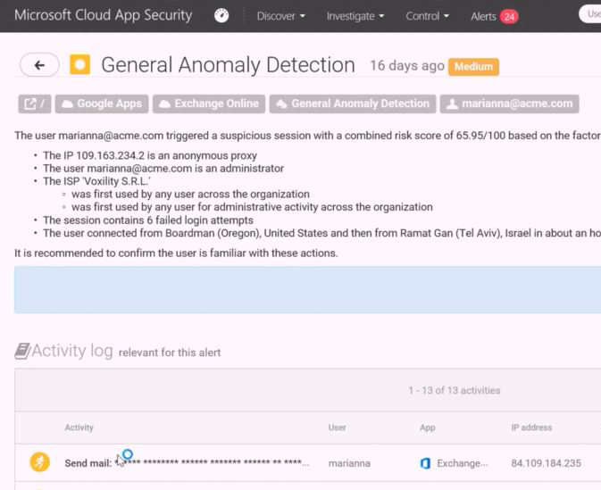

---
# required metadata

title: Detect attacks before they cause damage | Azure Active Directory Information Protection
description: A scenario that describes how Enterprise Mobility + Security can be used to protect corporate data from attacks before they cause damage by leveraging Advanced Threats Analytics, Cloud App Security, and Azure Active Directory Premium.
author: yuridio
ms.author: yurid
manager: swadhwa
ms.date: 12/2/2016
ms.topic: solution
ms.prod:
ms.service: ems
ms.technology: techgroup-identity
ms.assetid: de0a7e70-008b-45c1-bba8-f033b1f62194

# optional metadata

#ROBOTS:
#audience:
#ms.devlang:
#ms.reviewer: v-craic
#ms.suite: ems
#ms.tgt_pltfrm:
#ms.custom: active-directory, advanced-threat-analytics, cloud-app-security

---

# Detect attacks before they cause damage
A strong secure posture requires an advanced detection system in place to be able to identify threats before they cause major damage. Organizations can seamlessly leverage Microsoft security intelligence to detect suspicious activities on-premises and in the cloud.

A strong detection system must uncover suspicious activity and pinpoint threats with deep visibility and ongoing behavioral analytics. This lets IT  take immediate action against detected attacks and streamline recovery with powerful support.

## How can Enterprise Mobility + Security help you?
Microsoft Enterprise Mobility + Security enables IT to identify attackers in your organization using innovative behavioral analytics and anomaly detection technologies, on-premises and in the cloud.  It will assist IT to detect known malicious attacks and known security vulnerabilities in their systems.

## Recommended solution
To address the requirements of this scenario, EMS uses [Advanced Threats Analytics](https://docs.microsoft.com/en-us/advanced-threat-analytics/), [Cloud App Security](https://docs.microsoft.com/en-us/cloud-app-security/what-is-cloud-app-security) and [Azure Active Directory Premium](https://docs.microsoft.com/en-us/azure/active-directory/active-directory-get-started-premium). By implementing these technologies, organizations will be able to:

- Detect or identify abnormal behavior using innovative behavioral analytics and anomaly detection technologies leveraging machine learning
- Detect known malicious attacks (i.e. Pass the Hash, Pass the Ticket) and known security vulnerabilities
- Focus on what is important fast clear and relevant attack information
- Identify anomalies and policy violations that may be indicative of a security breach

The following diagram summarizes the capabilities involved in this scenario and how they are used to protect your resources:

# How to detect attacks before they cause damage
Traditionally, security investments were focused only on protection. However nowadays it is imperative to also have good detection and response. IT organizations should focus on an approach that looks at how to protect, detect, and respond to threats.

IT must look at how to appropriately secure identity, data, applications, devices, and infrastructure—on-premises or in the cloud.  This requires an approach to security that considers all your end-points, from sensors to the datacenter. In the past, IT administrators relied on malware signatures to recognize threats.

Traditional IT security tools provide limited protection against sophisticated cyber-security attacks when user credentials are stolen. Initial set up, creating rules, and fine-tuning are cumbersome and may take years. Every day, you receive several reports full of false positives. Most of the time, you don’t have the resources to review this information and even if you could, you may still not have the answers, since these tools are designed to protect the perimeter, primarily stopping attackers from gaining access. Today’s complex cyber-security attacks require a different approach.

To mitigate current threats in this new cyber security attack landscape, IT needs innovative threat detection solutions leveraging behavioral analytics and machine learning technologies so they can rapidly recognize entirely new threats.  By leveraging ATA and Cloud App Security to detect attacks on-premises and in the cloud, IT can rapidly respond to incidents before they cause major damage to the environment.

Read [ATA capacity planning](https://docs.microsoft.com/en-us/advanced-threat-analytics/plan-design/ata-capacity-planning) before implementing ATA on-premises, and also [ATA prerequisites](https://docs.microsoft.com/en-us/advanced-threat-analytics/plan-design/ata-prerequisites), for general considerations prior to installing ATA. Use the [pre-installation checklist](https://docs.microsoft.com/en-us/advanced-threat-analytics/deploy-use/preinstall-ata) to validate if your infrastructure is ready to receive ATA. Once you finish this planning and validation phase, you will be ready to [deploy ATA](https://docs.microsoft.com/en-us/advanced-threat-analytics/deploy-use/install-ata-step1). Once ATA is deployed on your environment, the configuration is minimal and it will immediately start to learn about your environment and trigger alerts if it finds known malicious attacks. Follow step 1 to use [ATA](https://docs.microsoft.com/en-us/advanced-threat-analytics/understand-explore/what-is-ata) to identify suspicious activity on-premises.

To detect threats for cloud apps, this scenario uses [Cloud App Security](https://docs.microsoft.com/en-us/cloud-app-security/what-is-cloud-app-security). Make sure to follow the [general setup instructions](https://docs.microsoft.com/en-us/cloud-app-security/general-setup) to setup Cloud App Security and use [cloud discovery](https://docs.microsoft.com/en-us/cloud-app-security/set-up-cloud-discovery) option to analyze your traffic logs against Cloud App Security's cloud app catalog. Follow step 2 to use Cloud App Security to detect threats and compliance violations.

## How to implement this solution
Follow these steps to implement [Advanced Threats Analytics](https://docs.microsoft.com/en-us/advanced-threat-analytics/) and [Cloud App Security](https://docs.microsoft.com/en-us/cloud-app-security/what-is-cloud-app-security):

- Step 1: Use Advanced Threat Analytics (ATA) to detect suspicious activity on-premises
- Step 2: Use Cloud App Security to detect threats and compliance violations for cloud apps  

### Step 1: Using ATA to detect suspicious activity
The constant reporting of traditional security tools and sifting through them to locate the important and relevant alerts can get overwhelming. Instead, ATA provides an easy-to-consume, simple-to-drill-down, social media feed-like report helping IT to focus on what is important fast. Presenting this quantity of data as a timeline gives you the power of perspective, and insight into who’s accessing what, when they’re accessing it, and how they’re accessing the data.

When you open the [attack timeline](https://docs.microsoft.com/en-us/advanced-threat-analytics/deploy-use/working-with-suspicious-activities) in ATA, you see a comprehensive report with suspicious activities showing the [entities](https://docs.microsoft.com/en-us/advanced-threat-analytics/plan-design/ata-architecture) that were involved in this activity and what the recommendations are:

In this example, there is an event indicating suspicion of identity theft using pass-the-ticket attack. You also have a list of recommendations that can be used for initial remediation steps. In this example, ATA provided an alert as the administrator’s Kerberos ticket was stolen from the server SHAREDADMIN-SRV to EXTVENDOR-TS and used to access DC01. You can go further in your investigation process by clicking on any object in this event. For example, by clicking in the external vendor Terminal Server (EXTVENDOR-TS) you will have access to all [suspicious activities](https://docs.microsoft.com/en-us/advanced-threat-analytics/deploy-use/working-with-suspicious-activities) in which this server was involved.

ATA uses machine learning both in its deterministic and detection engines to establish an understanding of the normal behavior patterns for both users and entities, and it’s that unique capability that allows us to provide timely and accurate alerts across a huge variety of attack vectors.

### Step 2: Using Cloud App Security to detect threats and policy violations for cloud apps

More and more organizations are adopting SaaS apps, not only to reduce costs but also to unlock competitive advantages such as improved time to market and better collaboration. Even if your company does not use cloud applications, your employees probably do. According to research, more than 80 percent of employees admit to using non-approved SaaS apps in their jobs.

With this fast transition to cloud apps, we know you may be concerned about storing corporate data in the cloud and how to make it accessible to users anywhere without comprehensive visibility, auditing, or controls. Legacy security solutions are not designed to protect data in SaaS applications. Traditional network security solutions, such as firewalls and IPS, don’t offer visibility into the transactions that are unique to each application and traffic off-premises, including how data is being used and stored. Classic controls fail to provide protection for cloud apps as they monitor only a small subset of cloud traffic and have limited understanding of app-level activities.

So how can you maintain visibility, control, and protection of your cloud apps? We have your solution:

Microsoft Cloud App Security is a comprehensive service that provides deeper visibility, comprehensive controls, and improved protection for your cloud applications. Cloud App Security is designed to help you extend the visibility, auditing, and control you have on-premises to your cloud applications.

Cloud App Security provides not only visibility and control but also powerful threat protection for your cloud applications, enhanced with vast Microsoft threat intelligence and research. You can identify high-risk usage and security incidents, and detect abnormal user behavior to prevent threats.

When you access the Cloud App Security dashboard, you have a comprehensive view of the secure state of your cloud apps, including a section dedicated to alerts:

You can click in the Alerts menu to access the [alert center](https://docs.microsoft.com/en-us/cloud-app-security/monitor-alerts). The alerts center gathers alerts of a wide variety of categories, including threat detection, privileged accounts and compliance violations.

The alerts center gathers all the red flags identified by Cloud App Security including anomaly and threat detection compliance violations and privileged accounts. Cloud App Security advanced machine learning heuristics learns how each user interacts with each cloud app and through behavioral analysis, assesses the risk in each transaction.

When you are investigating an alert, you can click in the alert’s name to obtain more information about it. In the following example the alert is referring to a match in the [file policy](https://docs.microsoft.com/en-us/cloud-app-security/data-protection-policies) *Public shared confidential files*, which is considered high priority since it can lead to data leakage.   

While the previous example was based on a policy violation, Cloud App Security is also able to [detect anomalies](https://docs.microsoft.com/en-us/cloud-app-security/anomaly-detection-policy#anomaly-detection-policy-reference). Cloud App Security has an initial learning period of 7 days during which it does not flag any new users, activity, devices or locations as anomalous. After that, each session is compared to the activity – when users were active, IP addresses, devices, etc. – that were detected over the previous month and a risk score is assigned to these activities. The description for this type of alert is called General Anomaly Detection and once you click on it, you will see a screen similar to the following:

On this page, you can see which user triggered the alert, the IP address, the group membership of the user, and more information about the suspicious behavior. You can view more details about this activity, which includes the failed logon attempts, the location where the logon was originated, and the app that was used to perform the logon attempt.
