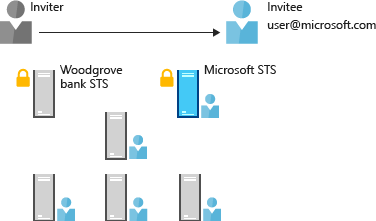

---
# required metadata

title: Enable business without borders
description: This article describes how Enterprise Mobility + Security can be used to provide a single identity that works across cloud and on-premises assets, and keeps users as productive as possible by leveraging tools within Azure Active Directory.
keywords:
author: andredm7
ms.author: andredm
manager: swadhwa
ms.date: 10/19/2016
ms.topic: solution
ms.prod:
ms.service: active-directory
ms.technology:
ms.assetid: 38e9802b-d8c0-4f5c-b89d-8ce1e04f7387

# optional metadata

ROBOTS: noindex
#audience:
#ms.devlang:
ms.reviewer: atkladak, jsnow
ms.suite: ems
#ms.tgt_pltfrm:
#ms.custom:

---

# Enable business without borders
Identity is not a nice to have – it is at the core of an efficient workforce. Organizations need to empower their employees to access all their data and applications from every device and every location. Users need to collaborate with each other and with partners, and connect with customers. The tools they use don’t live in a protected and controlled environment any more; it can be found in any public cloud.

This new world introduces challenges and advanced threats that cannot be mitigated with traditional tools. There is no point in protecting just your network while the new boundary is the user. The key to be productive and protected in this environment is a strong identity solution.

## How can Enterprise Mobility + Security help you?
Enterprise Mobility + Security (EMS) is the only comprehensive cloud solution that natively protects corporate data on the device itself and beyond with four layers of protection across identities, devices, apps, and data. EMS helps you solve one of the key challenges in the mobile-first, cloud-first world – how to provide a single identity that works across cloud and on-premises assets, and keep users as productive as possible.

### Access to single sign-on applications
With Identity Federation and single sign-on, users have one set of login credentials and passwords, and IT is able to more efficiently manage user identity.
### Multi-factor authentication
Users also have the ability to bring new devices into the enterprise, but IT can validate that devices connecting to the network are owned and controlled by individuals with the appropriate credentials. Multi-factor authentication (MFA) helps to provide a layer of protection.
### Self-service group management
When users do forget passwords, they have the ability to reset their own passwords, reducing the burden on IT and making the user more efficient by being able to resolve the issue quickly.
### Cross-organization collaboration
Business to Business collaboration is important to 97% of Microsoft customers, who consider it a key requirement to work with partners. Azure Active Directory B2B (business-to-business) collaboration supports cross company relationships by enabling partners to selectively access corporate applications and data using self-managed identities.

## Recommended solution
[Azure Active Directory B2B (business-to-business) collaboration](https://azure.microsoft.com/documentation/articles/active-directory-b2b-what-is-azure-ad-b2b/) is the recommended solution that provides to organizations access to everything they need from everywhere, in a secure and productive way, in collaboration with existing investments on traditional tools.
- IT Pros providing access to their organization’s data and applications to partner organizations and collaborators.
- Partner users that are acting “on behalf of”, as representatives or employees of their organization.
- Access reviews, email verification, allow list, deny list, etc. govern access to host application and resources.
- Partner users are discoverable and can see other users from their own organization (subject to policy).

### How Azure AD B2B collaboration works

Azure AD B2B collaboration is based on an invite and redeem model, which utilizes email addresses of the partners you want to work with and the respective applications you want to use.

1. Your admin logs into Azure portal, and invites partner users by importing a CSV file that contains the partner’s user information.
2. Azure portal sends e-mails to the partners.
3. Partners click the link in the e-mail they receive from Azure portal. If the partner user is already in Azure AD,  they’re prompted to enter their work credentials; if not, the partner user will need to sign up as an Azure AD B2B collaboration user.
4. The partner’s user gets automatically redirected to the application in which they were invited to collaborate.

## How to implement this solution
The following steps describe how to implement each Azure AD B2B collaboration previously discussed. Each link represents a different set of articles with a different set of instructions/steps to be implemented in your organization:
- Learn [How to use Azure AD B2B collaboration](https://azure.microsoft.com/documentation/articles/active-directory-b2b-detailed-walkthrough/).
- Learn [How to use CSV file to specify partner user information](https://azure.microsoft.com/en-us/documentation/articles/active-directory-b2b-references-csv-file-format/).
