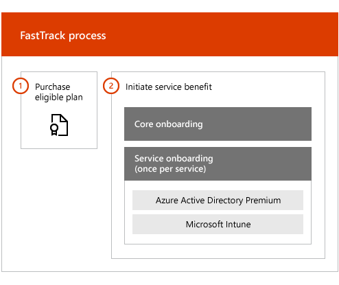

---
# required metadata

title: Overview
description: Overview
keywords:
author: andredm7
ms.author: andredm
manager: angrobe
ms.date: 03/21/2018
ms.topic: article
ms.prod:
ms.service: microsoft-intune
ms.assetid: e60e3714-5120-41e2-9878-83ac75107967

# optional metadata

#ROBOTS: noindex
#audience:
#ms.devlang:
ms.reviewer:
ms.suite: ems
#ms.tgt_pltfrm:
#ms.custom: active-directory, ad-health-connect, multi-factor-authentication, microsoft-intune

---

# FastTrack Center Benefit Overview

With FastTrack Center Benefit for Microsoft Azure Active Directory Premium and Microsoft Intune, you work remotely with FastTrack specialists to get your environment ready for use and to plan the rollout and usage within your organization. To learn more about eligibility, see [FastTrack Center Benefit Process for Enterprise Mobility + Security (EMS)](fasttrack-center-benefit-process-for-enterprise-mobility-suite-ems.md).

Onboarding has two major components:

-   **Core onboarding** - Tasks required for tenant configuration and integration with Azure Active Directory, if needed. Core onboarding also provides the baseline for onboarding other Microsoft Online eligible services.

-   **Service onboarding** - Tasks required to configure any of the standalone variants of the EMS workload (Azure AD Premium and Intune).

The following diagram describes the high-level onboarding phases for the the FastTrack Center Benefit.

Here's how the process works:

- The FastTrack Center tries to contact you to offer onboarding assistance after you purchase licenses of an eligible service. You can also request assistance from the [FastTrack Center](http://fasttrack.microsoft.com/) if you're ready to deploy these services for your organization. To request assistance, sign in to the [FastTrack Center](http://fasttrack.microsoft.com/) with your work or school account, go to the dashboard, expand the **Need Help?** link at the lower-right corner of the page, and then follow the prompts to complete your request. Once onboarding support starts, we’ll set up a schedule of online meetings.

-   The FastTrack team helps you first with core capabilities (common for all Microsoft Online Services) and then with onboarding each eligible service.

All onboarding support is provided remotely by assigned FastTrack personnel:

-   The FastTrack team remotely assists you with various onboarding activities by using a combination of tools, documentation, and guidance.

-   Onboarding support is provided by the FastTrack Center, and is available during normal business hours for a given region.

-   Onboarding support is available in Traditional Chinese, Simplified Chinese (resources speak Mandarin only), English, French, German, Italian, Japanese, Korean, Portuguese (Brazil), Spanish, Thai, and Vietnamese.

-   The FastTrack team can work directly with you or your representative.

> [!NOTE]
> **Want to learn more?** see
> [Enterprise Mobility + Security](https://www.microsoft.com/cloud-platform/enterprise-mobility).

## Next steps

[FastTrack Center benefit for EMS - Source environment expectations](fasttrack-center-benefit-process-for-ems-environment-expectations.md)
