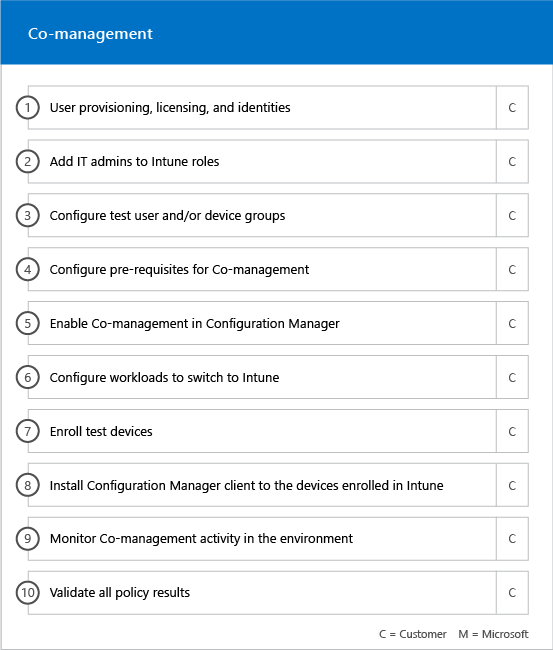

---
# required metadata

title: Onboarding and migration phases
description: Phases of the FastTrack Center Benefit
keywords:
author: andredm7
ms.author: anmorgan
manager:
ms.date: 08/13/2018
ms.topic: article
ms.prod:
ms.service: microsoft-intune
ms.assetid: e51f030b-8b08-4fea-96c9-d4ded435a264

# optional metadata

#ROBOTS: noindex
#audience:
#ms.devlang:
ms.reviewer:
ms.suite: ems
#ms.tgt_pltfrm:
#ms.custom: active-directory, ad-health-connect, multi-factor-authentication, microsoft-intune

---

# Onboarding phases

When you use the [FastTrack Center Benefit Eligible Services and Plans](fasttrack-center-benefit-for-enterprise-mobility-suite-ems.md) to get Microsoft Azure Active Directory Premium and Microsoft Intune ready for use, there are several phases involved in the process. The following sections describe each phase of the onboarding process.

Onboarding has four primary phases:

## Initiate phase

After you purchase the appropriate number of licenses, follow the guidance from the purchase confirmation email to associate the licenses to your existing tenant or new tenant. Microsoft then verifies your eligibility for the FastTrack Center Benefit and tries to contact you to offer onboarding assistance.

> [!NOTE]
> You can also request assistance from the [FastTrack Center](http://fasttrack.microsoft.com/) if you're ready to deploy these services for your organization.

### To request assistance

1. Go to [FastTrack Center](http://fasttrack.microsoft.com/) and sign in with your work or school account.

2. On the Customer Dashboard, choose **Go to FastTrack** at the bottom right of the page.

3. On the FastTrack Dasboard, expand the **Need Help** at the bottom right of the page, and then follow the prompts to complete your request.

Once the onboarding support starts, FastTrack sets up a schedule of online meetings with you to discuss the onboarding process, verify data, and set up a kick-off meeting.

## Assess phase

Once the onboarding process begins, the FastTrack Center works with you to assess your source environment and the requirements. Tools are run to assess your environment, and FastTrack Specialists guide you through assessing your on-premises Active Directory, Internet browsers, client devices' operating systems, Domain Name System (DNS), network, infrastructure, and identity system to determine if any changes are required for onboarding.

The FastTrack Center also connects you with guidance about how to drive successful adoption of the eligible services.

Based on your current setup, we provide a remediation plan that brings your source environment up to the minimum requirements for successful onboarding to EMS or its individual cloud services. We also set up appropriate checkpoint calls for the remediation phase.

## Remediate phase
You perform the tasks in the remediation plan on your source environment so that you meet the requirements for onboarding and adopting each service (as needed).

Before you begin the Enable phase, we jointly verify the outcomes of the remediation activities to make sure you’re ready to proceed.

## Enable phase
When all remediation activities are complete, the project shifts to configuring the core infrastructure for service consumption and to provisioning each eligible EMS cloud service.

**Enable phase - Core capabilities**

Core onboarding involves service provisioning and tenant and identity integration. It also includes steps for providing a foundation for onboarding online services such as Azure AD Premium and Intune.

> [!NOTE]
> WAP stands for Web Application Proxy. SSL stands for Secure Sockets Layer. SDS stands for School Data Sync. For more information on SDS, see [Welcome to Microsoft School Data Sync](https://go.microsoft.com/fwlink/?linkid=871480).

> [!NOTE]
> A managed authentication method includes, but is not limited to password hash synchronization. Identity integration is a one time activity and does not include migrating or decommissioning of existing authentication methods, such as managed or federated.

### Enable phase - Azure AD Premium

The Azure AD Premium environment can be set up by using the Azure Active Directory Connect tool directory synchronization and Active Directory Federation Services (AD FS) (as needed).

For Azure AD Premium scenarios that include synchronizing on-premises identities to the cloud, we help you by adding IT admins and users to your subscription, configuring management prerequisites, setting up Azure AD Premium, setting up directory synchronization with managed authentication and AD FS using the Azure AD Connect tool, configuring test users, and validating your core use cases for the service.

Azure AD Premium setup includes enabling the following features:

-   Self-Service Password Reset (SSPR).

-   Azure Multi-Factor Authentication (Azure MFA).

-   Up to three (3) or more Software as a Service (SaaS) application integrations with single sign-on (SSO) from the [Azure Active Directory Marketplace](https://azure.microsoft.com/marketplace/active-directory/).

-   Automatic user provisioning for pre-integrated SaaS applications as listed in the [App integration tutorial list](https://docs.microsoft.com/en-us/azure/active-directory/saas-apps/tutorial-list), limited to outbound provisioning only.

-   Customized logon screen, including logo, text, and images.

-   Self-Service and Dynamic Groups (Groups).

-   Azure Active Directory Application Proxy.

-   Azure Active Directory Connect Health.

-   Identity Protection.

-   Privileged Identity Management.

-   Azure Active Directory Conditional Access, including Terms of Use, if required.

### Enable phase - Intune

For Intune, we guide you through getting ready to use Microsoft Intune to manage devices. The exact steps depend on your source environment and are based on your mobile device and mobile app management needs. The steps can include:

-   Licensing your end users. We also provide assistance on how to activate volume licenses for your Microsoft cloud service tenant (as needed).

-   Configuring identities to be used by Intune by leveraging either your on-premises Active Directory or cloud identities.

-   Adding users to your Intune subscription, defining IT admin roles, and creating user and device groups.

-   Configuring your Mobile Device Management (MDM) authority, based on your management needs, including:

    -   Setting Intune as your MDM authority when Intune is your only MDM solution or is in conjunction with Mobile Device Management for Office 365.

-   Providing MDM guidance for:

    -   Configuring tests groups to be used to validate MDM management policies.

    -   Configuring MDM management policies and services like:

        -   Application deployment for each supported platform through web links or deep links.

        -   Conditional access policies.

        -   Deployment of email, wireless networks, and virtual private network (VPN) profiles if you have an existing  certificate authority, Wi-Fi or VPN infrastructure in your organization.

        -   Setting up the Microsoft Intune Exchange Connector (when applicable).

        -   Connecting to Intune Data Warehouse

        -   Integrating Intune with:
	        -   Team Viewer for remote assistance (Team viewer subscription is required).

	        -   Mobile Threat Defense (MTD) partner solutions (Mobile Threat Defense subcription is required).

	        -   Telecom expense management solution (Telecom expense management solution subscription is required).

	        -   Windows Defender Advanced Threat Protection (Windows E5 or Microsoft 365 E5 licenses are required).

    -   Enrolling devices of each [supported platform](https://technet.microsoft.com/library/dn600287.aspx) to Intune.

-   Providing Intune App Protection (app-management) guidance about:

    -   Configuring app protection policies for each supported platform.

    -   Configuring conditional access policies for managed apps.

    -   Targeting the appropriate user groups with the above MAM policies.

    -   Using managed-applications usage reports.

-   Providing PC management guidance about:

    -   Installing the Intune client software (when needed).

    -   Using the software and hardware reports available in Intune.

	> [!IMPORTANT]
	> FastTrack does not support Windows 10 classic PC management with Intune. FastTrack only supports Windows 10 device management through Intune mobile device management (MDM).

#### Co-management

FastTrack guides you through getting ready to concurrently manage Windows 10 devices with both Configuration Manager and Intune. The exact steps depend on your source environment, the steps can include:

- Explain the benefits of Co-management.

- License your end users. FastTrack also provides assistance on how to activate volume licenses for your Microsoft cloud service tenant (as needed).

- Configure identities to be used by Intune by leveraging either your on-premises Active Directory and/or cloud identities.

- Adding users to your Intune subscription, defining IT admin roles, and creating user and device groups.

- Provide guidance on how to move from Intune integrated with System Center Configuration Manager (Hybrid) to Intune Standalone.

- Provide guidance on setting up Azure Active Directory for MDM auto-enrollment.

- Provide guidance setting up hybrid Azure Active Directory Join.

- Provide guidance on how to set up Cloud Management Gateway

- Enable Co-management in Configuration Manager console.

- Configure supported workloads that you want to switch to Intune.

- Install Configuration Manger client in Intune enrolled devices.

- Provide guidance on how to monitor the Co-management activity in your environment.

FastTrack also provides you guidance on how to drive successful adoption of the eligible services.

> [!NOTE]
> **Want to learn more?** see [Enterprise Mobility + Security](https://www.microsoft.com/en-us/cloud-platform/enterprise-mobility).

## Next steps

[FastTrack benefit for EMS - Microsoft responsibilities](fasttrack-center-benefit-process-for-ems-fasttrack-responsibilities.md)
