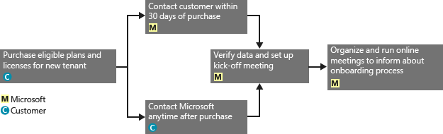
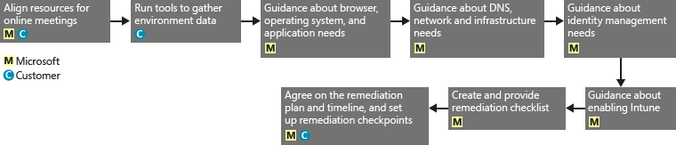
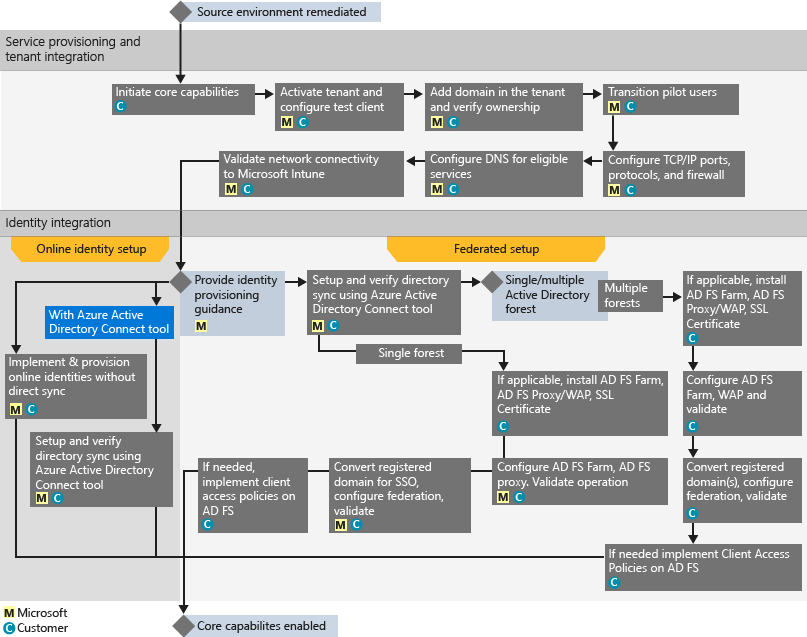
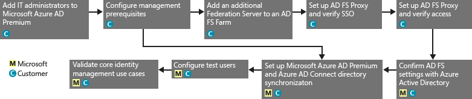
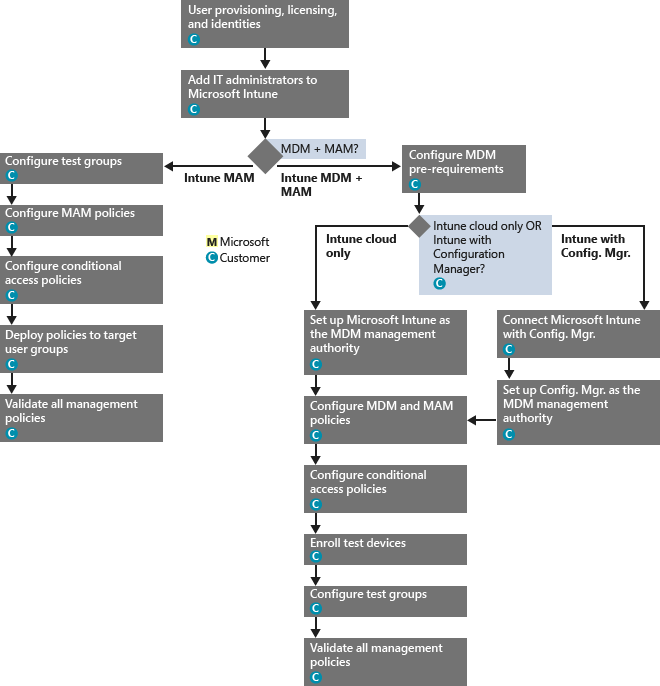

---
# required metadata

title: FastTrack Center Benefit Process for Enterprise Mobility Suite - phases | Enetrprise Mobility Suite
description:
keywords:
author: 
manager: swadhwa
ms.date: 04/28/2016
ms.topic: article
ms.prod:
ms.service:
ms.technology:
ms.assetid: e51f030b-8b08-4fea-96c9-d4ded435a264

# optional metadata

ROBOTS: noindex
#audience:
#ms.devlang:
ms.reviewer: 
ms.suite: ems
#ms.tgt_pltfrm:
#ms.custom:

---

# FastTrack Center Benefit Process for Enterprise Mobility Suite - phases
When you use the [FastTrack Center Benefit for Enterprise Mobility Suite (EMS)](fasttrack-center-benefit-for-enterprise-mobility-suite-ems.md) to get Azure Active Directory Premium, Microsoft Intune and/or Azure Rights Management ready for use, there are several phases involved in the process. The following sections describe each phase of the onboarding process.

To read about the other parts of the FastTrack onboarding process, see [FastTrack Center Benefit Process for Enterprise Mobility Suite (EMS)](fasttrack-center-benefit-process-for-enterprise-mobility-suite-ems.md).

Onboarding has four primary phases, as shown in the following figure:

## Initiate phase

After you have purchased the appropriate number of licenses, follow the guidance from the purchase confirmation email to associate the licenses to your existing tenant or new tenant. Microsoft will verify your eligibility for the FastTrack Center Benefit, and will attempt to contact you to offer onboarding assistance. You can also request assistance from the [FastTrack Center](http://fasttrack.microsoft.com/) if you are ready to deploy these services for your organization. To request assistance, sign in to the [FastTrack Center](http://fasttrack.microsoft.com/) (http://fasttrack.microsoft.com), go to the dashboard, click the Offers tab, and click “Request Assistance for Microsoft Intune, Azure Active Directory Premium, or Azure Rights Management Premium”. Once onboarding support starts, we’ll set up a schedule of online meetings.

During this phase, we’ll discuss the onboarding process, verify data, and set up a kick-off meeting.

## Assess phase

Once the onboarding process begins, Microsoft will work with you to assess your source environment and the requirements. Tools will be run to assess your environment, and Microsoft will guide you through assessing your on-premises Active Directory, Internet browsers, client devices' operating systems, DNS, network, infrastructure, and identity system to determine if any changes are required for onboarding.

Microsoft will also connect you with guidance about how to drive successful adoption of the eligible services.

Based on your current setup, we’ll provide a remediation plan that will bring your source environment up to the minimum requirements for successful onboarding to EMS or its individual cloud services. We’ll also set up appropriate checkpoint calls for the remediation phase.

## Remediate phase
If needed, you’ll do the tasks in the remediation plan on your source environment so that you meet the requirements for onboarding and adopting each service.

Before beginning the Enable phase, we’ll jointly verify the outcomes of the remediation activities to make sure you’re ready to proceed.

## Enable phase
When all remediation activities are complete, the project shifts to configuring the core infrastructure for service consumption and to provisioning each eligible EMS cloud service.

**Enable phase - Core capabilities**

Core onboarding involves service provisioning and tenant and identity integration. It also includes steps for providing a foundation for onboarding online services such as Azure Active Directory Premium, Microsoft Intune and Azure Rights Management Premium.

###Enable phase - Azure Active Directory Premium

The Azure Active Directory Premium environment can be set up with Azure Active Directory Connect tool directory synchronization and Active Directory Federation Services (AD FS), as needed.

For Azure Active Directory Premium scenarios that include synchronizing on-premises identities to the cloud, we’ll help you by adding IT administrators and users to your subscription, configuring management prerequisites, setting up Azure Active Directory Premium, setting up directory synchronization using the Azure Active Directory Connect tool, and Active Directory Federation Services (AD FS), using the Azure Active Directory Connect tool, configuring test users and validating your core use cases for the service.

Azure Active Directory Premium setup includes enabling the following features:

-   Self Service Password Reset (SSPR)

-   Azure Multi-Factor Authentication (MFA)

-   Software as a Service (SaaS) application--set up one SaaS application from the [Azure Active Directory Marketplace](https://azure.microsoft.com/marketplace/active-directory/).

-   Self-Service Group Management (SSGM)

-   Administrative reports

###Enable phase - Microsoft Intune

For Microsoft Intune, and based on your mobile device and mobile applications management needs, we’ll guide you through getting ready to use Microsoft Intune to manage devices. The exact steps depend on your source environment, and may include:

-   Licensing your end users. When needed, we’ll also provide assistance on how to activate volume licenses for your Microsoft cloud service tenant.

-   Configuring identities to be used by Microsoft Intune, by leveraging either your on-premise Active Directory or cloud identities.

-   Adding users to your Microsoft Intune subscription, defining IT Admin roles and creating user and device groups.

-   Based on your management needs, configuring your Mobile Device Management authority:

    -   Set Microsoft Intune as your MDM authority when Microsoft Intune is your only MDM solution or is in conjunction with Mobile Device Management for Office 365.

    -   If you have an existing implementation of System Center Configuration Manager and you are looking to expand its management capabilities with Microsoft Intune, set Configuration Manager as your MDM authority.

        > [!NOTE]
        > If you are only looking to leverage Mobile Application Management over your end-users' owned devices, shared devices, or kiosk-type devices, setting up an MDM authority is not required.

-   If Mobile Device Management is in your scope, we’ll provide guidance with:

    -   Configuring tests groups to be used to validate MDM management policies.

    -   Configuring MDM management policies and services such as:

        -   Application deployment for each supported platform through web links or deep links.

        -   Conditional access policies.

        -   Deployment of email profiles.

        -   Setting up the Microsoft Intune Exchange Connector, when applicable.

    -   Enrolling devices of each [supported platform](https://technet.microsoft.com/library/dn600287.aspx) to your Microsoft Intune or Configuration Manager with Microsoft Intune service.

-   If Mobile Application Management (MAM) is in your scope, or if you are looking to complement your existing Microsoft or third-party MDM solution with MAM policies, we’ll provide guidance with:

    -   Configuring MAM policies for each supported platform.

    -   Configuring conditional access policies for managed apps.

    -   Targeting the appropriate user groups with the above MAM policies.

    -   Using managed-applications usage reports.

-   If PC management is in your scope, we’ll provide guidance with:

    -   When needed, installing the Intune client software.

    -   Using the software and hardware reports available in Intune.

Microsoft will also connect you with guidance about how to drive successful adoption of the eligible services.

###Enable phase - Azure Right Management Premium

The Azure Right Management Premium environment can be set up with Azure Active Directory Connect directory synchronization and Active Directory Federation Services (AD FS), as needed.

For AzRMS scenarios that include synchronizing on-premises identities to the cloud, we’ll help you by adding IT administrators and users to your subscription, configuring management prerequisites, setting up Azure Right Management Premium, setting up directory synchronization using Azure Active Directory Connect tool, and Active Directory Federation Services using Azure Active Directory Connect, configuring test users and validating your core use cases for the service.

AzRMS setup includes enabling the following features:

-   AzRMS Service Enablement

-   IRM Configuration for Exchange Online and Sharepoint Online

-   Rights Management Connector with Exchange on-premise and Sharepoint on-premise

-   RMS Sharing Application for Windows and non-Windows devices

>[!div class="step-by-step"]
[FastTrack source environment](fasttrack-center-benefit-process-for-ems-environment-expectations.md)
[Customer FastTrack responsibilities](fasttrack-center-benefit-process-for-ems-your-responsibilities.md)

### Want to learn more?
See [Enterprise Mobility Suite](https://www.microsoft.com/en-us/server-cloud/enterprise-mobility/overview.aspx).

