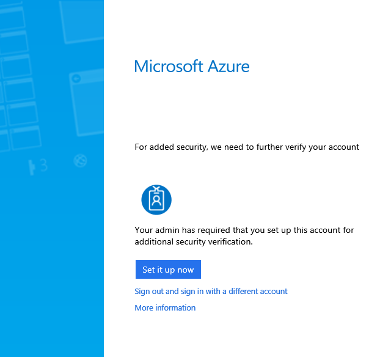
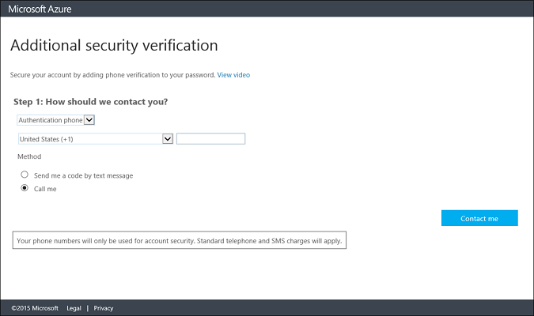
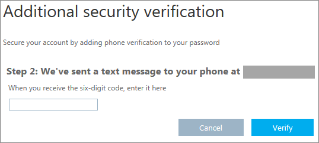
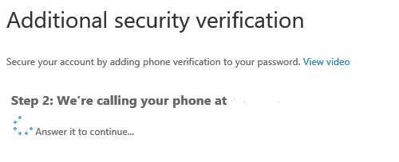
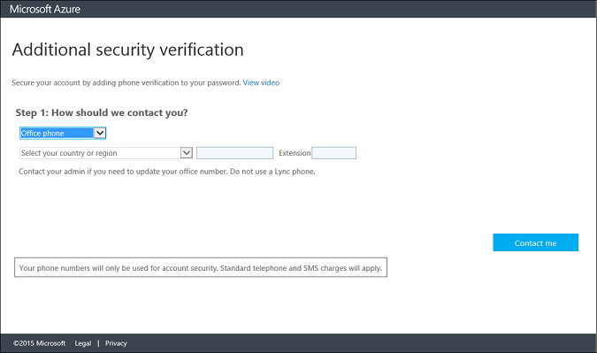
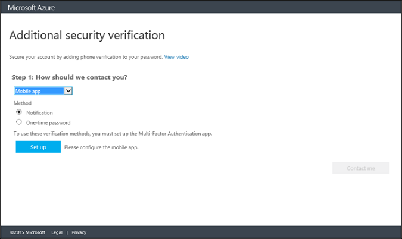
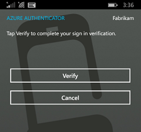
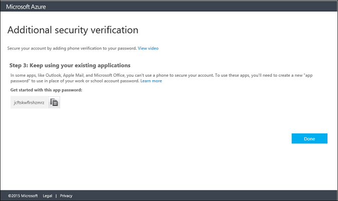

---
# required metadata

title: How to enroll in multi-factor authentication
description: How to set up your preferred method for additional security verification
keywords:
author: craigcaseyMSFT
ms.author: v-craic
manager: jeffgilb
ms.date: 09/28/2016
ms.topic: article
ms.prod:
ms.service: ems
ms.technology:
ms.assetid: 06e21ca9-ed6a-4f6e-a7e2-5445aaeb3552

# optional metadata

ROBOTS: noindex
#audience:
#ms.devlang:
ms.reviewer:
ms.suite: ems
#ms.tgt_pltfrm:
#ms.custom:

---

# How to set up your preferred method for additional security verification

Additional security verification settings are used when an admin has configured your account to require that both your password and a response from your phone must be used to verify your identity. If an administrator has configured your account to require additional security verification, you will be unable to sign in until you have completed the auto-enrollment process.

The first time that you sign in after your account has been configured, you will be prompted to begin the auto-enrollment process. You can begin this process by clicking Set it up now.

Using the enrollment process, you will be able to specify your preferred method of identity verification. This can be any of the following options listed in the table below. For additional information, including a walk-through, simply click on one of the methods.

|Method|Description|
|------------|----------------------------------|
|[Mobile Phone Call](#mobile-phone-(text-or-call))|Places an automated voice call to the authentication phone number. The user answers the call and presses # in the phone keypad to authenticate. This phone number will not be synchronized to the on-premises Active Directory.|
|[Mobile Phone Text Message](#mobile-phone-(text-or-call))|Sends a text message containing a verification code to the user. The user is prompted to either reply to the text message with the verification code or to enter the verification code into the sign-in interface.|
|[Office Phone Call](#office-phone-call)|Places an automated voice call to the user. The user answers the call and presses # in the phone keypad to authenticate.|
|[Mobile App](#mobile-application)|Pushes a notification to the Azure Authenticator mobile app on the user’s smartphone or tablet. The user taps Verify in the app to authenticate. Alternately, the app can also be used as an OTP token for offline authentication. The user enters the token into the sign-in screen to authenticate.|

_The Azure Authenticator app can operate in two different modes to provide the additional security that a multi-factor authentication service can provide. These are the following:_

- **Notification** - In this mode, the Azure Authenticator app prevents unauthorized access to accounts and stops fraudulent transactions. This is done using a push notification to your phone or registered device. Simply view the notification and, if it is legitimate, select **Authenticate**. Otherwise you may choose **Deny** or choose to deny and report the fraudulent notification. For information on reporting fraudulent notifications see How to use the Deny and Report Fraud Feature for Multi-Factor Authentication.
- **One-Time Password** - In this mode, the Azure Authenticator app can be used as a software token to generate an OATH verification code. This verification code can then be entered along with the username and password to provide the second form of authentication.

The Azure Authenticator app is available for [Windows Phone](http://www.windowsphone.com/en-us/store/app/azure-authenticator/03a5b2bf-6066-418f-b569-e8aecbc06e50), [Android](https://play.google.com/store/apps/details?id=com.azure.authenticator),
and [IOS](https://itunes.apple.com/us/app/azure-authenticator/id983156458).

## Mobile Phone (Text or Call)
If you want to use your mobile phone as your primary contact method, you can use the following steps. They will walk you through setting up multi-factor authentication to use your mobile phone for either a call or text as your contact method.

1. Under **Step 1: How should we contact you?** select **Authentication phone**.

  
2.	In the **country or region** box, select a value from the drop-down list. A default value may already be displayed.
3.	In the box next to the **country or region** box, type your mobile phone number. Include the area code.
Spaces are allowed, but punctuation characters are not. For example, 5554445555 and 555 444 5555 are allowed, but 555-444-5555 and (555) 444 5555 are not allowed.
4.	Select the mode you would prefer to use with your mobile phone: Text or Call.
5.	Click **Next**.
6.	Click the **Verify Now** button. This will initiate a call or a text to your mobile phone. Be sure to have your phone with you. Depending on the mode you selected, Text or Call, your response will be different.
 - If you selected the text mode, a 6-digit code will be texted to you. Enter this code in the box that is displayed in the browser.

        
 - If you selected the call mode, you will receive a phone call. Respond to the call using the # sign on your phone.

        
7. Click **Next**.
8.	At this point, you have setup your contact method and now it is time to setup app passwords for non-browser apps such as Outlook 2010 or older. If you do not use these apps click **Done**. Otherwise **continue** to the next step.
9. If you are using these apps then **copy** the app password provided.

  
10.	Paste the password that was copied to the clipboard into your non-browser application.
11.	Click **Done**.

## Office Phone Call
This section of this document will walk you through setting up Azure Multi-Factor Authentication to use your Office Phone as your primary contact method.
1. Select Office Phone from the drop-down list.

  
2.	Specify your country from the drop-down list and enter your Office phone number.
3.	Click **Contact Me**. This will initiate a call to your office phone. Be sure you are near your phone.
4.	Click **Next**.
5.	At this point, you have setup your contact method and now it is time to setup app passwords for non-browser apps such as Outlook 2010 or older. If you do not use these apps click **Done**. Otherwise **continue** to the next step.
7.	If you are using these apps then copy the app password provided.
8.	Paste the password that was copied to the clipboard into your non-browser application.

  
9.	Click **Done**.

## Mobile Application
This section of this article will walk you through setting up Azure Multi-Factor Authentication to use your mobile app as your primary contact method.

The Azure Authenticator app is available for Windows Phone, Android, and IOS.

1. Select **Mobile App** from the drop-down.

  
2.	Select either Notification or One-time password and click **Set up**.
3.	On the phone that has the Azure Authenticator app installed, launch the app and click **scan barcode**.

  
4.	Scan the barcode picture that came up with the configure mobile app screen. Click **Done** to close the barcode screen. If you are unable to scan the barcode, you can enter the information manually.

  
5.	On the phone, it will begin to activate, once this has completed click **Contact me**. This will send either a notification or a verification code to your phone. Click **Verify**.

  
6.	Click **Close**. At this point, your verification should be successful.
7.	Now it is recommended that you enter your mobile phone number in case you lose access to your mobile app.
8.	Specify your country from the drop-down list and enter your mobile phone number in the box next to country. Click **Next**.
9.	At this point, you have setup your contact method and now it is time to setup app passwords for non-browser apps such as Outlook 2010 or older. If you do not use these apps click **Done**. Otherwise **continue** to the next step.
10.	If you are using these apps then copy the app password provided.
11.	Paste the password that was copied to the clipboard into your non-browser application.

  
12.	Click **Done**.

### Want to learn more?
See [Enterprise Mobility + Security](https://www.microsoft.com/en-us/server-cloud/enterprise-mobility/overview.aspx).
