---
# required metadata

title: How to manage your password
description: How to manage your own password
keywords:
author: NathBarn
ms.author: NathBarn
manager: angrobe
ms.date: 02/01/2017
ms.topic: article
ms.prod:
ms.service: microsoft-intune
ms.technology:
ms.assetid: 162e59f3-33a2-44b5-a59f-24612dc743f3

# optional metadata

#ROBOTS: noindex
#audience:
#ms.devlang:
ms.reviewer:
ms.suite: ems
#ms.tgt_pltfrm:
#ms.custom:

---

# How to manage your own password

If you're a user (not an admin) in an organization that uses Office 365 or Microsoft Accounts to access work resources, read the sections below to learn how to fix common problems with your password.

## How to register for password reset
The fastest way to register for password reset is to go to [http://aka.ms/ssprsetup](http://aka.ms/ssprsetup).

1.	Navigate to [http://aka.ms/ssprsetup](http://aka.ms/ssprsetup).
2.	Enter your username and password.
3.	Choose an option to register for by clicking **set it up now**. In this case, I'll demonstrate registering my **authentication phone**.
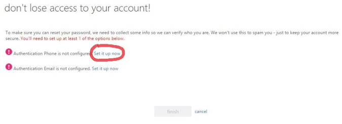
4.	Select your country code from the dropdown and enter your full phone number with area code.
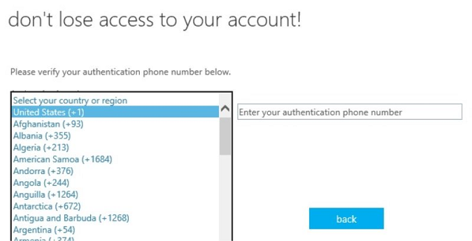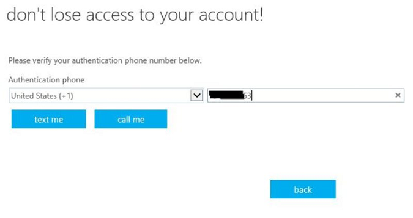
5.	Select one of the **text me** or **call me** options. In this case, I'll select **text me**, which will send a 6 digit code to my phone. Wait for the code to arrive on your phone.  
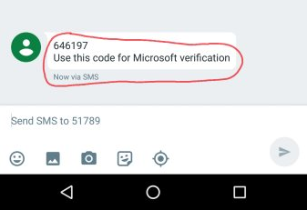
6.	Once the code arrives, enter it into the input box, then click "verify".
7.	When you see **thanks**, that's it! Now you can use what you registered for to reset your password at any time by going to [https://passwordreset.microsoftonline.com](https://passwordreset.microsoftonline.com).
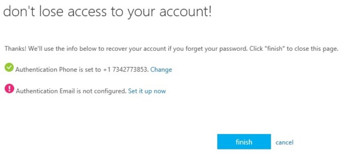

> [!IMPORTANT]
> If your admin lets you register for more than one option, we highly recommend you also register a back-up option in case you lose your phone or access to your email.

## How to reset your password
Follow the steps below to reset your work or school account password from any work or school account sign-in screen.

> [!IMPORTANT]
> This feature is only available to you if your admin has turned it on. If it's not turned on, you'll see a message indicating your account is not enabled for this feature. You can use the "contact your administrator" link in this case to get in touch with your admin to unlock your account.
> 
> If your admin has enabled you for this feature, you'll first need to sign up before you can use it. You can do that here: [http://aka.ms/ssprsetup](http://aka.ms/ssprsetup).

1. On the any work or school account sign-in page, click on one of the "can't access your account?" or "forgot your password?" links, or navigate to [https://passwordreset.microsoftonline.com](https://passwordreset.microsoftonline.com) directly.
   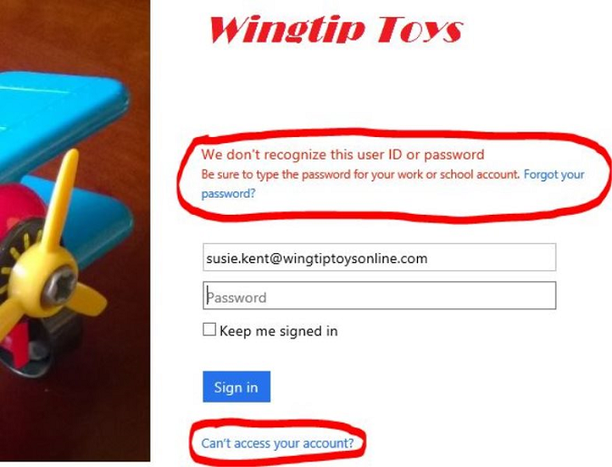
2. On the "who are you?" page, enter your work or school account ID and prove you aren't a robot by passing the captcha.
   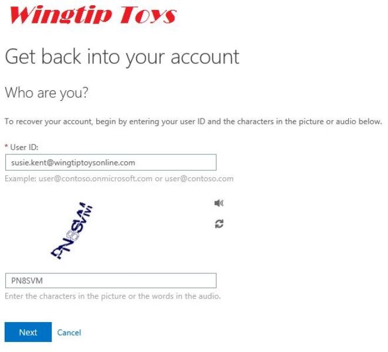
3. Click **Next**.
4. Choose an option to reset your password. Depending on how your admin has configured the system, you might see one or more of the following choices:
   - **Email my alternate email** - sends an email with a 6 digit code to either your alternate email or authentication email (you choose).
   - **Text my mobile phone** - texts your phone with a 6 digit code to either your mobile phone or authentication email (you choose).
   - **Call my mobile phone** - calls your mobile phone or authentication phone (you choose) - press the # key to verify the call.
   - **Call my office phone** - calls your office phone - press the # key to verify the call.
   - **Answer my security questions** - displays your pre-registered security questions for you to answer.
   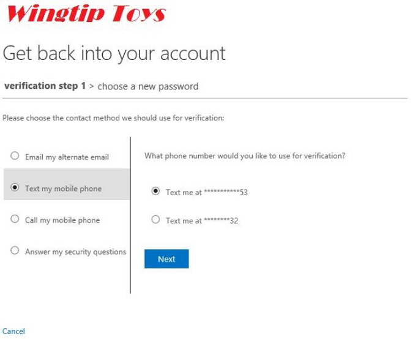
5. We'll use the **text my mobile phone** option as an example. If you are using a phone-based option, you'll need to verify your phone number before we'll send a text. Enter your full phone number and then click **Next** to verify it's correct and send a text.
   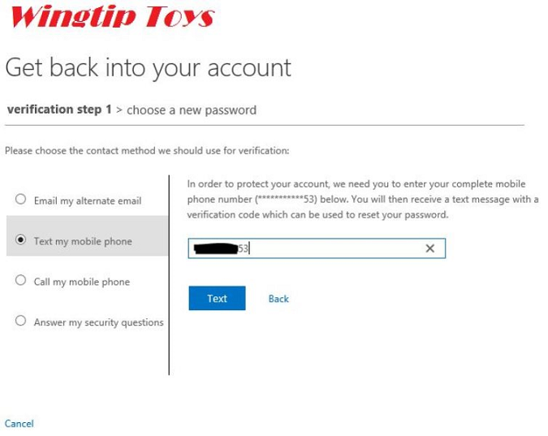
6. When you receive the text, make sure you use the verification code in the message body, not the number the code was sent from. It might take a few minutes to get the text, so grab a coffee!  
   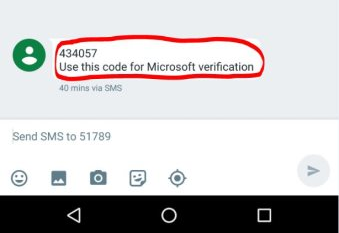
7. Now, enter the code you just received on your phone into the input box on the page.
   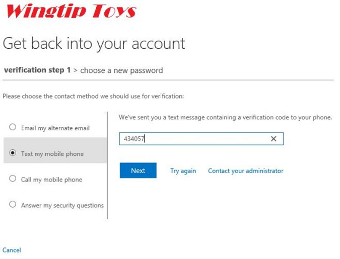
8. Your admin may require a second verification step, in which case repeat step 4 with a different option selected.
9. On the "choose a new password" screen, select a new password and confirm your choice, then click **Finish**.
   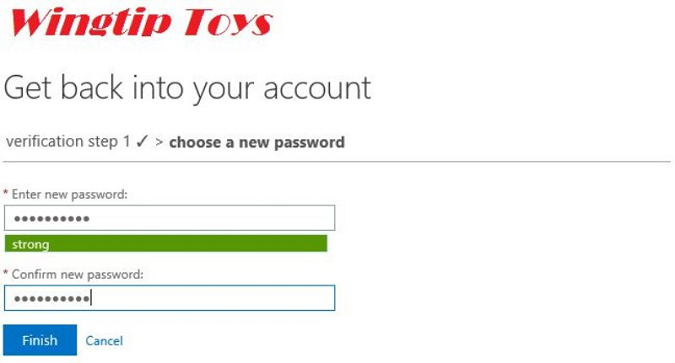
10.	Once you see the success page, you are good to go! You can now sign in with your new password.
    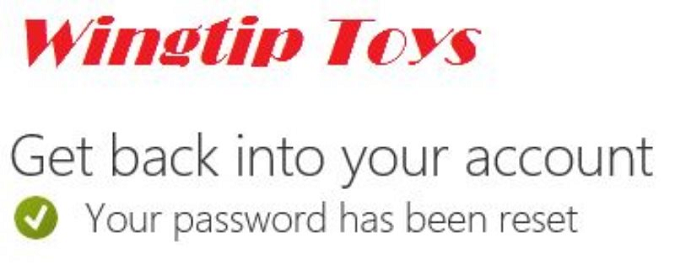
    Run into a problem resetting your password? Read about [common problems and their solutions](https://azure.microsoft.com/documentation/articles/active-directory-passwords-update-your-own-password/#common-problems-and-their-solutions).

### Want to learn more?
See [Enterprise Mobility + Security](https://www.microsoft.com/en-us/server-cloud/enterprise-mobility/overview.aspx).
