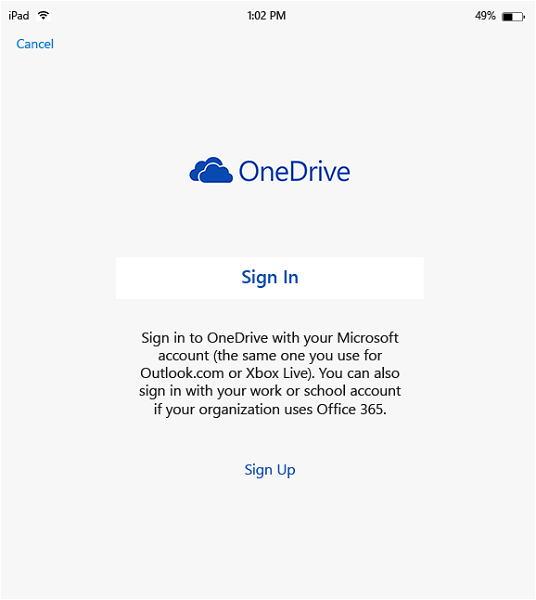
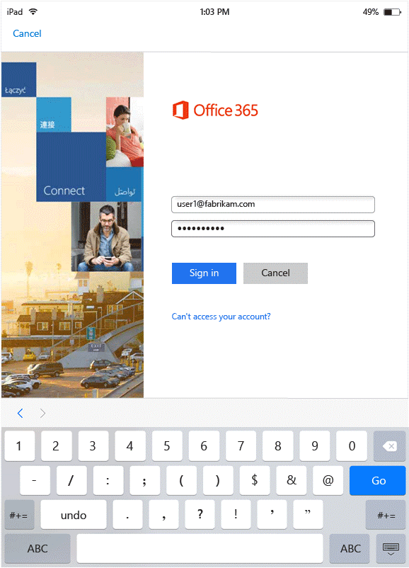
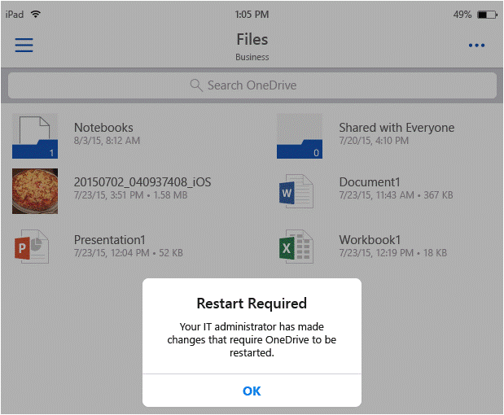
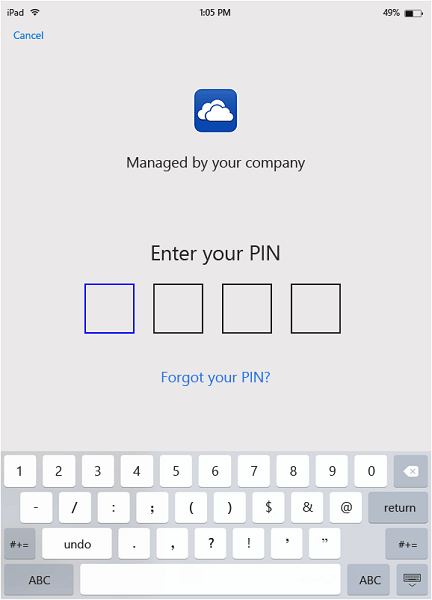
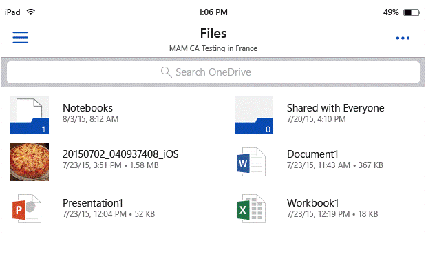
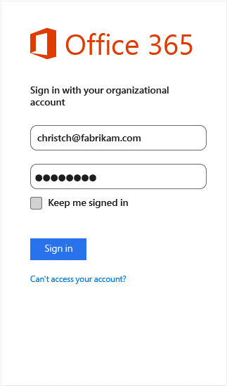
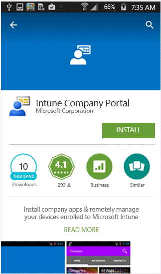
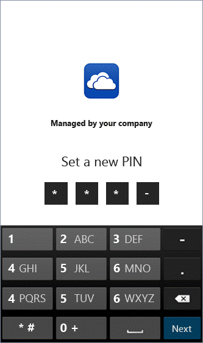

---
# required metadata

title: How to use mobile applications that your organization manages
description: How to use mobile apps managed by your organization
keywords:
author: nathbarn
ms.author: nathbarn
manager: angrobe
ms.date: 02/01/2017
ms.topic: article
ms.prod:
ms.service: microsoft-intune
ms.technology:
ms.assetid: 174348f0-dbc6-4204-8626-3c6f38b7bbde

# optional metadata

#ROBOTS: noindex
#audience:
#ms.devlang:
ms.reviewer:
ms.suite: ems
#ms.tgt_pltfrm:
#ms.custom:

---

# How to use mobile apps managed by your organization

## Accessing OneDrive on an iOS device

This section uses OneDrive for Business as the example to demonstrate how the user’s experience can slightly change on an application managed by Intune.

1. Launch the **OneDrive for Business** app to open the sign in page.

   
   > [!NOTE]
   > On a personal device, typically the end user would download the app. If the device is managed by a MDM solution, you can deploy the app to the device.

2. Type your work account user name. You are redirected to the **O365 authentication** page to enter your work credentials.

   
3. After your credentials are successfully authenticated by Azure AD, the MAM polices are applied, and you will be asked to restart the **OneDrive for Business** app.

   
   > [!NOTE]
   > The restart required dialog box is displayed only on devices that are not enrolled in Intune.

4. Re-launch the **OneDrive for Business** app. The app launches with the MAM policies turned on. You are now prompted to set a **PIN** for the app. (if you configured the policy for this).

   
5. Once you set the PIN and confirm, you are able to access the files on your **OneDrive for Business**.

   
   > [!NOTE]
   > When you change a deployed policy, the changes will be applied next time you open the app.

## Accessing OneDrive on an Android device
This section uses OneDrive for Business as the example to demonstrate how the user’s experience can slightly change on an application managed by Intune.
1. Launch the **OneDrive for Business** app to open the sign in page.
   > [!NOTE]
   > On a personal device, typically the end user would download the app. If the device is managed by a MDM solution, you can deploy the app to the device.

2. Type your work account user name. You are redirected to the O365 authentication page to enter your work credentials.

   
3. Once your credentials are successfully authenticated by Azure AD, you should see a message displayed with instructions to install the company portal app, if it is not already installed on the device. Tap **Get the app** to proceed.
   > [!NOTE]
   > The Company Portal app is required for all apps associated with MAM policies on Android devices. For devices not enrolled in Intune, the app must be installed on the device, but does not require launching or signing into the app.

4. You are now in the **Google Play** store where you can download and install the **Company Portal** app.

   

   The Company Portal app helps keep the data secure and protected.
   
5. Once you have completed the install, choose **Accept** to accept the terms.
6. The **OneDrive for Business** app launches automatically.
7. The next time you open OneDrive for Business, you will see the prompt to set a **PIN**, provided the policy settings are set to require a PIN to access the **OneDrive for Business** app.

   
8. Once the PIN is set and confirmed, you can continue using **OneDrive for Business**, which is now managed by app policies.

### Want to learn more?
See [Enterprise Mobility + Security](https://www.microsoft.com/en-us/server-cloud/enterprise-mobility/overview.aspx).
