---
# required metadata

title: End-user Intune enrollment instructions for IT admins
description: End user Intune enrollment instructions for IT administrators
keywords:
author: nathbarn
ms.author: nathbarn
manager: angrobe
ms.date: 02/01/2017
ms.topic: article
ms.prod:
ms.service: microsoft-intune
ms.technology:
ms.assetid: 5c13446e-aa31-47df-ad9d-373be7660197

# optional metadata

#ROBOTS: noindex
#audience:
#ms.devlang:
ms.reviewer:
ms.suite: ems
#ms.tgt_pltfrm:
#ms.custom:

---

# End-user Intune enrollment instructions for IT administrators

This document contains enrollment instructions that you can customize and give to your users to help them enroll their iOS and Android devices in Microsoft Intune™ (for Windows devices, see [Using your Windows device with Intune](https://docs.microsoft.com/intune-user-help/using-your-windows-device-with-intune). We recommend that you copy the parts of this document that you think are most appropriate for your users. For example, you may want to produce a single document for each device platform, or to add more screenshots.

In addition to these written instructions, you can also include hyperlinks to any of the Intune end user videos, found at [https://channel9.msdn.com/Series/IntuneEnrollment](https://channel9.msdn.com/Series/IntuneEnrollment).

> [!NOTE]
> Microsoft, Intune, and Office 365 are registered trademarks of Microsoft Corporation. iPhone, Mac and Apple are trademarks of Apple, Inc. Android is a trademark of Google Inc. Samsung KNOX is a trademark of Samsung Electronics Co., Ltd.

## Why enroll in Intune
When you enroll, you are able to use your mobile device to access work or school files and data. It also allows your IT department to manage those work or school resources and keep them secure, while giving you the freedom to use your preferred device to get your work done.

To use your device at work, enroll it in Intune by using the Company Portal. You can then easily find company apps to install, see other devices you’ve added, and find contact information for your IT administrator. You will also be giving your IT administrator permission to manage your device to help protect the company information on the device. Before starting enrollment, make sure that you have a good wifi or cellular connection to the Internet before beginning.

## Enroll your Android device in Intune using the Intune Company Portal app

These enrollment steps are for Samsung Knox Android devices and "native” (non-Samsung Knox) Android devices. To determine if you have a Samsung Knox device, go to **Settings > About phone**. If you don't see the word "Knox" listed there, you have a native Android device. The screens shown on your device may look slightly different from the ones in this section.

If you get an error while trying to enroll your device in Intune, see [Send enrollment errors to your IT admin](https://technet.microsoft.com/en-US/library/mt502762(TechNet.10).aspx#BKMK_andr_send_enroll_errors).

Before or after enrolling, you may be asked to choose a category that best describes how you use your device. Your IT administrator uses this category to help determine what apps you have access to.
1.	Install the free Microsoft Intune Company Portal app on your device from [Google Play](https://play.google.com/store/apps/details?id=com.microsoft.windowsintune.companyportal).
2.	Open the Microsoft Intune Company Portal app.
3.	On the Company Portal **Welcome** screen, tap **Sign in**, and then sign in with your work or school account.

  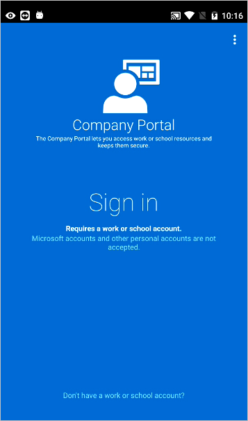

4.	If your IT administrator set up company terms and conditions, tap **ACCEPT** to accept the terms.

  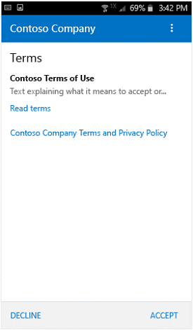
5.	If you are using an Android 6.0 or later device, do this step; otherwise, go to the next step.

  If your IT administrator set up certain policies, you may see either or both of the following messages:

  - If you see the message, **Allow Company Portal to access your contacts?**, tap **ALLOW**. It is safe to tap ALLOW, because Microsoft never accesses your contacts! Google controls the message text, so Microsoft cannot change it. When you allow access, it only allows the Company Portal app to access data logs to help troubleshoot issues with your device.

        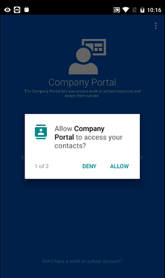
  - If you see the message, **Allow Company Portal to make and manage phone calls?**, tap **ALLOW**. It is safe to tap ALLOW, because Microsoft never makes or manages your phone calls! Google controls the message text, so Microsoft cannot change it. When you allow access, it only allows the Company Portal app to see your phone number and an ID called an IMEI.

        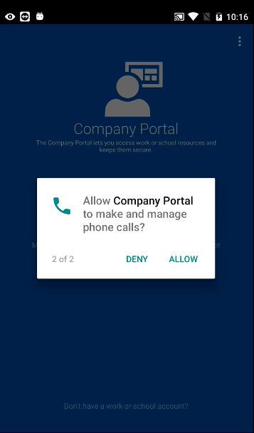

  If you tap **DECLINE**, the messages will appear again the next time you sign in to the Company Portal app, but you can turn off future messages by tapping the **Never ask again** check box. If you later decide to allow access, go to **Settings > Apps > Company Portal > Permissions > Phone**, and then turn on the permission.
6.	Sign in to the Company Portal app using your work or school account and password, and tap **Sign in**.

  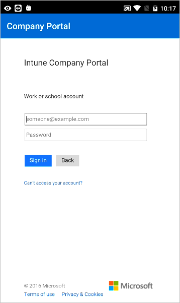
7.	On the Company Access Setup page, tap **BEGIN**.

  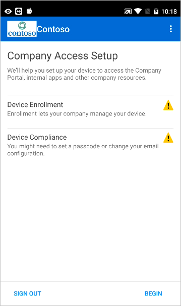
8.	Read about what you’ll be able to do when you enroll your device, and then tap **CONTINUE**.

  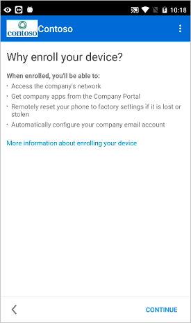
9.	See the list of what your IT administrator can and can’t see on your enrolled device, and tap **CONTINUE**.

  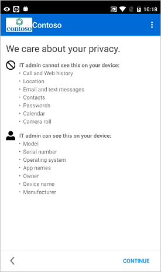
10.	Review some of the things that you might see once you tap Enroll. When you finish reading, tap **ENROLL**.

  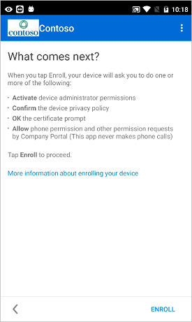
11.	On the Activate device administrator screen, tap **ACTIVATE**.

  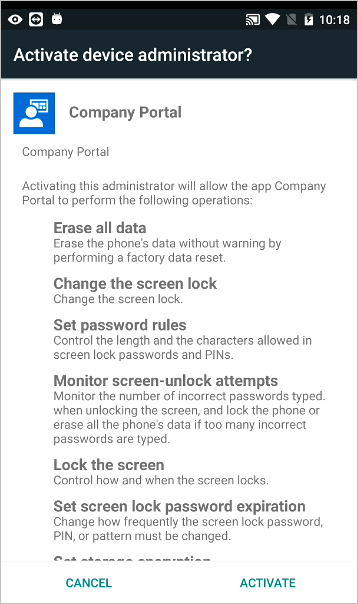
12.	Follow the prompts to enter a PIN or password. If you already set up a PIN or password on this device, you won't see this screen or be required to enter a new PIN or password.

  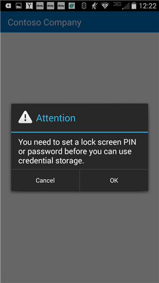
13.	Follow the instructions below that match the type of device you’re using (native Android or Samsung Knox). If you don’t have a Samsung Knox device, follow the instructions for native Android. To determine if you have a Samsung Knox device, go to **Settings > About phone**. If you don't see the word "Knox" listed there, you have a native Android device.
 - Native (non-Samsung Knox) device: On the **Name the certificate screen**, tap **OK** to accept the default certificate.

        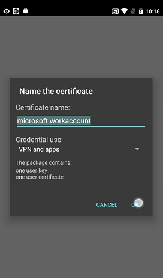
 - Samsung Knox device: Tap **CONFIRM**

        

 You’ll see the following message appear on your screen as Intune enrolls your device.

  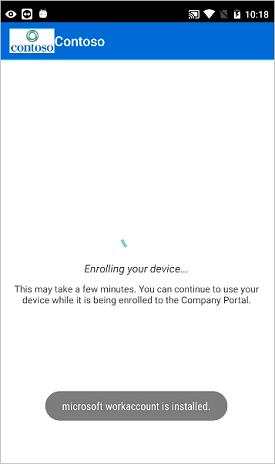
14.	 On the **Company Access Setup** screen, tap **CONTINUE**. If your IT administrator set up additional security requirements, such as the need to set a password, follow the on-screen instructions, and then tap **CONTINUE** when you are taken back to the Company Access Setup screen.

  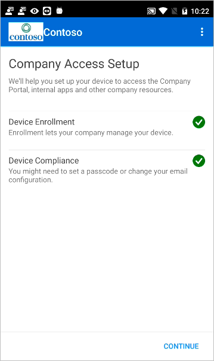
15.	Tap **DONE**.

  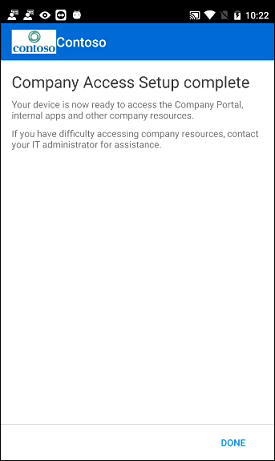
16.	Your device is now enrolled in Intune, and you are taken back to the Company Portal app.
17.	Before trying to install company apps, go to **Settings > Security**, and turn on **Unknown sources**. If you don't turn on this option before trying to install apps, you'll see the message "Install blocked. For security reasons, your phone is set to block installations of apps obtained from unknown sources." You can tap **Settings** on the error dialog to go to the **Unknown sources** option.

## Enroll your iOS device in Intune
Use these instructions to enroll your iOS device in Intune. For more information about enrollment, see [What happens when I install the Company Portal app and enroll my device in Intune?](https://technet.microsoft.com/library/mt598622(TechNet.10).aspx#BKMK_ios_what_happ_enroll). If you get an error while trying to enroll your device in Intune, see [Send enrollment errors to your IT admin](https://technet.microsoft.com/library/mt598622(TechNet.10).aspx#BKMK_ios_error_enrolling_tbl).

Before or after enrolling, you may be asked to choose a category that best describes how you use your device. Your IT administrator uses this category to help determine what apps you have access to.
1.	Install the free Microsoft Intune Company Portal app on your device from the App Store.
2.	Open the Microsoft Intune Company Portal app.
3.	On the Company Portal **Welcome** screen, tap **Sign in**, and then sign in with your work or school account.

  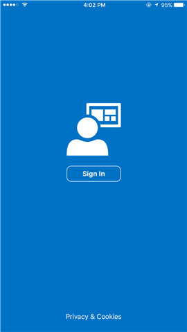
4.	If your IT administrator set up company terms and conditions, tap **Accept** to accept the terms.
5.	On the Company Access Setup page, tap **Begin**.

  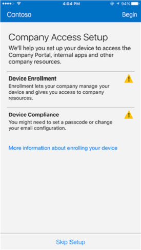
6.	Read about what you’ll be able to do when you enroll your device, and then tap **Continue**.

  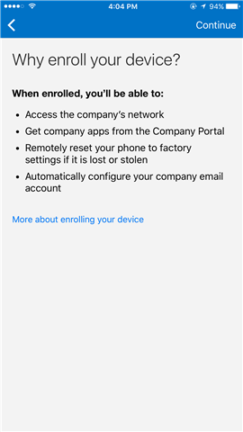
7.	See the list of what your IT administrator can and can’t see on your enrolled device, and tap **Continue**.

  
8.	Review some of the things that you might see once you tap Enroll. When you finish reading, tap **Enroll**.

  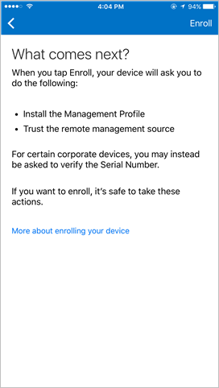
9.	On the Install Profile screen, tap **Install**, and enter your passcode, if prompted.

  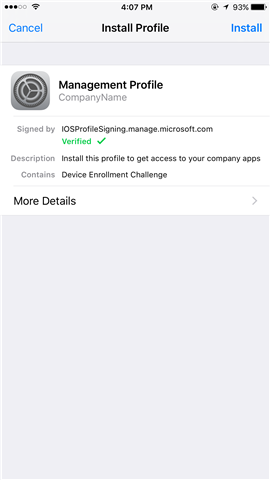
10.	Tap **Install**.

  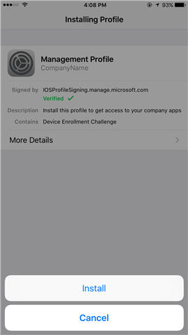
11.	Tap **Install** to indicate that you've read the warning.

  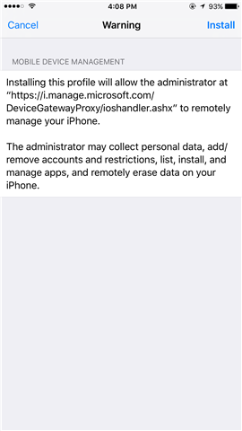
12.	Tap **Trust**.

  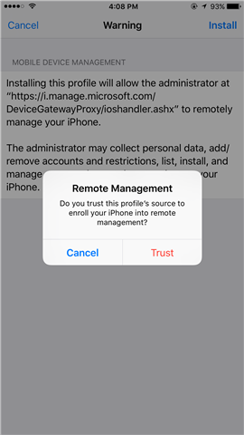
13.	When the screen changes to show that the profile has finished installing, tap **Done**. An “Enrolling device” message displays on the screen.

  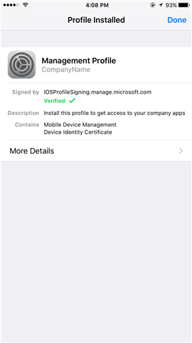
14.	When a message displays asking if you want to open the page in the Company Portal, tap **Open**.

  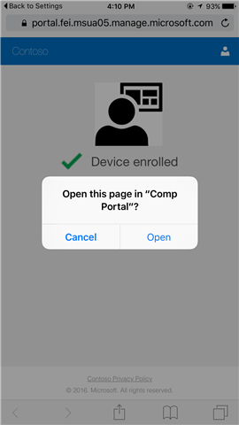
- On the Company Access Setup screen, tap **Continue**. If your IT administrator set up additional security requirements, such as the need to set a password, follow the on-screen instructions until you meet all of the compliance requirements, and then tap **Continue** when you are returned to the Company Access Setup screen.

  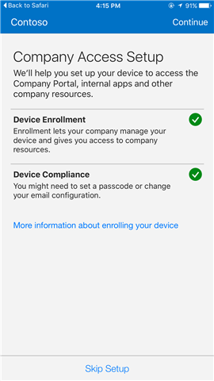
15. Tap **Done**.

  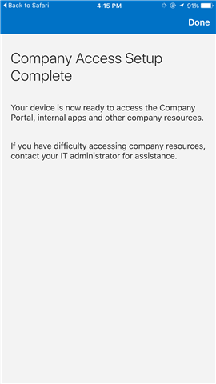

Your device is now enrolled in Intune, and you are taken back to the Company Portal app.

## Enroll your Mac OS X device in Intune
1.	Using a Safari browser, open the [Company Portal website](https://portal.manage.microsoft.com/), and tap the notification bar.
2.	Tap **This device is either not enrolled or the Company Portal can't identify it**.

  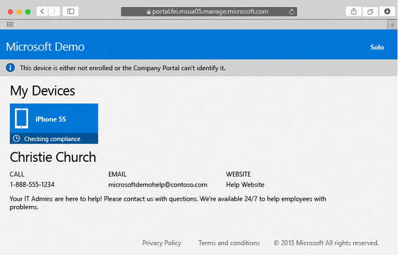
3.	Tap **Install** to start enrolling your device.

  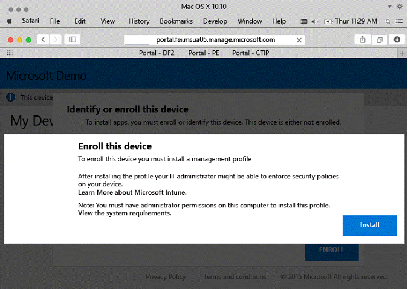
4.	On the Install Management Profile dialog, tap **Install**. If a dialog box appears asking you to enter your credentials, enter your username and password, and then tap **Continue > Install**.

  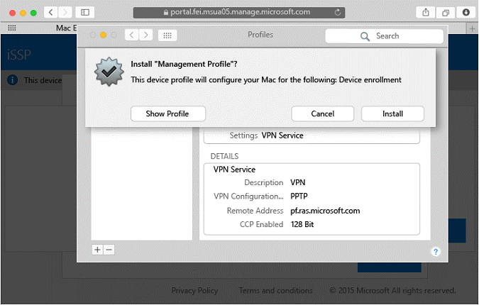

When you finish enrolling, you'll see a Management Profile page showing that your profile has been verified.

  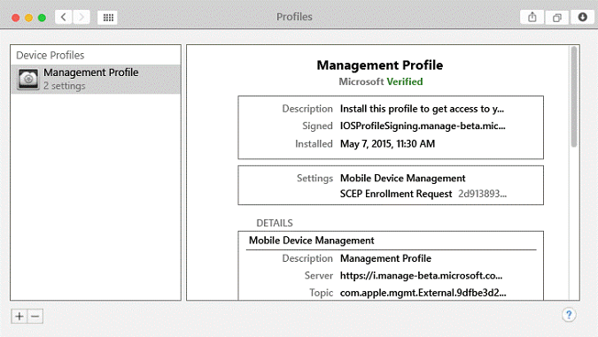

### Want to learn more?
See [Enterprise Mobility + Security](https://www.microsoft.com/en-us/server-cloud/enterprise-mobility/overview.aspx).
