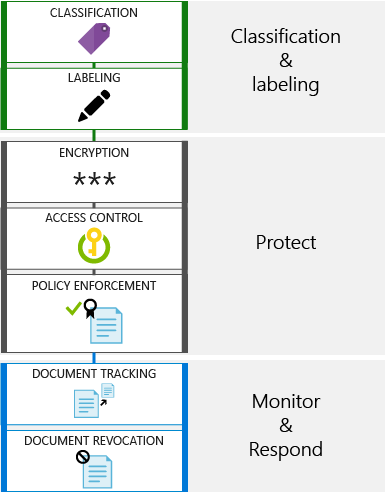
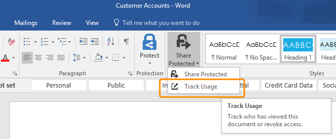
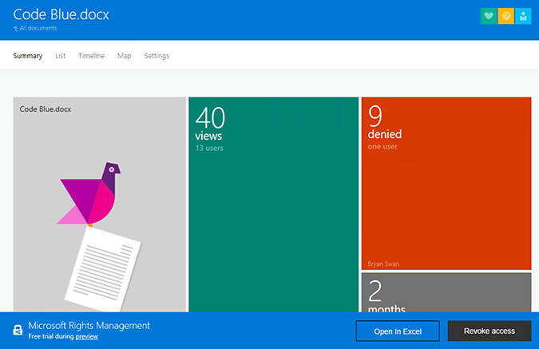
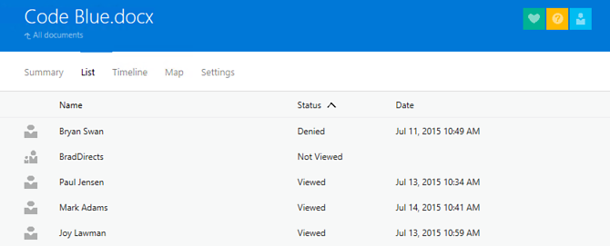
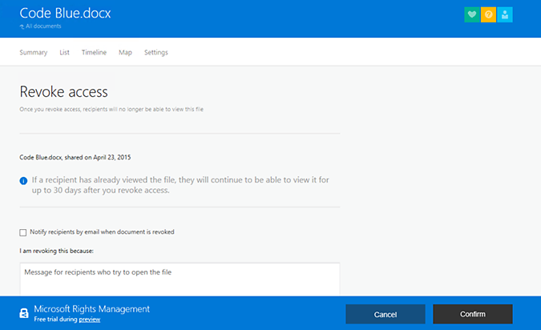

---
# required metadata

title: Track usage of shared data and respond to data abuse | Azure Rights Management
description: A scenario that describes how Enterprise Mobility + Security can be used to track usage of shared data and respond to data abuse by leveraging Azure Rights Management capabilities.
author: yuridio
manager: swadhwa
ms.date: 12/7/2016
ms.topic: solution
ms.prod:
ms.service: rights-management
ms.technology: techgroup-identity
ms.assetid: c7e6e01a-5796-4bd7-a0c5-847ecfc08a1e

# optional metadata

#ROBOTS:
#audience:
#ms.devlang:
ms.reviewer: v-craic
ms.suite: ems
#ms.tgt_pltfrm:

---

# Track usage of shared data and respond to data abuse

Having visibility and control over shared data is critical to track data use or abuse. Nowadays data sharing is broader and organizations will need to share data outside of their domain to address business needs.

In this context, it is a common scenario for users to not only share the documents but also to monitor who is accessing the documents and to revoke access when necessary. IT administrators want to have a similar experience that they have nowadays when sharing data with a group of authorized users - they want to keep in control and take proper actions regarding data use or abuse. Continue reading to learn more about how Enterprise Mobility + Security helps address this scenario.

## How can Enterprise Mobility + Security help you?
Enterprise Mobility + Security (EMS) is the only comprehensive cloud solution that protects corporate data on the device itself and beyond with four layers of protection across identities, devices, apps, and data. EMS helps you solve one of the key challenges in the mobile-first, cloud-first world – how to share data while staying in control and taking actions to quickly respond to an issue. With EMS, you will enable your employees to collaborate securely within and outside of your organization. EMS allows document owners and admins to track activities on sensitive files that they have shared with others. They can view activities, such as recipients opening the file or unauthorized users being denied access to the files. Users can also view the geographical locations from which the files were accessed. With a single click, the users can also revoke access to a shared file.

### Recommended solution
By integrating Azure Rights Management you can track how people are using your protected documents. If necessary, you can also revoke access to these documents when you want to stop sharing them. This capability is available for Office applications (Word, Excel, Outlook and PowerPoint), using the RMS group, Share Protected option, and Track Usage. For Windows systems, you can also use File Explorer and for all other supported devices, you can track usage using the web browser. Tracking and revocation is part of the monitor & respond phase of the document lifecycle as shown in the following diagram:

Watch this short video for a quick introduction on how Azure Information Protection makes it simpler to track document usage.

<iframe width="675" height="480" src="https://sec.ch9.ms/ch9/76ac/35499c0a-859c-4a3e-9a5c-fa4e5d0e76ac/AzureRMSDocumentTrackingandRevocation_high.mp4 " frameborder="0" allowfullscreen></iframe>

#### How to implement this solution
Tracking usage of shared data is not a capability that you have to configure, if you already used the steps from the scenario [Share sensitive data internally](https://docs.microsoft.com/enterprise-mobility-security/solutions/share-sensitive-data) and externally  to configure Azure Rights Management and the client application. Now you just need to choose how you want to track your documents. The available options are:

1. Track usage using Office
- Track usage using Browser
- Revoke access to shared document

### How to track usage of shared data and respond to data abuse
In the sections that follows you have the available options to track usage of shared data according to a specific scenario.

#### Scenario 1: Track usage using Microsoft Office
For users that are trying to obtain more information regarding document usage that was protected using Office applications (Word, Excel, and PowerPoint), they can use the RMS group, select **Share Protected** option, and then click **Track Usage**, as shown in the following image:

Read [Track and revoke your documents when you use the RMS sharing application](https://docs.microsoft.com/information-protection/rms-client/sharing-app-track-revoke) for more information regarding this feature.

#### Scenario 2: Track usage using Browser
In some circumstances, you may not have an Office application installed on your device, but you still need to monitor document usage. From a [supported browser](https://docs.microsoft.com/rights-management/rms-client/sharing-app-track-revoke), go to the [document tracking site](http://go.microsoft.com/fwlink/?LinkId=529562), sign in with your credentials, and when you select the document that you want to track, you should see statistics of usage as shown in the following screen:

In this screen, you can see the number of views and number of denied access for the number of months that this file was shared. Although each tile has a summary showing the users that accessed the file, you can obtain more information when you click on the tile. For the example in the previous screen, the following result is shown when selecting the denied access:

#### Scenario 3: Revoke access to shared document

While monitoring document, usage is an important step to understand a user’s behavior, the biggest value comes when you can take an action based on what you found while monitoring the document. For example, after reading the usage report you identified that a valid user received access denied while trying to access this document. At this point you should take a corrective action to fix this issue.

There are also scenarios where you are responding to a security incident. For example, it was identified that one of the documents that was widely shared has company’s confidential information and HR requested IT to revoke access to this document. When you [revoke a document](https://docs.microsoft.com/rights-management/rms-client/sharing-app-track-revoke), it doesn't delete the document that you shared, but authorized users will no longer be able to open it. To revoke access, you just need to click **Revoke Access**, located in the track usage page and you will see a form similar to the following screen:

You can enable the option to notify the recipients that the access to this documented was revoked and you can include a message with the explanation of why this document was revoked.
