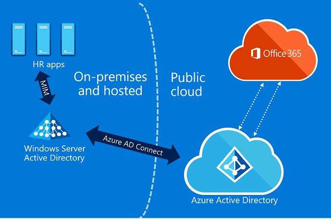
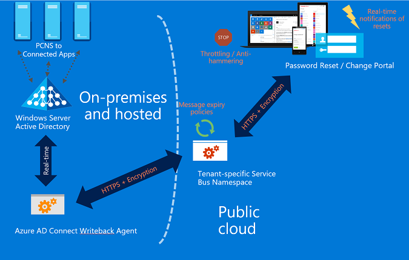
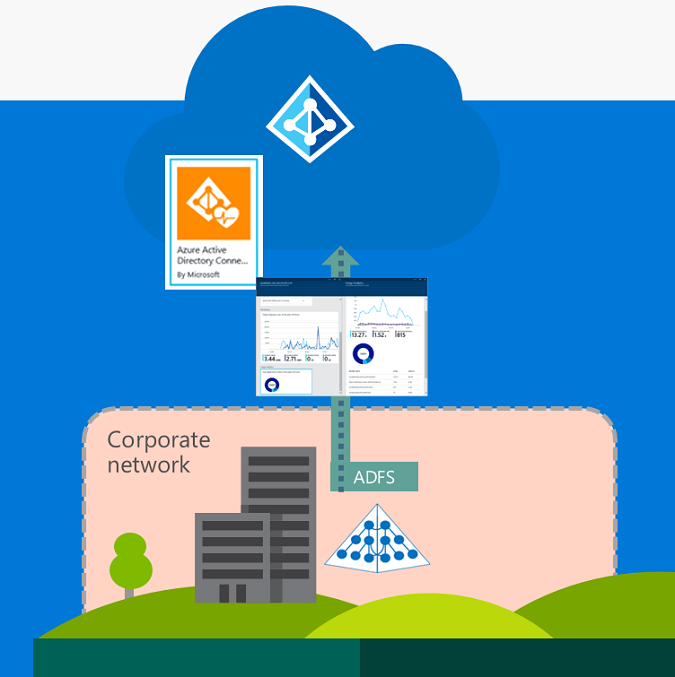
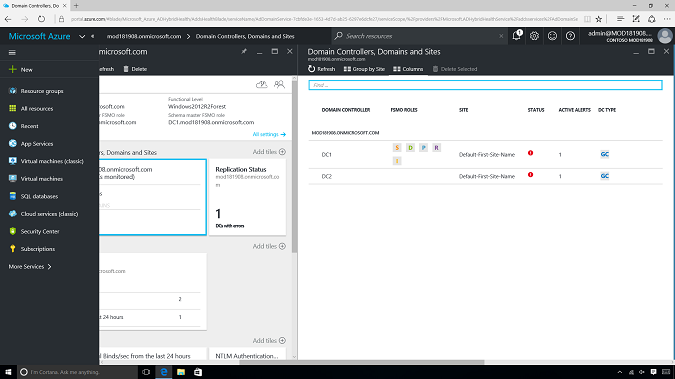
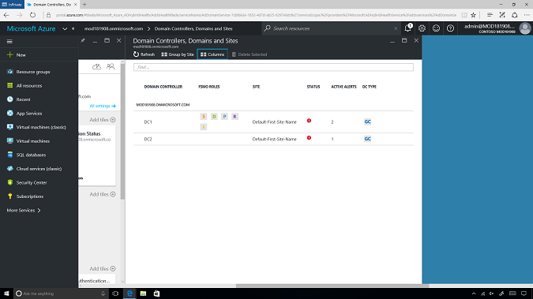
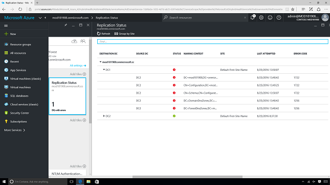
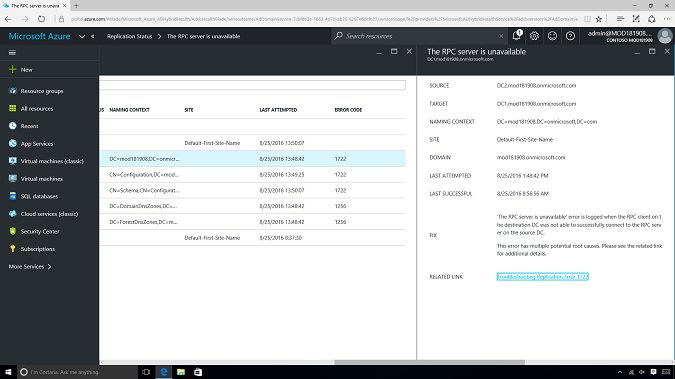
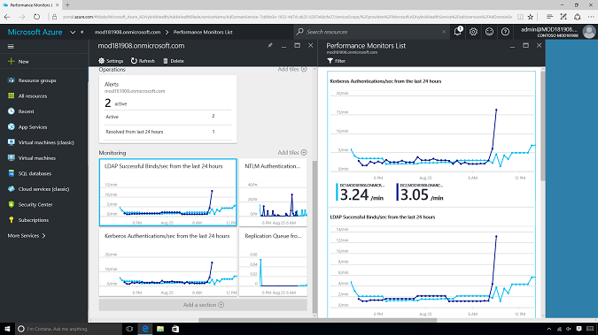

---
# required metadata

title: Manage access at scale
description: Manage access at scale
keywords:
author: craigcaseyMSFT
manager: jeffgilb
ms.date: 10/18/2016
ms.topic: article
ms.prod:
ms.service:
ms.technology:
ms.assetid: 0292919a-af10-4a25-8916-c704aed643f6

# optional metadata

ROBOTS: noindex
#audience:
#ms.devlang:
ms.reviewer:
ms.suite: ems
#ms.tgt_pltfrm:
#ms.custom:

---

# Manage access at scale
Microsoft has been empowering organizations since its existence. Microsoft not only provides identity that takes you everywhere, but it also provides a set of tools to automate, secure, and manage IT within your organization. Even after the advent of cloud-computing, there is still demand to manage and control IT operations like helpdesk calls to reset user passwords, user group management, and application requests.

## How can Enterprise Mobility + Security help you?
Enterprise Mobility + Security (EMS) is the only comprehensive cloud solution that natively protects corporate data on the device itself and beyond with four layers of protection across identities, devices, apps, and data. EMS helps you solve one of the key challenges in the mobile-first, cloud-first world – how to provide a comprehensive set of tools within  Azure Active Directory (Azure AD) that will help you with the following:
- Advanced user lifecycle management
- Low IT overhead and cost
- Monitor your identity bridge

### Recommended solution
Azure AD Premium is the recommended solution to empower your organization with identity access management.
#### Advanced user lifecycle management
Azure AD provides  automated advanced user lifecycle management by leveraging, dynamic group membership rules, and application management capabilities.

- For organizations with on-premises HR, Microsoft identity Manager establishes user identities in Windows Server Active Directory.
- For organizations with Software as a service (SaaS) delivered HR, Azure AD currently integrates with Workday, and will integrate with more apps in the future.
- Azure AD Connect synchronizes users and groups between Windows Server Active Directory and Azure AD.
- Azure AD provides group-based automated licensing for Office 365, and other Microsoft online services.

#### Application management
How many users like to remember passwords for each application they  use every day? [Single Sign-on](https://azure.microsoft.com/en-us/documentation/articles/active-directory-appssoaccess-whatis/) addresses this common problem: you can log into several SaaS applications by using a single user account and password, which can be automatically provisioned for all the applications within your organization. This capability is available for Microsoft cloud applications such as Office 365, and for third-party applications such as Salesforce, ServiceNow, and Workday.

 It is also available for on-premises applications through [Azure AD Application Proxy](https://azure.microsoft.com/documentation/articles/active-directory-application-proxy-publish/), which offers a simple, secure, and cost-effective remote access as a service solution to all your on-premises applications. Your remote employees can access your on-premises resources without being restricted to the corporate network and without requiring IT to implement VPN, DMZ environments, or reverse proxies.

 - It works in the cloud, so you can save time and money. On-premises solutions require you to set up and maintain DMZs, edge servers, or other complex infrastructures.
 - It is easier to set up and secure than on-premises solutions because you don't have to open any inbound connections through your firewall.
 - It offers great security. When you publish your apps using Azure AD Application Proxy, you can take advantage of the rich authorization controls and security analytics in Azure. This means that you get advanced security capabilities for all your existing apps without having to change any app.
 - It gives your users a consistent authentication experience. Single sign-on gives your end users the ease and simplicity of access to all the apps they need to be productive with one password.

#### Low IT overhead and cost
Azure AD Premium also offers self-service for password reset, group management, and app management capabilities to empower IT and end-user’s productivity in your organization. There’s no need for users to make helpdesk phone calls and spend minutes and minutes in a call, provide a lot of information to get a temporary password, which is sent by e-mail or shared during the call in an unsecured way.
- It works with federation, password sync, or cloud-only user accounts. It also enforces all your on-premises password policies.
- All traffic is encrypted with tenant-specific key, and over HTTPS.
- Users can update their AD password or unlock their own AD accounts in real-time.
- Real-time notifications are sent to users and admins.

#### Monitor your identity bridge
Azure AD Connect Health helps organizations to monitor and gain insight into their on-premises identity infrastructure and the synchronization services, as well as to maintain a reliable connection to Office 365 and Microsoft Online Services by providing monitoring capabilities for their key identity components, such as AD FS Servers, Azure AD Connect servers, and Active Directory Domain Controllers.

- One-click audit & compliance through Azure portal.
- Forensics and investigation: helps IT administrators to answer “who did what, where, and when”.
- Activity reports: provides audit, sign ins, SSPR, group activity, app activity, app provisioning, etc.
- Security Reports: provides rich mitigation and resolution for security anomalies through Identity protection.

## How to implement an advanced user Lifecycle management
Let’s go through a few examples, and the steps you could take to implement this solution:
1. In a real-world scenario, your organization hires a professional, and adds his/her user to the HR system as a member of the Marketing team.
2.	Assuming you’ve already integrated your on-premises Active Directory with Azure AD through directory synchronization, the on-premises Azure AD Connect synchronizes the user account with Azure AD.
3.	After the user account shows up on Azure AD, you can create a dynamic group membership rules that automatically assigns Marketing users to it.
4.	After the Marketing group is automatically populated with its users, you can leverage group-based selective licensing, which gives you the ability  to add users into a specific license group such as Azure AD Premium or Office 365 Enterprise E5.
  - In this example, that gives the users access to all the required Office 365 apps they need to perform their work, as well as Azure AD Premium accesses to perform other automated tasks.

If for some reason an employee needs to leave the company, you can remove them from the HR system, which will automatically remove access from all the applications and resources previously provisioned to them. If the employee just needs to move to another department, the dynamic group membership rules will automatically remove access from Marketing applications and add access to another department’s applications as the user gets removed from the Marketing team and added into the new department’s dynamic group.

### How to manage cloud and on-premises applications
Here are the steps that you could take to add, deploy and manage Microsoft, and third-party SaaS applications with Azure AD.
- Learn more about [Integrating Azure AD with applications](https://azure.microsoft.com/documentation/articles/active-directory-integrating-applications-getting-started/).
- Learn more about [Enabling Single-Sign-On to SaaS apps](https://azure.microsoft.com/documentation/articles/active-directory-sso-integrate-saas-apps/).
- Learn more about [Managing Access to Apps](https://azure.microsoft.com/documentation/articles/active-directory-managing-access-to-apps/).

## How to implement password reset self-service portal
By default, Azure AD comes with a free feature that lets every admin  perform their own self-service password reset.

When using Azure AD Premium, you can go beyond IT administrators by providing password reset self-service portal capabilities for your users. You can quickly enable user password reset policies that will extend the same rich admin capabilities to every user within your directory.

Learn more about the [pre-requisites, how to enable, and how to configure the password self-service portal](https://azure.microsoft.com/en-us/documentation/articles/active-directory-accessmanagement-manage-groups/) on your Azure AD tenant.

## How to implement Azure AD Connect Health
You can check the [Azure AD Connect Health documentation](https://azure.microsoft.com/en-in/documentation/articles/active-directory-aadconnect-health/) to gather more information about the tool, its capabilities, and the steps you can take to start using it in your organization.

Azure AD Connect Health is available at [Azure portal](https://ms.portal.azure.com) and requires a health agent to be installed on the on-premises domain controllers you want to monitor. Learn more about [how to install the health agent](https://azure.microsoft.com/en-in/documentation/articles/active-directory-aadconnect-health-agent-install/).

The domain controllers (DCs) dashboard provides a single point of view into the health and operational status of the environment where the admin can easily find which DCs are FSMO role owners, have active alerts, are global catalogs, along with additional columns like “PDC reachable”, “GC reachable”, “SYSVOL state”, and others:

In addition, DCs can be grouped either by their corresponding domain, or the administrator can group them by site:

The Replication Status dashboard shows what the replication topology looks like within the environment, along with information about the last replication attempt for each naming context:

The details of an alert contain more information about the issue causing the alert, the fix required, and a link to additional troubleshooting resources:

AD Connect Health performance monitoring provides an easy way to compare the performance of the monitored DCs against each other, as well as comparing different metrics of interest:

