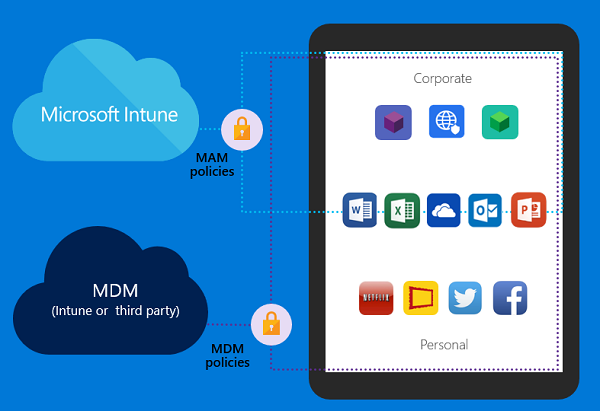

# Application management options

>[!NOTE]
>This topic is part of a larger design considerations guide. If you'd like to start at the beginning of the guide, check out the [main topic](mdm-design-considerations-guide.md). To get a downloadable copy of this entire guide, visit the [TechNet Gallery](https://gallery.technet.microsoft.com/Mobile-Device-Management-7d401582).

Mobile application management (MAM) policies help prevent your company data from being leaked to consumer apps or services on mobile devices. Typically, these policies would only be enforced on device enrolled in a mobile device management solution. Intune has now expanded its MAM capabilities to include devices managed by other mobile device management solutions and devices that aren’t enrolled in any device management system.

As shown in the figure below, if you already have an MDM solution in place, Intune MAM can help you manage and secure Office applications and Office 365 data without needing to un-enroll employee devices and re-enroll them in Intune MDM in a coexistence or migration scenario:

**Overview of application management separation for mobile devices using Intune MAM policies**

Intune MAM features are not a replacement for entire MDM solutions. The MDM protocol is required for comprehensive device management scenarios like VPN, Wi-Fi, certificate management, application deployment, and configuring device level security settings.

For hybrid deployments with ConfigMgr and Intune, mobile app management policies can be used to protect apps on devices that are not managed by Intune. Using this new capability, you can apply mobile app management policies for apps connecting to Office 365 services. This is not supported for apps connecting to on-premises Exchange or SharePoint. To use this capability, you must use the Azure preview portal.

Depending on how you answered the questions in Step 1, you should be able to determine how you want applications to be managed in the mobile device management solution. The lists below show the advantages and disadvantages of each app management option.

## Intune (standalone)

**Advantages**

- Supports managing applications on devices enrolled in Intune, on devices enrolled in other management solutions, or on devices not enrolled in any management solution
- Isolates company data from consumer personal data within apps enlightened for Intune. These include Office Mobile apps, third-party apps that have adopted the Intune SDK, or line-of-business apps wrapped by Intune
- Sharing company data with cut/copy/paste across company apps, while preventing the sharing of company data into personal apps
- Key data loss prevention policies like per-app PINs, save-as controls, and managed data sharing between apps.
- Support for these capabilities in Microsoft Word, Excel, PowerPoint, Outlook, OneNote, and OneDrive for Business
- Manage iOS apps purchased through the Apple Volume Purchase Program for Business volume-purchase program
- Supported on Android and iOS devices

**Disadvantages**

- Not supported on Windows Phone  devices

## MDM for Office 365

- Not currently supported

## Hybrid (Intune with ConfigMgr)

**Advantages**

- All the advantages of Intune standalone

**Disadvantages**

- Requires additional configuration to connect Intune with the on-premises ConfigMgr infrastructure
- For organizations that don’t have a current ConfigMgr infrastructure configured, it will need to be planned, installed and configured prior to integrating with Intune

Explore the details about mobile application management options by reviewing the following for Intune & ConfigMgr:  Configure and deploy mobile application management policies in the Microsoft Intune console. Additionally, be sure to check out the list of Microsoft apps you can use with Intune MAM policies, as well as the expanding list of Intune’s compatible partner apps.