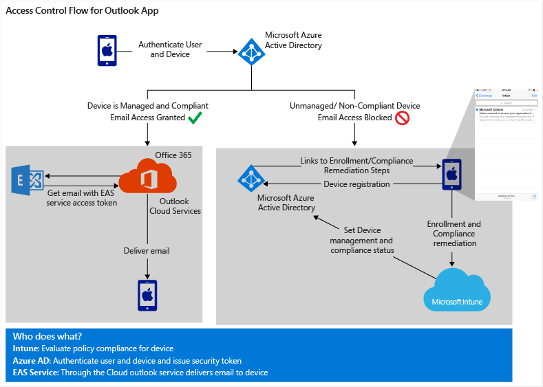

---
# required metadata

title: Protect company email and documents
description: Allow only compliant devices to access your company’s email and protect the content in email and attachments.
keywords:
author: craigcaseyMSFT
manager: swadhwa
ms.date: 04/28/2016
ms.topic: article
ms.prod:
ms.service:
ms.technology:
ms.assetid: 78d8368e-1bfe-4ac4-991d-467321a76ed7

# optional metadata

#ROBOTS:
#audience:
#ms.devlang:
ms.reviewer:
ms.suite: ems
#ms.tgt_pltfrm:
#ms.custom:

---

# Protecting corporate email and documents
Protecting corporate email involves two main objectives:

-   Allow only compliant devices to access your company’s email

-   Protect the content in email and attachments

## Allow only compliant devices to access your company’s email
An important step to protecting corporate data is restricting access to devices that don’t use a strong password, are not jailbroken, or not encrypted. Microsoft Intune gives you the ability to set conditions that your users have to meet to gain access to your company resources. This is known as conditional access.

Conditional access is determined by two types of policies you can set in Intune:

**Compliance policies** determine the compliance of a device. They evaluate settings and conditions like:

-   **PIN and passwords**: Your IT can create rules to require passwords before unlocking a device, the complexity of the password, password expiration, and other password settings.

-   **Encryption**: Your IT can restrict access to devices that are encrypted.

-   **Device is not jailbroken or rooted**: Intune can detect if an enrolled device is jailbroken, and your IT can set the policy to block access on such devices.

**Conditional access policies** are configured for a particular service like Exchange Online or SharePoint Online. For each service, you can define which groups of users these policies should apply to. For example, you can make sure that everyone in the finance department can only access company email from enrolled and compliant devices.

## High level end-user experience
After the solution is implemented, end-users will only be able to access the company email on managed and compliant devices. Once they have the ability to access the email on the devices, the company data is protected and contained within the app ecosystem and only available to the intended users. Access can be revoked at any time if the device becomes noncompliant.

Specifically, the conditional access policies set in Intune ensure that the devices can only access email if they are compliant with the compliance policies you set. Actions such as copy and paste or saving to personal cloud storage services can be restricted using mobile application management policies. Azure Rights Managements service can be used to ensure that the sensitive email data, and forwarded attachments, can only be read by intended recipients. The end-user experience is described in more detail in [End-user experience of conditional access](end-user-experience-conditional-access.md).

Watch [this](https://www.youtube.com/watch?feature=player_embedded&v=lYx3YIezccg) four minute video to see how conditional access affects your end users.

## Why Architecture Matters
The different components of EMS and Office 365 are built for and designed to run in the cloud. This brings all the benefits that the cloud offers: scalability, flexibility, and ease of management.

Since different businesses have different requirements, EMS is designed to integrate with existing on-premises infrastructure such as Active Directory, Exchange Server, or System Center Configuration Manager. This allows you to use the credentials already established in your network for both on-premises and cloud resources.

The following sections describe the architecture as designed to run in the cloud, and touch briefly on the on-premises option.

### Email Access Flow
Depending on the type of email application that you use to access Exchange online, the path to establishing secured access to email can be slightly different. However, the key components: Azure Active Directory (Azure AD), Office 365/Exchange Online, and Microsoft Intune, are the same. The IT experience, and end-user experience also are similar. EMS currently supports native email apps and the Microsoft Outlook app for iOS and Android.

### Access control flow for native email applications
Exchange ActiveSync (EAS) clients attempting to access email in Exchange Online will be evaluated for the following properties:

-   Is the device managed by Intune?

-   Is the device registered with Azure Active Directory?

-   Is the device compliant?

-   Is the client EAS ID mapped to a registered device?

To get to a compliant state, the device on which the EAS client is running needs to:

-   Enroll with Intune

-   Register with [Azure Active Directory](https://msdn.microsoft.com/en-us/6a14cb1f-a058-4453-8ede-d9f4a66a7073.aspx), and

-   Be compliant with the device policies set by your IT admin.

On most platforms, the Azure Active Directory device registration happens automatically during enrollment. The device states are written by Intune into Azure Active Directory, and then read by Exchange Online the next time the EAS client tries to get email. If the device is not registered, the user will get a message in their inbox with instructions on how to register (also known as enrolling). If the device is not compliant, the user will get a different email that redirects them to the Intune web portal where they can get more information on the compliance problem and how to remediate it.

**Azure AD**, authenticates the user and the device, Microsoft Intune manages the compliance and conditional access policies, and **Exchange Online** manages access to email based on the device state.

### Access control flow for Outlook applications
Similar to the EAS client, the Outlook email app attempting to access mail in Exchange Online will be evaluated for the following properties:

-   Is the device managed by Intune?

-   Is the device registered with Azure Active Directory?

-   Is the device compliant?

The device compliance is established in much in the same way as described in the EAS client access control flow. However, for Outlook apps, the flow between the components is slightly different. When the Outlook app attempts to get email, it is redirected to Azure AD. Azure AD issues a security token if the device is successfully evaluated to be enrolled and compliant. The security token is then used to get corporate email from Exchange Online. The email sync is actually brokered through the Outlook cloud service, which gets an EAS service access token on behalf of the user to complete the authentication and delivers the email.

## The IT admin experience:
There is no complex infrastructure setup required for Azure AD or Exchange to make this happen. Your IT admins:

-   Configure and deploy the compliance polices that are used to evaluate the compliance status of the device.

-   Configure the Exchange Online conditional access policy, and specify which Azure AD security groups will be affected by, or exempted from these policies.

-   Choose to allow or block devices that are not capable of enrolling in Intune. The list of supported operating systems for mobile devices is listed later.

There is an optional setup stage that may be needed. The reporting that is used to manage and monitor device access and status requires the Microsoft Intune service to service connector to be set up.

## The End-user experience:
When the user attempts to access email on the device for the first time, or sync subsequently, the device enrollment and compliance status is checked. The process of enrolling or fixing compliance issues is a guided experience. The end-user is shown the necessary steps to enroll their device and make it compliant without needing to call your IT help desk:

-   **If the device is not enrolled**, the sign-in page will show access denied and will prompt for enrollment. On enrollment, the device is automatically registered in Azure Active Directory. Intune checks the device for compliance and provides remediation steps to resolve any non-compliance issues. Once the device is compliant, Intune sets the device compliance status with Azure Active Directory.

-   **If the device is enrolled but is not in compliance**, a link with steps to remediate the issues is sent to the device. When the end-user corrects the issue (for example, set password, encryption), Intune which manages the compliance policies updates the compliance status of the device in Azure AD.

Once the device is evaluated as enrolled and compliant, the email sync should happen within a few minutes.

## Where to go from here
Now that you understand about protecting corporate email and documents, you can read about how to [protect email attachments](protect-email-attachments.md). Or if you are ready, learn more about [implementing a solution to protect your corporate email](implement-solution.md).
