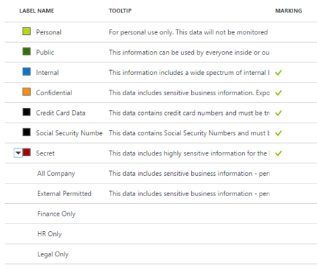

---
# required metadata

title: Protect data against user mistakes | Microsoft Docs
description: A scenario that describes how Enterprise Mobility + Security can be used to protect corporate data from user mistakes and prevent data loss by leveraging Cloud App Security and Azure Information Protection capabilities.
author: yuridio
ms.author: yurid
manager: swadhwa
ms.date: 01/23/2017
ms.topic: solution
ms.prod:
ms.service: cloud-app-security
ms.technology: techgroup-identity
ms.assetid: 0af3894c-7b0e-4c0c-8874-31e041d81300

# optional metadata

#ROBOTS:
#audience:
#ms.devlang:
ms.reviewer: v-craic
ms.suite: ems
#ms.tgt_pltfrm:
ms.custom: information-protection

---

# Protect data against user mistakes

While the transition to mobility and the cloud has substantially increased employee productivity, the complex interaction between users, devices, apps, and data –  on-premises as well as in the cloud – has generated new blind spots for IT teams. Even though organizations may not embrace this transition, employees already are. As the interactions between these components and the sophistication of attack vectors increases, security remains a top challenge for enterprises. IT staffs struggle to maintain visibility, control, and protection of corporate data.

Data control resources that protect corporate data from user mistakes and prevent data loss are important steps toward securing your resources while enabling users to be productive.

## How can Enterprise Mobility + Security help you?

Enterprise Mobility + Security (EMS) enables IT to gain deeper visibility into user, device, and data activity on-premises and in the cloud.  With EMS, IT can protect corporate data from user mistakes with stronger controls and enforcement.  IT will be able to monitor risk detection by using powerful reporting and analytics on users, upload/download traffic, usage patterns, and transactions for discovered applications.

## Recommended solution

To address the requirements of this scenario, EMS uses [Cloud App Security](https://technet.microsoft.com/library/mt489024.aspx) and [Azure Information Protection](https://docs.microsoft.com/information-protection/understand-explore/what-is-information-protection). By implementing these technologies, organizations will be able to have:

- Complete visibility into employee cloud app usage and Shadow IT
- Granular-level control and data policies for on-going data protection in cloud apps
- Persistent data classification and protection that ensures data is protected at all times—regardless of where its stored or with whom it's shared
- Ability to safely share data with people inside and outside of your organization
- Intuitive controls for data classification and protection
- Visibility and control of shared data for users and IT

The following diagram summarizes the capabilities involved in this scenario and how they are used to protect your resources:

## How to implement this solution

Follow these steps to implement [Cloud App Security](https://technet.microsoft.com/library/mt668458.aspx) and [Azure Information Protection](https://docs.microsoft.com/information-protection/understand-explore/what-is-information-protection):

- Step 1: Discover cloud apps in use and control them with policy
- Step 2: Protect data on-premises or in the cloud

## How to protect data against user mistakes

Cloud applications are in use by most enterprises today, and we will soon reach a time where more corporate data will be stored in the cloud than on-premises. Many times, users will be using SaaS apps from their devices without their company’s consent or knowledge, which causes an increase in Shadow IT usage of cloud. This conclusion comes from studies showing that 80% of employees admitted to using unapproved SaaS apps for corporate usage. [Cloud App Security](https://technet.microsoft.com/library/mt657567.aspx) provides a detailed overview of all cloud apps being used in the organization. It identifies all users and IP addresses accessing an application. It also conducts a risk assessment for more than 13,000 cloud apps and provides an automated risk score for each app based on more than 60 parameters.

Follow step 1 to discover the cloud apps in your environment and implement policies to control these apps. The second stage of this solution will implement [Azure Information Protection](https://docs.microsoft.com/en-us/information-protection/get-started/requirements) to protect and classify data, which can mitigate users' mistakes and data misuse.

### Step 1: Discover cloud apps in use and control them with policy

The first step to use Cloud App Security is to [discover your apps](https://technet.microsoft.com/en-us/library/mt657567.aspx). If you skip this step, there will be no apps to analyze and to restrict using policies. If you didn’t start the discover process, the Discover option in the Cloud App Security dashboard will show the following message:

Discovering which apps are in use across your organization is the first step in making sure your sensitive corporate data is protected. Once the discover process is finished, you will be able to see a list of apps that were discovered under the [Cloud Discovery dashboard](https://technet.microsoft.com/en-us/library/mt727946.aspx).

Each app has a score that represents the credibility and reliability of the cloud apps. When accessing the app’s rank, you will notice that there are three categories that are used to create this rank: General, Security, and Compliance. Each category has certain attributes that are tested during the discovery process. If one attribute is not fully compliant, it will show as partial and you can access the details of that attribute to understand why it is shown as partial.

The next step is to control the behavior of the applications that were discovered using policies. This capability enables IT to fine tune the applications discovered and the associated risk level to your organization. There are different types of policies; which one you should create first depends on the business requirement of your organization. By default, the Anomaly detection policy is enabled, so it's not necessary to configure a new policy for it to work. But you can fine tune which types of anomalies you want to be alerted about in the default policy.

Once the policy is configured, you can investigate potential violations to a policy that is currently in place. In this particular scenario, you want to verify if there is any Personally Identifiable Information (PII) shared in the cloud. The information about this type of activity is available via File Policy. The file-level policy you will be looking at is the PII compliance policy. The purpose of this policy is to identify files containing personally identifiable information that are publicly shared and also provide options for investigation and remediation.

In this particular case, there are three matches for this policy, which means that there are three files that match this policy. You can click on one to investigate the file name and its location.

### Step 2: Protect data on-premises or in the cloud

Before implementing this solution, review the requirements for Azure Information Protection and ensure that Azure Rights Management is activated.

Microsoft’s Azure Information Protection helps you classify and label your data at the time of creation. Protection (encryption + authentication + use rights) can then be applied to sensitive data. Classification labels and protection are persistent, traveling with the data so that it’s identifiable and protected at all times, regardless of where it’s stored or with whom it’s shared. When planning to implement information protection policies and labels, use the following guidelines:

- Classify data based on sensitivity
- Start with the data that is most sensitive
- IT can set automatic rules; users can complement them
- Associate actions such as visual markings and protection

Azure Information Protection comes with default labels, however you can customize and create your own labels or sub-labels that users see on the Information Protection bar.

> [!NOTE]
> Labels are metadata written to documents. Labels are in clear text so that other systems such as a DLP engine can read it.

In the following example, you can see custom sub-labels that were created under Secret label:

Once you define how you will be using your labels (default or custom ones), [configure a label to apply Rights Management protection](https://docs.microsoft.com/en-us/rights-management/information-protection/configure-policy-protection#to-configure-a-label-to-apply-rights-management-protection).

With Azure Information Protection, data classification and protection controls are integrated into Office and other common applications. This integration provides simple one-click options to secure data that users are working on. In the Azure portal, an administrator can apply predefined patterns, such as “Credit card numbers” or “USA Social Security Numbers” as a condition for automatic classification. Alternately, they can use text patterns and regular expressions to define a custom string or pattern.

When you configure conditions for a label, you can automatically assign a label to a document/email or, you can prompt users to select the label that you recommend. Read [How to configure conditions for automatic and recommended classification for Azure Information Protection](https://docs.microsoft.com/en-us/rights-management/information-protection/configure-policy-classification) for more information on how to perform this configuration.

> [!NOTE]
> For more information about data classification and protection read [Secure data using classification, labeling and protection](https://docs.microsoft.com/en-us/enterprise-mobility-security/solutions/infoprotect-secure-classify-scenario).
