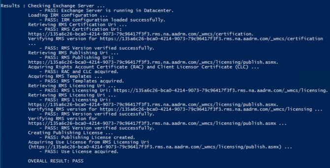
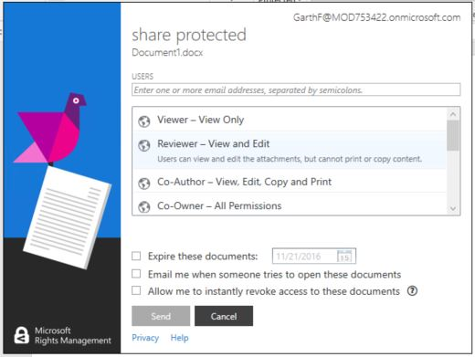

---
# required metadata

title: Share sensitive data internally and externally | Azure Information Protection
description: A scenario that describes how Enterprise Mobility + Security can be used to share sensitive data internally and externally by leveraging Microsoft Azure Information Protection capabilities.
author: yuridio
ms.author: yurid
manager: swadhwa
ms.date: 10/24/2016
ms.topic: solution
ms.prod:
ms.service:
ms.technology: techgroup-identity
ms.assetid: a996fbf8-ece4-40bc-b866-d4606c230027

# optional metadata

#ROBOTS:
#audience:
#ms.devlang:
#ms.reviewer: v-craic
#ms.suite: ems
#ms.tgt_pltfrm:
#ms.custom:

---

# Share sensitive data internally and externally

While many data breaches are due to cyberattacks, experts agree that many more are the result of human error, otherwise known as “oops” moments that happen when employees inadvertently leak sensitive business data. With the right security information and data loss prevention protocols in place, nearly all of these kinds of breaches are avoidable.

For business and users, data sharing is inevitable and while this is necessary, it also creates one of the biggest challenges in the industry, which is: how to enable data sharing across different devices while reducing leakage of data shared with others? The threat landscape is even broader when you need to share sensitive data with external sources, like partners, customers and other parties. 

In this context, it is a common scenario for enterprises to have projects where they need to enable employees to collaborate internally across data silos and externally with third-party vendors, while aligning security protocols to the business and influence end-user behavior in data classification and protection processes. 

## How can Enterprise Mobility + Security help you?

Enterprise Mobility + Security (EMS) is the only comprehensive cloud solution that natively protects corporate data on the device itself and beyond with four layers of protection across identities, devices, apps, and data. EMS helps you solve one of the key challenges in the mobile-first, cloud-first world – how to deliver secure email to employees’ on-the-go. With EMS, you will enable your employees to collaborate securely within and outside of your organization. EMS allows IT Administrators to leverage [Azure Rights Management](https://docs.microsoft.com/information-protection/understand-explore/what-is-azure-rms) policy template to email usage. Usage rights are attached to the message itself so that protection occurs online and offline as well as inside and outside of the organization’s firewall.

## Recommended solution

By integrating Azure Rights Management with Rights Management in Exchange Online, EMS allows organizations to protect data that leaves the organization via email. You can implement this solution for Exchange Servers located on-premises and for Exchange online (Office 365). Both Information Rights Management and [Office 365 Message Encryption](https://technet.microsoft.com/library/dn569285.aspx) are policy based and designed to work with the Exchange transport rule engine. That means Microsoft Azure Rights Management allows you to set up complex policy restrictions easily, with just a single action.

Some of the capabilities available with this solutions are described below:

- Help protect emails against unauthorized access by applying different IRM options to your email messages.
- Help keep your information safe, online or offline, because your files are protected whether they’re viewed using Office Online or downloaded to a local machine.
- Seamless integration with all Office documents helps guard your organization’s intellectual property.
- Apply custom templates based on your business needs in addition to using default Rights Management Services templates.

## How to implement this solution

To configure Exchange Online to support Azure RMS, you must configure the information rights management (IRM) service for Exchange Online. Follow these steps to implement this solution:

1. Integration with Exchange: 
	- Exchange Online: Enable Exchange Online to use Azure RMS
	- Exchange On-premises: Deploying the Azure Rights Management connector
2. Send a Protected Office Document Using Exchange

## How to share sensitive data internally and externally

Companies need to need to enable employees to collaborate internally across data silos and externally with third-party vendors, while aligning security protocols to the business and influence end-user behavior in data classification and protection processes. Data share becomes a critical part of the process and organizations need to enable while reducing the likelihood that data privacy and integrity will be compromised.

### Step 1: Integration with Exchange

Rights Management protection is applied to email by applying an Azure Rights Management policy template to an email message. The first step to enable this integration to take place will vary according to where you Exchange is located: in the cloud (Exchange online) or on-premises. 

#### Enable Rights Management Integration with Exchange Online

To configure Exchange Online to support Azure RMS, you must configure the information rights management (IRM) service for Exchange Online. In the article [Office 365: Configuration for clients and online services](https://docs.microsoft.com/rights-management/deploy-use/configure-office365), follow the steps from the section [Exchange Online: IRM Configuration](https://docs.microsoft.com/rights-management/deploy-use/configure-office365#exchange-online-irm-configuration) to configure Exchange Online for IRM.

The last step should be the final test to validate the configuration and you should see a result similar to the one shown in the following screen:

#### Enable Rights Management Integration with Exchange On-Premises

To configure rights management integration with Exchange on-premises you need to configure the Microsoft Rights Management (RMS) connector. This connector will enable existing on-premises Exchange servers to use their Information Rights Management (IRM) functionality with the cloud-based Microsoft Rights Management service (Azure RMS). You can use this connector even if some of your users are connecting to online services, in a hybrid scenario.

Review the [prerequisites to install RMS Connector](https://docs.microsoft.com/rights-management/deploy-use/deploy-rms-connector#prerequisites-for-the-rms-connector) and follow the five steps available in the article [Installing and configuring the Azure Rights Management connector](https://docs.microsoft.com/rights-management/deploy-use/install-configure-rms-connector).

### Step 2: Send a Protected Document Using Exchange

Follow Step 3 of the [Secure data using classification and labeling](infoprotect-secure-classify-scenario.md)scenario to install RMS Sharing application. If you need to support different types of clients, review the article [Rights Management sharing application: Installation and configuration for clients](https://docs.microsoft.com/rights-management/deploy-use/configure-sharing-app) for more details on how to install RMS Sharing application.

If you want to share an Office document, for example directly from Word, you can simple use the Share Protected icon in the ribbon as shown in the following image:

After you click on this option you should see the share protected dialog with more details about how you want to share this document as shown in the following image:

On top of this window you must type the target user’s email, and select the type of access that you want to provide for this user. In the bottom of this window, you can also control the document’s expiration date and enable the option to receive an email every time someone tries to open this document. After finishing making the proper selections, click Send and Outlook will open with a new message as shown in the following screen:

> [!IMPORTANT] 
> Watch [Collaborate securely using Azure Information Protection](https://myignite.microsoft.com/videos/49947) presentation from Microsoft Ignite for more information about this scenario.
