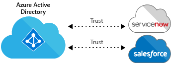
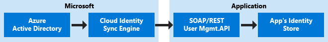

---
# required metadata

title: Thousands of apps, one identity
description: This article describes how Enterprise Mobility + Security can be used to provide a single identity that works across any web-based apps in the industry by leveraging tools within Azure Active Directory.
keywords:
author: andredm7
ms.author: andredm
manager: swadhwa
ms.date: 10/19/2016
ms.topic: solution
ms.prod:
ms.service: active-directory
ms.technology:
ms.assetid: dd879a14-919e-431b-89b9-c035c83a6899

# optional metadata

ROBOTS: noindex
#audience:
#ms.devlang:
ms.reviewer: atkladak, jsnow
ms.suite: ems
#ms.tgt_pltfrm:
#ms.custom:

---

# Thousands of apps, one identity
Azure Active Directory (Azure AD) makes your users more productive by providing a common identity for users of software as a service (SaaS) applications accessing both cloud and on-premises resources.

Azure AD integrates with many of today’s popular SaaS applications such as, Box, Twitter, ServiceNow, DocuSign, Workday, and many more. It supports single sign-on (SSO) authentication, identity, and secures access management to applications from any device in a secured and reliable way.

## How can Enterprise Mobility + Security help you?
Enterprise Mobility + Security (EMS) is the only comprehensive cloud solution that natively protects corporate data on the device itself and beyond with four layers of protection across identities, devices, apps, and data. EMS helps you solve one of the key challenges in the mobile-first, cloud-first world – provide a single identity that works across any web-based apps in the industry:
- Cloud-connected seamless authentication experience
- Single sign-on to 1000 pre-integrated apps or your own apps
- Secure remote access to on-premises apps
- Support to lift-and-shift to the cloud

## Recommended solution
Azure AD is a cloud identity and access management solution that can provide organizations with access to everything they need from everywhere – in a secure and productive way – in collaboration with existing investments on traditional tools.
### Access to single sign-on applications

Before single sign-on, IT admins had to manage different users and passwords for all different applications that organizations had to support:

- Users enter a username and password into each app they use
- Users manage too many passwords
- Password re-use is common
- Revoking access is very difficult

According to recent research, 63% of confirmed data breaches involved weak, default, or stolen passwords.

Single sign-on lets users access all the applications and resources they need to do business by signing in only once using a single user account. Once signed in, users can access all the applications they need without being required to authenticate (e.g. type a password) a second time.

Azure AD supports three types of single sign-on authentication:

- **Microsoft Azure AD Single Sign-on:** This option uses federated sign on to let users automatically sign in to the third-party applications, such as Salesforce, using the user account information from Azure AD.
- **Password Single Sign-On:** This option enables users to be automatically signed in to the third-party SaaS application by Azure AD using the third-party user account information.
- **Existing Single Sign-on:** This option supports single sign-on to third-party SaaS companies using Active Directory Federation Services (ADFS), or another third-party single sign-on provider.

### How single sign-on works
Azure AD supports single sign-on with apps that support any of these standard protocols:
- SAML 2.0
- OAuth 2.0 / OpenID Connect
- WS-Federation

An application gets configured to use Azure AD as its identity provider. Once configured, the app no longer requires direct username/password input, and instead redirects to the identity provider for authentication:

### Do I still need Azure Active Directory Federation Services (ADFS)?
Yes. One ADFS connection to Azure AD gives you seamless single sign-on from domain joined machines:
- Users see no web-based sign-in page
- Individual application trusts are managed in Azure AD

### What if an app doesn’t support federated single sign-on?
Password-Based SSO is the best solution for apps that don’t support SAML/OpenID and only support entering usernames and passwords in a web form.
- Enables application-specific sets of credentials to be defined and stored in Azure AD
- Credentials can be assigned to users or groups for shared access

### User account provisioning
User account provisioning is the act of creating, updating, and/or disabling user account records in an application’s local user profile store. Most SaaS apps store the user’s role and permissions in their own local user profile store.

Azure AD provisioning service connects to a soap/rest user management API provided on a per app basis, which adds, updates, and disables user accounts. It supports group syncing, and profiles/roles can also be imported from the app into Azure AD.

### The end-user experience
The Applications Access Panel is a cross-device and cross-browser portal, accessible using iOS, Android, Mac, and Windows. To reach the Access Panel, users authenticate against Azure AD once, then see the list of Applications they have access to, and can launch the app with just a click from there. If the application was configured for SSO by the administrator, the users don’t need to re-authenticate to access the application: single sign-on will take care of the authentication automatically.

### Bring your own apps
Azure AD application gallery features thousands of applications that you can add to your organization, but if you cannot find a third-party application, you can add still add it as a custom app for your organization to use.

You can onboard just about any web-based application that has a user name and password based authentication mechanism, whether they are listed in the Azure application gallery or not.

### Secure remote access to on-premises apps
[Azure AD Application Proxy](https://azure.microsoft.com/en-us/documentation/articles/active-directory-application-proxy-enable/) provides single sign-on (SSO) and secure remote access for web applications hosted on-premises. This can include SharePoint sites, Outlook Web Access, or any other LOB web applications you have. These on-premises web applications are integrated with Azure AD, the same identity and control platform that is used by O365.

End users can then access your on-premises applications the same way they access O365 and other SaaS apps integrated with Azure AD, without the need for a VPN or for changing the network infrastructure.

## How to implement this solution
The following steps describe how to implement each Azure AD capability previously discussed. Each link represents a different set of articles with a different set of instructions/steps to be implemented in your organization:
1. [Enable single sign-on with application proxy.](https://azure.microsoft.com/en-us/documentation/articles/active-directory-application-proxy-sso-using-kcd/)
- [Provide secure remote access to on-premises applications.](https://azure.microsoft.com/en-us/documentation/articles/active-directory-application-proxy-get-started/)
  - [Working with custom domains in Azure AD application proxy.](https://azure.microsoft.com/en-us/documentation/articles/active-directory-application-proxy-custom-domains/)
  - [Working with claims aware apps in application proxy.](https://azure.microsoft.com/en-us/documentation/articles/active-directory-application-proxy-claims-aware-apps/)
  - [Working with conditional access for apps published using application proxy.](https://azure.microsoft.com/en-us/documentation/articles/active-directory-application-proxy-conditional-access/)
- [Bring your own apps to Azure AD.](https://blogs.technet.microsoft.com/enterprisemobility/2015/06/17/bring-your-own-app-with-azure-ad-self-service-saml-configuration-now-in-preview/)

## Additional resources
- **App Gallery on Azure.com**
  - https://azure.microsoft.com/marketplace/active-directory/
- **SaaS Application List** (with integration capabilities)
  - https://aadappgallery.azurewebsites.net/M
- **SaaS Application Tutorials**
  - https://azure.microsoft.com/documentation/articles/active-directory-saas-tutorial-list/
