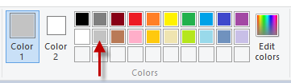
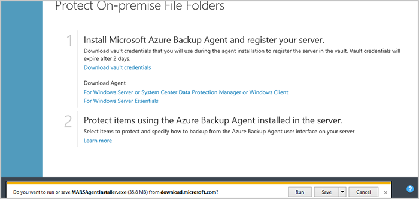

<properties pageTitle="Authoring for EMS in Markdown" description="Explains how to create images in markdown according to guidelines set for the Enterprise Mobility Suite repositories." services=""     solutions="" documentationCenter="" authors="v-jocgar" manager="robmazz" />

<tags ms.service="contributor-guide" ms.devlang="" ms.topic="article" ms.tgt_pltfrm=""  ms.workload="" ms.date="02/25/2016" ms.author="v-jocgar" />

# Authoring for EMS in Markdown

To Do: 
- [ ] Confirm EMS article layout for images /articles/<service-directory>/media
- [ ] Provide an example for /articles/<service-directory>/media
- [ ] Confirm the max width for images in EMS doc page center column (580 or 600px?) in 3 paragraphs
- [ ] Confirm whether EMS has a different set of symbols for conceptual art other than those offered at http://aka.ms/CnESymbols. 
- [ ] Confirm URL for our Contributor's Guide
- [ ] Confirm the entire linking scheme
- [ ] Are articles organized by service subdirectories?
- [ ] Anchor linking methodology needs to be confirmed
- [ ] Confirm the linking methodology and use of selectors.
- [ ] Test the linking scheme to ensure that it works correctly

This article contains pointers about how to write technical articles for EMS services and technologies. These guidelines apply whether you are creating new documentation or updating existing documentation.

## Why write for EMS?

The Microsoft Enterprise Mobility Suite (EMS) was created specifically to help address today's move to integrated, mobile, cloud-based services. Its three core components -- Microsoft Azure Active Directory Premium, Microsoft Intune, and Microsoft Azure Rights Management -- were built from the start as cloud services. They were designed to work together, providing an integrated technology family that's unlike any other on the market. To detect attacks on-premises, EMS also includes Microsoft Advanced Threat Analytics. Using EMS, corporate users can be productive on the devices they love while you’re protecting company assets.

Creating documentation for individual products is always a priority. But because EMS is a suite of products, we are also looking for articles and how-to documents that help our customers use the products well together. We do create documentation for cross-product scenarios, but we welcome the input of employees and users who are hands-on with these products within their own companies.

As a result, we've opened up our documentation on Github, where you can contribute in a number of ways:
- **Correcting text mistakes.** We know, they drive us crazy too, but we don't always catch them, so get connected through Github, and help us out.
- **Suggesting new topics.** If there's a procedure or subject that comes up often enough to deserve a doc topic and we don't have it, by all means write it up, and we'll see about including it.
- **Adding to our FAQ.** If you find yourself wondering about something we don't cover but it's a question/answer situation rather than a whole topic, submit an addition to the FAQ, and let us have a look at it. 

The bottom line is, we know you have great suggestions and ideas, and we want to make it easy for you to participate in improving EMS overall. 

## Tips for better articles

As you write for EMS, keep the following in mind:

**Practices specific to EMS**
- The official product name is "Microsoft Enterprise Mobility Suite", but we can almost always just say "EMS", as in "EMS Cloud Identity and Access Management."
- Use "EMS" at first reference before a service or feature name and then drop it (e.g. "EMS Cloud Identity and Access Management" becomes "Cloud Identity and Access Management" after first use). 
- EMS uses sentence casing for all titles. 
- Try to avoid acronyms in general - they just confuse people.

**Good writing practices**
- Use a casual and friendly voice--like you were talking to another person one-on-one. See the [Style and Voice topic](./style-and-voice.md) for details.
- Spell-check and grammar-check your topics, even if you have to cut and paste the text into Word to do so.
- Use simple sentences. They are easier to understand, and they are more easily translated by both human and machine translators.
- Don't break up steps with commentary or asides.
- Include the words "following" or "as follows" in every sentence that precedes a list or code snippet.
- For steps that include code snippets, put additional information about the step into the code as comments. 
	- This reduces the amount of text people have to read through. 
	- Key information gets copied into the code project to remind people what the code is doing when they refer to it later.

## Create images in Markdown
You can include images with your articles by following the simple Markdown syntax. 

### Image folder creation and link syntax

For a new article, you'll need to create a folder in the following location:
<span style="color:red;">Confirm article repo layout for images</span>

    /articles/<service-directory>/media/

For example:
<span style="color:red;">Provide an example</span>

    /articles/identity-access/media/

After you create the folder and added images to it, use the following syntax to create images in your article:

```

```

## Image guidelines specific to Enterprise Mobility Suite

Screenshots are currently encouraged if it's not possible to include steps to reproduce. Do write your content so that the content can stand without the screenshots if necessary.

Use the following guidelines when creating and including art files:
- Share art files across documents if possible. Copy the URL to the file you need and add it to the article. 

- Portable Network Graphic (.PNG) files are highly preferred over other formats.

- Use red squares of the default width provided in Paint (5 px) to call attention to particular elements in screenshots.  

    Example:

    

- Avoid white space on edges of screenshots. Screenshots should have a 1-pixel-wide gray border so that white areas of the screenshot do not blend into the web page.
	- If you crop a screenshot in a way that leaves white background at the edges, add a single pixel gray border around the image.  
	- If using Paint, use the lighter gray in the default color palette (#C3C3C3).
	 
	- If using a graphics app that requires RGB values, the color numbers are R195, G195, B195. 
- You can easily add a gray border around an image in Visio. To do this: 
  - Select the image. 
  - Select Line  and ensure the the correct color is set. 
  - Change the line weight to 1 1/2 pt.  

	**Example:**

    

- Conceptual images with white space do not need a gray border.  

    **Example:**

    

- Try not to make an image too wide. Images will be automatically resized if they are too wide. However, resizing an image sometimes causes fuzziness, so we recommend that you limit the width of your images to <span style="color:red;">Confirm max image width</span> 580 px, and manually resize images before submission if necessary.

- Show command outputs in screenshots.  If your article includes steps where the user is working within a shell, it's useful to show command output in screenshots. In this case, restricting your shell width to about 72 characters generally ensures that your image will remain within the <span style="color:red;">Confirm max image width</span> 580 px width guideline. Before taking a screenshot of output, resize the window so that just the relevant command and output is shown (optionally with a blank line on either side).

- Take whole screenshots of windows when possible. When taking a screenshot of a browser window, resize your browser window to <span style="color:red;">Confirm max image width</span> 580 px wide or less, and keep the height of the browser window as short as possible such that your application fits within the window.

    Example:

    

- Use caution with what information is revealed in screenshots. Be sure not to reveal internal company information or your personal information.

- In conceptual art or diagrams, use the official icons in the Cloud and Enterprise symbol and icon set. A public set is available at <span style="color:red;">Confirm that we use these icons</span> http://aka.ms/CnESymbols.


## Guidelines for linking technical articles on docs.microsoft.com

| Link scenario | Guidance for the target link  |
|---------------|-----------|
|Linking from an EMS technical article to another EMS technical article|Use relative links.|
|Linking to an EMS page outside the documentation directory, to an MSDN library topic, a TechNet library topic, or to a KB article|​Use the actual link to the article or topic. Remove the en-us language locale from the link.|
|Linking from an EMS article to any other web page|Use the direct link|

### Use friendly link text

The words you include in a link should be friendly - in other words, they should be normal English words or the title of the page you are linking to. Do not use "click here". It's bad for SEO and doesn't adequately describe the target.

**Correct:**
<span style="color:red;">Confirm URL for our Contributor's Guide</span> 
- `For more information, see the [contributor guide index](https://github.com/Microsoft/EMDocs/contributor-guide/contributor-guide-index.md).`

- `For more details, see the [SET TRANSACTION ISOLATION LEVEL](https://msdn.microsoft.com/library/ms173763.aspx) reference.`

**Incorrect:**

- `For more details, see [https://msdn.microsoft.com/library/ms173763.aspx](https://msdn.microsoft.com/library/ms173763.aspx).`

<span style="color:red;">Confirm URL for our Contributor's Guide</span> 
- `For more information, click [here](https://github.com/Microsoft/EMDocs/contributor-guide/contributor-guide-index.md).`

### Markdown syntax for EMS relative links
<span style="color:red;">Confirm the entire linking scheme</span> 

To create an inline link from an EMS technical article to another EMS technical article, use this link format. If you create any new links to or from articles in the directories, you’ll need to follow the new linking syntax.

Article links from a subdirectory to an article in the root directory:

    [link text](../article-name.md)

Article in the root directory links to an article in a service subdirectory: 
<span style="color:red;">Are articles organized by service subdirectories?</span>

    [link text](service-directory/article-name.md)

Article in a service subdirectory links to an article that is in another service subdirectory:

    [link text](../service-directory/article-name.md)
 
Article in a directory links to another article in the same directory:

    [link text](article-name.md)


You do not have to create anchors anymore - they are automatically generated at publishing time for all H2 headings. The only thing you have to do is create links to the H2 sections:
<span style="color:red;">Anchor linking methodology needs to be confirmed</span>

    [link](#the-text-of-the-H2-section-separated-by-hyphens)
    [Create cache](#create-cache)

To link to an anchor in another article in the same subdirectory:

    [link text](article-name.md#anchor-name)
    [Configure your profile](media-services-create-account.md#configure-your-profile)

To link to an anchor in another service subdirectory:

    [link text](service-directory/article-name.md#anchor-name)
    [Configure your profile](service-directory/media-services-create-account.md#configure-your-profile)


## Custom markdown link syntax
<span style="color:red;">Confirm the linking methodology and use of selectors.</span>

Since includes files are located in another directory, you will need to use relative paths as below. For a link to a single article from an includes file, use this format:

    [link text](../articles/service-folder/article-name.md)
    
Learn more about how to use an include file in the [Custom markdown extensions guidelines](custom-markdown-extensions.md#includes).

If you have selectors embedded in an include, you would use this sort of linking: 

    > [EMS.SELECTOR-LIST (Dropdown1 | Dropdown2)]
    - [(Text1 | Example1 )](../articles/service-folder/article-name1.md)
    - [(Text1 | Example2 )](../articles/service-folder/article-name2.md)
    - [(Text2 | Example3 )](../articles/service-folder/article-name3.md)
    - [(Text2 | Example4 )](../articles/service-folder/article-name4.md)

To link to a page on EMS (such as a pricing page, a Service Level Agreement page, or anything else that is not a documentation article), use an absolute URL, but omit the *en-us* locale. The goal here is that links work in GitHub and on the rendered site:

    [link text](https://www.microsoft.com/server-cloud/enterprise-mobility/pricing.aspx)

To test your links, push your page to your fork and view it in the rendered view and publish to Sandbox. The cross links on the GitHub version of the page should work as long as the targets of the URLs are present in your branch.

## Reference-style links

You can use reference style links to make your source content easier to read. The reference style links replace the inline link syntax with simplified syntax that allows you to move the long URLs to the end of the article. Here's Daring Fireball's example:

Inline text:

    I get 10 times more traffic from [Google][1] than from [Yahoo][2] or [MSN][3].

Link references at the end of the article:

    <!--Reference links in article-->
    [1]: http://google.com/
    [2]: http://search.yahoo.com/  
    [3]: http://search.msn.com/


## Back to Home

- [Overview article](./../README.md)
- [Index of guidance articles](./contributor-guide-index.md)

