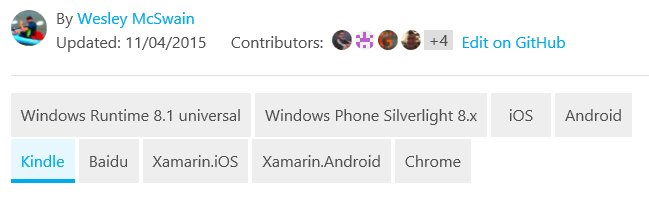

<properties pageTitle="Custom markdown extensions used in our technical articles"  description="Lists the custom markdown extensions that enable embedded videos, notes and tips, reusable content, and other items in docs.microsoft.com/ems technical articles." services="" solutions="" documentationCenter="" authors="v-jocgar" manager="robmazz" editor=""/>

<tags ms.service="contributor-guide" ms.devlang="" ms.topic="article" ms.tgt_pltfrm=""  ms.workload="" ms.date="02/26/2016" ms.author="v-jocgar"/>

## Custom markdown extensions for EMS
To Do:
- [ ] #34 Confirm that we're using Markdown extensions for Note, Important, etc. 
- [ ] #35 Confirm that EMS is using tokens, and the correct directory location.
- [ ] #36 Confirm that the custom icon files are available and installed in the correct location.
- [ ] #37 Confirm the directory name for tokens that use media files
- [ ] #38 Confirm the correct procedures for using tokens.
- [ ] #39 Provide an example of the syntax for using tokens. 
- [ ] #40 Confirm EMS Documentation URL.
- [ ] #41 Confirm that videos from Channel 9 can be used by external writers. 
- [ ] #42 Confirm location of EMS videos on Channel 9.
- [ ] #43 Confirm usage of EMS videos on Channel 9.
- [ ] #44 Confirm video embed syntax.
- [ ] #45 Need a rendered example from Github.
- [ ] #46 Need a rendered example of video from Github.
- [ ] #47 Need a rendered example from the EMS docs website. 
- [ ] #48 Confirm that Selectors are available to EMS articles
- [ ] #49 Need a simple selectors replacement example
- [ ] #50 Confirm simple selectors syntax
- [ ] #51 Need replacement simple selectors syntax
- [ ] #52 Need a replacement simple selectors example
- [ ] #53 Confirm that two-way selectors function as described.
- [ ] #54 Need a replacement two-way selectors example
- [ ] #55 Confirm two-way selectors syntax
- [ ] #56 Need a replacement two-way selectors example

## General help with Markdown

If you have not already read the [Authoring for EMS in Markdown](./authoring-in-markdown.md)  topic, we suggest that you read that topic before continuing with this one. 

## Custom markdown extensions used in our technical articles

Our articles use GitHub flavored markdown for most article formatting - paragraphs, links, lists, headings, etc. But we use custom markdown extensions where we need richer formatting in the rendered pages on Microsoft.com/ems. Here's the extensions we are currently using:

+ [Notes and tips]
+ [Tokens]
+ [Embedded videos]
+ [Technology and platform selectors]

## Notes and tips
Confirm that we're using Markdown extensions for Note, Important, etc.
You can choose from 4 types of notes and tips:

- EMS.NOTE
- EMS.WARNING
- EMS.TIP
- EMS.IMPORTANT

### Usage
In general, use notes and tips sparingly throughout your articles. When you do use them, choose the appropriate type of note or tip:

- Use EMS.NOTE to highlight neutral or positive information that emphasizes or supplements key points of the main text. A note supplies information that applies only in special cases.

  

- Use EMS.WARNING to alert the user to a condition that might cause a problem in the future. For example, selecting a certain option or making a certain choice might permanently lock you into a particular scenario.

  

- Use EMS.TIP to help your users apply the techniques and procedures described in the text to their specific needs. A tip might also suggest alternative methods that may not be obvious. Tips, however, are not essential to the basic understanding of the text.

  

- Use EMS.IMPORTANT to provide information that is essential to the completion of a task.

  

While these notes and tips support code blocks, images, lists, and links, try to keep your notes and tips simple and straightforward. If you find yourself creating complex notes with lots of formatting, that might be a sign you just need another section in the main text of the article. And, too many notes in an article can be distracting and hard to scan or read.

### Sample markdown

The samples all show an EMS.NOTE. To use a TIP, WARNING, or IMPORTANT, replace "NOTE" in the markdown:

    > [EMS.TIP]

    > [EMS.WARNING]

    > [EMS.IMPORTANT]

Single paragraph:

    > [EMS.NOTE] To complete this tutorial, you must have an active Microsoft account. If you don't have an account, you can create a free account in just a couple of minutes.

Multiparagraph:

    > [EMS.NOTE] To complete this tutorial, you must have an active Microsoft account.
    >
    > If you don't have an account, you can [create a free account](https://signup.live.com/signup) in just a couple of minutes.

## Tokens
Confirm that EMS is using tokens, and the correct directory location.
Reusable text fragments in our GitHub repository are called "tokens". When you have text that needs to be used in multiple articles, you include a reference to the text fragments in the markdown files. The text fragment (the token) itself is a simple markdown (.md) file. It can contain any valid markdown, including text, links, and images. 

All token markdown files must be in Confirm that the custom icon files are available and installed in the correct location. [the /tokens directory](need correct location) in the root of the repository. When the article is published, the token text is seamlessly integrated into the published topic.

- We use a specific syntax to reference a token.

- Media files you put in an token must be created in the `/media` folder specific to the token. Media folders for tokens belong in Confirm the directory name for tokens that use media files [the ems-content/tokens/media folder](need correct location). 

## Usage
Confirm the correct procedures for using tokens.
- Use tokens wherever you need the same text to appear in multiple articles.
- Tokens are meant to be used for significant amounts of content - a paragraph or two, a shared procedure, or a shared section. Do not use them for anything smaller than a sentence; they are not for product names or incomplete sentences.
- Don't embed tokens within other tokens. Bad things happen in the publishing system!
- Don't share media between files. Use a separate file with a unique name for each token and article. Store the media file in the media folder associated with the token.
- Don't use an tokens as the only content of an article. Tokens are meant to be supplemental to the content in the rest of the article.
- Because all tokens must be in the `/token` directory, the path to an token from an article is always

    ../token

- Do NOT repeat a link or image filename reference in both the article and the token. Add "-token" to the link reference or media filename to avoid repeating the reference:

 **Link reference**

 Change: odata.org
 To: odata.org-token

 **Image reference**

 Change: table.png
 To: table-token.png

### Example markdown for tokens
Provide an example of the syntax for using tokens. 
The syntax for adding an token to a documentation article is:

    [EMS.TOKEN [token-short-name](../tokens/token-file-name.md)]

Example

    [EMS.INCLUDE [howto-blob-storage](../tokens/howto-blob-storage.md)]

The first part of the token is the token name without the path and without the .md extension. The second part is the relative path to the token in the /token directory, with the .md extension.

### Rendering

In the rendered GitHub page, the token will render as follows:

 [EMS.TOKEN howto-blob-storage]

In the rendered HTML on Confirm EMS Documentation URL http://docs.microsoft.com/ems, the HTML from the tokens is merged into the rest of the document's HTML. However, the HTML will contain an HTML comment with the original token markdown filename and the GitHub commit hash. This comment is included for troubleshooting purposes so that the source content can easily be identified and found in GitHub:

  

## Embedded videos
Confirm that videos from Channel 9 can be used by external writers.
Our technical articles support embedded videos in technical articles as long as the videos are on Microsoft's [Channel 9](http://channel9.msdn.com/) site. The videos from Channel 9 must be integrated with Confirm location of EMS videos on Channel 9. [the docs.microsoft.com Video Center](need actual location). We currently do not support embedded YouTube videos; as a community contributor, you are welcome to **link-- to YouTube if the video you want to feature is posted there.

### Usage
Confirm usage of EMS videos on Channel 9.
- Make sure that the video is on the Channel 9 Video Center.

- Copy the video ID from the friendly URL of the video on Channel 9. For example, the video ID for the video at [https://channel9.msdn.com/Shows/This+Week+On+Channel+9/TWC9-Stacking-Microsoft-Windows-10-Pi-Bobble-Head-your-Nodejs-and-more](https://channel9.msdn.com/Shows/This+Week+On+Channel+9/TWC9-Stacking-Microsoft-Windows-10-Pi-Bobble-Head-your-Nodejs-and-more) is ** ??? **.

### Syntax
Confirm video embed syntax. 
    > [EMS.VIDEO video-id-string]

### Rendering
Need a rendered example of video from Github. 
On GitHub: [need example of how an article looks when added on Github](something.md)

Need a rendered example from the EMS docs website. 
Published article: [need an example of how an article looks on the doc site when incorporated](need actual location)

## Technology and platform selectors
Confirm that Selectors are available to EMS articles
Use technology and platform switchers in technical articles when you author multiple flavors of the same article to address differences in implementation across technologies or platforms. This is typically most applicable to our mobile platform content for developers. There are currently two different types of selectors, [simple selectors](#simple-selectors) and [two-way selectors](#two-way-selectors).

Because the same selector Markdown goes in each topic in the selection, we recommend placing the selector for your topic in an token, then referencing that token in all of your topics that use the same selector.

### Simple selectors

Simple (one-way) selectors render as a set of option buttons right below the title. Use these buttons when customers need to choose from topics in a single platform or technology set, such as .NET, Node.js, and Java.  Use the custom markdown extension for any selectors - do not use HTML for selectors.  

Need a simple selectors replacement example; leaving this Azure version here for reference.
See [Get started with Notification Hubs](http://azure.microsoft.com/documentation/articles/notification-hubs-windows-phone-get-started/) to see how the author created 8 versions of the same article, but used selectors to enable navigation across them all.

#### Syntax
Confirm simple selectors syntax
    > [EMS.SELECTOR]
    - [Link #1 Label](link #1 url)
    - [Link #2 Label](link #2 url)

#### Example
Need replacement simple selectors syntax
    > [EMS.SELECTOR]
    - [Windows Runtime 8.1 Universal](../articles/notification-hubs-windows-store-dotnet-get-started/)
    - [Windows Phone Silverlight 8.x](../articles/notification-hubs-windows-phone-get-started/)
    - [iOS](../articles/notification-hubs-ios-get-started/)
    - [Android](../articles/notification-hubs-android-get-started/)
    - [Kindle](../articles/notification-hubs-kindle-get-started/)
    - [Baidu](../articles/notification-hubs-baidu-get-started/)
    - [Xamarin.iOS](../articles/partner-xamarin-notification-hubs-ios-get-started/)
    - [Xamarin.Android](../articles/partner-xamarin-notification-hubs-android-get-started/)
    - [Chrome](../articles/notification-hubs-chrome-get-started/)

#### Rendering

Need a replacement simple selectors example; leaving this here for reference.
The image above shows the rendering on docs.microsoft.com/ems. On the rendered GitHub pages, the selectors render as a bulleted list of links.

### Two-way selectors
Confirm that two-way selectors function as described.
Two-way selectors lets users select a topics from a two way matrix. This is essential when an EMS technology, such as Mobile Services, supports multiple backend platforms as well as multiple clients. Keep in mind the following:

- While it was designed as `(Platform | Backend)`, the dropdown text can now be customized.
- You do not need a list item for every point in your matrix, but do only have an item where a topic URL exists and is not a duplicate.
- The link can be any URL, although it is generally another GitHub topic.

Need a replacement two-way selectors example; leaving this Azure version here for reference.
See [Get started with Mobile Services](http://azure.microsoft.com/en-us/documentation/articles/mobile-services-ios-get-started/) to see how the author created 15 versions of the same article (9 mobile client platforms and 2 backend platforms), but used selectors to enable navigation across them all. Note that 3 articles don't have both backend versions.

#### Syntax
Confirm two-way selectors syntax
	> [AZURE.SELECTOR-LIST (Dropdown1 | Dropdown2 )]
	- [(Dropdown1Text1 | Dropdown2Text1 )](../articles/dropdown1-text1-dropdown2-text1.md)
	- [(Dropdown1Text1 | Dropdown2Text2 )](../articles/dropdown1-text1-dropdown2-text1.md)
	- [(Dropdown1Text2 | Dropdown2Text3 )](../articles/dropdown1-text1-dropdown2-text1.md)
	- [(Dropdown1Text3 | Dropdown2Text4 )](../articles/dropdown1-text1-dropdown2-text1.md)

#### Example
Need a replacement two-way selectors example
	> [AZURE.SELECTOR-LIST (Platform | Backend )]
	- [(iOS | .NET)](./mobile-services-dotnet-backend-ios-get-started-push.md)
	- [(iOS | JavaScript)](./mobile-services-javascript-backend-ios-get-started-push.md)
	- [(Windows Runtime 8.1 universal | C#)](./mobile-services-dotnet-backend-windows-universal-dotnet-get-started-push.md)
	- [(Windows Runtime 8.1 universal C# | Javascript)](./mobile-services-javascript-backend-windows-universal-dotnet-get-started-push.md)
	- [(Windows Phone | .NET)](./mobile-services-dotnet-backend-windows-phone-get-started-push.md)
	- [(Windows Phone | Javascript)](./mobile-services-javascript-backend-windows-phone-get-started-push.md)
	- [(Android | .NET)](./mobile-services-dotnet-backend-android-get-started-push.md)
	- [(Android | Javascript)](./mobile-services-javascript-backend-android-get-started-push.md)
	- [(Xamarin iOS | Javascript)](./partner-xamarin-mobile-services-ios-get-started-push.md)
	- [(Xamarin Android | Javascript)](./partner-xamarin-mobile-services-android-get-started-push.md)
	- [HTML](../articles/mobile-services-html-get-started/)
	- [PhoneGap](../articles/mobile-services-javascript-backend-phonegap-get-started/)
	- [Sencha](../articles/partner-sencha-mobile-services-get-started/)

#### Rendering
Need a replacement two-way selectors example; leaving this here for reference.
The image above shows the rendering on azure.microsoft.com. On the rendered GitHub pages, the selectors render as a bulleted list of links.

<!--Anchors-->
[Notes and tips]: #notes-and-tips
[Tokens]: #tokens
[Embedded videos]: #embedded-videos
[Technology and platform selectors]: #technology-and-platform-selectors

## Back to Home

- [Overview article](./../README.md)
- [Index of guidance articles](./contributor-guide-index.md)
