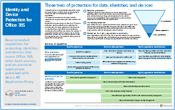
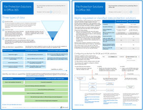
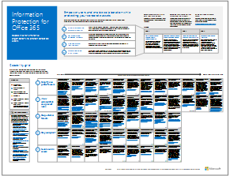
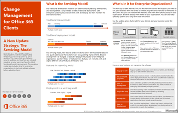
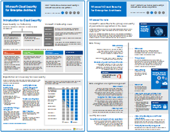
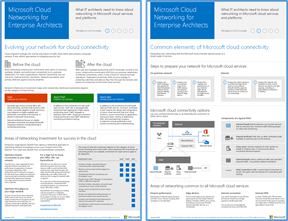
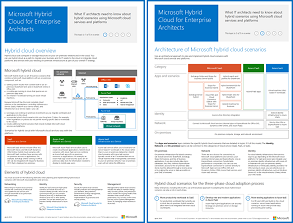
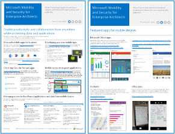
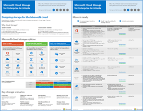
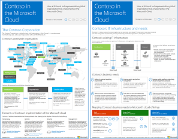

# Architecture models and posters for Microsoft 365 Enterprise

## Introduction
These architecture models and posters provide recommended capabilities and architectures for adoption of enterprise cloud capabilities, starting with capabilities included in the Microsoft 365 Enterprise plans.

Many of these resources are large posters or other illustrations. These are provided in two formats — Visio and PDF. You can modify the Visio files for your own use.

>[!TIP]
>Most of the posters on this page are available in multiple languages, including Chinese, English, French, German, Italian, Japanese, Korean, Portuguese, Russian, and Spanish. To download a poster in one of these languages, click the More languages link for that poster. Let us know what you think by sending us email at [cloudadopt@microsoft.com](mailto:cloudadopt@microsoft.com).
>

## Three tiers of protection for data, identities and devices
Microsoft provides many protection capabilities across our cloud services. We know it can be challenging to choose the right set of capabilities for your organization. These resources recommend the most common capabilities to help you secure your data, identities, and devices.

Capabilities are recommended in three tiers — baseline protection, sensitive protection, and protection for environments with highly regulated or classified data.

It’s important to use consistent levels of protection across your data, identities, and devices. For example, if you protect sensitive data at a higher level, be sure to protect the identities and devices that access this data at a comparable level. These resources show you which capabilities are comparable.

### Identity and Device Protection for Office 365 and other SaaS Apps

 

[PDF](https://go.microsoft.com/fwlink/p/?linkid=841656) | [Visio](https://go.microsoft.com/fwlink/p/?linkid=841657) | [More languages](https://www.microsoft.com/download/details.aspx?id=55032)

### File Protection Solutions in Office 365

 

[PDF](http://download.microsoft.com/download/7/8/9/789645A5-BD10-4541-BC33-F8D1EFF5E911/MSFT_cloud_architecture_O365 file protection.pdf) | [Visio](http://download.microsoft.com/download/7/8/9/789645A5-BD10-4541-BC33-F8D1EFF5E911/MSFT_cloud_architecture_O365 file protection.vsdx)

### Windows 10 Protection Solutions
**Coming soon**

### Information Protection for Office 365

 

[PDF](http://download.microsoft.com/download/2/3/D/23D91386-8349-4F7A-9470-FD5AED861F16/MSFT_cloud_architecture_informationprotection.pdf) | [Visio](http://download.microsoft.com/download/2/3/D/23D91386-8349-4F7A-9470-FD5AED861F16/MSFT_cloud_architecture_informationprotection.vsd) | [More languages](https://www.microsoft.com/download/details.aspx?id=54429)

## Windows 10 and Office 365 ProPlus deployment and change management
Windows 10 and Office 365 ProPlus are optimized for the cloud and deliver value to enterprise organizations beyond any competing client. These resources show how to architect end-to-end solutions for deployment, protection, and change management of your modern desktop.

### Change Management for Office 365 Clients

 

[PDF](https://go.microsoft.com/fwlink/p/?LinkId=626681) | [Visio](https://go.microsoft.com/fwlink/p/?LinkId=626680) | [Article](https://technet.microsoft.com/library/mt584223.aspx) | [More languages](https://www.microsoft.com/download/details.aspx?id=49141)

### Deploy a Modern and Secure Desktop
**Coming soon**

### Deploy Office 365 ProPlus
**Coming soon**

## Microsoft Cloud for enterprise architects series
Microsoft offers the broadest set of cloud offerings with the most potential for integration. These resources demonstrate common approaches for IT Architects, Solution Architects, and IT Decision Makers.

### Microsoft Cloud Identity for Enterprise Architects
Identity integration is a core infrastructure component for cloud integration. This resource summarizes solutions that are recommended and tested for enterprise organizations.

|**Item**|**Description**|
|:-----|:-----|
| |This model contains: <ul><li>Introduction to identity with Microsoft’s cloud </li> <li>Azure AD IDaaS capabilities </li><li>Integrating on-premises Active Directory Domain Services accounts with Microsoft Azure Active Directory </li> <li>Putting directory components in Azure </li><li>Domain services options for workloads in Azure IaaS </li></ul>|

[PDF](https://go.microsoft.com/fwlink/p/?LinkId=524586) | [Visio](https://download.microsoft.com/download/2/3/8/238228E6-9017-4F6C-BD3C-5559E6708F82/MSFT_cloud_architecture_identity.vsd) | [More languages](https://www.microsoft.com/download/details.aspx?id=54431)

### Microsoft Cloud Security for Enterprise Architects
Microsoft has developed leading-edge best practices in the design and management of online services. This resource shows how to take a systematic approach to security across all of your cloud solutions.

|**Item**|**Description**|
|:-----|:-----|
| |This model contains: <ul><li>Microsoft's role in providing secure services and platforms</li><li>Customer responsibilities to mitigate security risks</li><li>Top security certifications </li><li>Security offerings provided by Microsoft consulting services </ul></li>Take [Security in a Cloud-Enabled World](https://mva.microsoft.com/training-courses/security-in-a-cloudenabled-world-12725?l=CfLHobAcB_3904300474), a Microsoft Virtual Academy course based on this architecture poster.|

[PDF](https://go.microsoft.com/fwlink/p/?linkid=842070) |  [Visio](https://go.microsoft.com/fwlink/p/?LinkId=842071) | [More languages](https://www.microsoft.com/download/details.aspx?id=48121)

### Microsoft Cloud Networking for Enterprise Architects
Cloud migration changes the volume and nature of traffic flows within and outside a corporate network. It also affects approaches to mitigating security risk. Learn about network infrastructure components affected by adoption of Office 365, Microsoft Intune, or Dynamics 365 and by deploying line-of-business applications in Azure PaaS and IaaS.

 

[PDF](https://go.microsoft.com/fwlink/p/?linkid=842073) | [Visio](https://go.microsoft.com/fwlink/p/?linkid=842074) | [Article](https://technet.microsoft.com/library/mt733214.aspx) | [More languages](https://www.microsoft.com/download/details.aspx?id=54425)

This model contains the following pages:

* **Evolving your network for cloud connectivity** Cloud migration changes the volume and nature of traffic flows within and outside a corporate network. It also affects approaches to mitigating security risk.
* **Common elements of Microsoft cloud connectivity** Integrating your networking with the Microsoft cloud provides optimal access to a broad range of services.
* **ExpressRoute for Microsoft cloud connectivity** ExpressRoute provides a private, dedicated, high-throughput network connection to Microsoft's cloud.
* **Designing networking for Microsoft SaaS (Office 365, Microsoft Intune, and Dynamics CRM Online)** Optimizing your network for Microsoft SaaS services requires careful analysis of your Internet edge, your client devices, and typical IT operations.
* **Designing networking for Azure PaaS** Optimizing networking for Azure PaaS apps requires adequate Internet bandwidth and can require the distribution of network traffic across multiple sites or apps.
* **Designing networking for Azure IaaS** Step through the design process to create an optimal Azure virtual network (VNet) for hosting server-based IT workloads, including subnets, address spaces, routing, DNS, load balancing, and connectivity to your on-premises network, other VNets, and the Internet.

Take [Optimize Your Network for Microsoft Cloud Offerings](https://mva.microsoft.com/training-courses/optimize-your-network-for-microsoft-cloud-offerings-17743), a new Microsoft Virtual Academy course based on this architecture poster.

### Microsoft Hybrid Cloud for Enterprise Architects
You can use hybrid cloud solutions as a path to migrate your business and IT needs to the cloud or to integrate cloud platforms and services with your existing on-premises infrastructure as part of your overall IT strategy. Learn about hybrid solutions for Office 365 workloads, PaaS workloads, and IaaS LOB solutions.

|**Item**|**Description**|
|:-----|:-----|
| |This model contains: <ul><li>Top mobile apps for business </li><li>Platform, services, and resources for developing mobile apps </li><li>Managing access to cloud-based applications and data from mobile devices </li><li>Comparison of capabilities and platform support for Office 365 MDM, Azure Active Directory Premium, and Intune</ul></li>|

[PDF](https://go.microsoft.com/fwlink/p/?linkid=842082) | [Visio](https://go.microsoft.com/fwlink/p/?linkid=842083) | [Article](https://technet.microsoft.com/library/mt750500.aspx) | [More languages](https://www.microsoft.com/download/details.aspx?id=54424)

### Microsoft Mobility and Security for Enterprise Architects
Microsoft provides broad support for mobile workers. Learn how to protect your organization's data and applications while enabling collaboration and productivity.

|**Item**|**Description**|
|:-----|:-----|
| |This model contains: <ul><li>Top mobile apps for business </li><li>Platform, services, and resources for developing mobile apps </li><li>Managing access to cloud-based applications and data from mobile devices </li><li>Comparison of capabilities and platform support for Office 365 MDM, Azure Active Directory Premium, and Intune|

[PDF](https://go.microsoft.com/fwlink/p/?linkid=842076) |  [Visio](https://go.microsoft.com/fwlink/p/?linkid=842077) | [More languages](https://www.microsoft.com/download/details.aspx?id=55023)

### Microsoft Cloud Storage for Enterprise Architects
Storage is one of the first workloads organizations move to the cloud. Learn how the most common storage scenarios of enterprise organizations map across Microsoft’s cloud.

|**Item**|**Description**|
|:-----|:-----|
| |This model contains: <ul><li>Reasons for using cloud storage and the key scenarios </li><li>Move-in ready cloud storage options that are bundled with existing services, which you can use immediately and with minimal configuration </li><li>Some assembly required storage options that you can use as a starting point for your storage solution with additional configuration or coding for a custom fit </li><li>Build it from the ground up with storage building blocks to create your own storage solution or storage for your apps from scratch</ul></li>|

[PDF](https://go.microsoft.com/fwlink/p/?linkid=842079) | [Visio](https://go.microsoft.com/fwlink/p/?linkid=842080) | [More languages](https://www.microsoft.com/download/details.aspx?id=49552)

### Contoso in the Microsoft Cloud
See how a fictional but representative global organization has implemented Microsoft's cloud offerings, including Office 365, Azure, Dynamics 365, and Intune. Learn about Contoso’s existing on-premises IT infrastructure and the key design decisions it has made to address networking, identity, subscriptions and licenses, and security in its journey to the cloud.

|**Item**|**Description**|
|:-----|:-----|
| |This model contains: <ul><li>Reasons for using cloud storage and the key scenarios </li><li>Move-in ready cloud storage options that are bundled with existing services, which you can use immediately and with minimal configuration </li><li>Some assembly required storage options that you can use as a starting point for your storage solution with additional configuration or coding for a custom fit</li><li>Build it from the ground up with storage building blocks to create your own storage solution or storage for your apps from scratch</ul></li>|

[PDF](https://go.microsoft.com/fwlink/p/?linkid=842085) | [Visio](https://go.microsoft.com/fwlink/p/?linkid=842086) | [Article](https://technet.microsoft.com/library/mt775341.aspx) | [More languages](https://www.microsoft.com/download/details.aspx?id=54427)

### Microsoft’s Enterprise Cloud Roadmap
See the posters, icon sets, community venues, and other resources that describe the industry's most complete cloud solution.

|**Item**|**Description**|
|:-----|:-----|
|  Microsoft's Enterprise Cloud Roadmap [(https://aka.ms/cloudarchitecture)](https://aka.ms/cloudarchitecture)|Swipe through this Sway experience for the resources that describe the industry's most complete cloud solution.|
