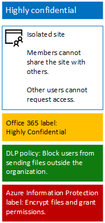

# Protect files with  Azure Information Protection

## Introduction

Use the steps in this article to configure Azure Information Protection (AIP) to provide encryption and permissions for files in a highly confidential SharePoint Online team site. 

The encryption and permissions protection travels with a file even when it is downloaded from the site. For more information about highly confidential SharePoint Online team sites, see [Secure SharePoint Online sites and files](secure-sharepoint-online-sites-and-files.md).

## Configure Azure Information Protection

First, follow the instructions in [Activate Azure RMS with the Office 365 admin center for your Office 365 subscription](https://docs.microsoft.com/information-protection/deploy-use/activate-office365).

Next, configure the **AIP Highly Confidential** label with protection and permissions for your highly confidential SharePoint Online team site by following these steps:

1. Sign in to the **Office 365 portal** with an account that has the Security Administrator or Company Administrator role. For help, see [Where to sign in to Office 365](https://support.office.com/Article/Where-to-sign-in-to-Office-365-e9eb7d51-5430-4929-91ab-6157c5a050b4).
2. In a separate tab of your browser, go to the Azure portal ([https://portal.azure.com](https://portal.azure.com/)).
3. In the list pane, click **More services**, type **information**, and click **Azure Information Protection**.
4. On the **Azure Information protection – Global policy** blade, under the list of labels, click **Highly Confidential**.
5. On the **Label: Highly Confidential** blade, in **Set permissions for documents and emails containing this label**, click **Protect**.
6. In the **Protection** section, click **Azure RMS**.
7. On the **Protection** blade, under **Protection settings**, click **+ Add permissions**.
8. On the **Add permissions** blade, under **Specify users and groups**, click **+ Browse directory**.
9. On the **AAD Users and Groups** pane, select the site members access group for your highly sensitive SharePoint Online team site, and click **Select**.
10. Under **Choose permissions from the preset**, clear the **Print, Copy and extract content**, and **Forward** check boxes.
11. Click **OK** two times.
12. On the **Label: Highly Confidential** blade, click **Save**.
13. On the **Azure Information Protection – Global policy** blade, click **Publish**.

Below is the resulting configuration for your highly confidential SharePoint Online team site.

 

You are now ready to begin creating documents and protecting them with Azure Information Protection and the Highly Confidential label.

You must [install the Azure Information Protection client](https://docs.microsoft.com/information-protection/rms-client/install-client-app) on your device or Windows-based computer. You can script and automate the installation, or users can install the client manually. 

For more information, see the following resources:

* [The client side of Azure Information Protection](https://docs.microsoft.com/information-protection/rms-client/use-client)
* [Installing the Azure Information Protection client](https://docs.microsoft.com/information-protection/rms-client/client-admin-guide)
* [Download page for manual installation](https://www.microsoft.com/download/details.aspx?id=53018)

Once installed, your users run and then sign-in from an Office application (such as Microsoft Word) with their Office 365 account. A new **Sensitivity** toolbar allows you to select the **Highly Confidential** label. 

Make sure that your users know the SharePoint Online team site to store their highly confidential files.

>[!Note]
>If you have multiple highly sensitive SharePoint Online team sites, you must create multiple Azure Information Protection labels with the above settings, with the permissions for each label set to the site members access group of a specific SharePoint Online team site.
>

## Next steps
[Microsoft Security Guidance for Political Campaigns, Nonprofit Organizations, and Other Agile Organizations](https://technet.microsoft.com/library/mt493213.aspx)

[Secure SharePoint Online sites and files](secure-sharepoint-online-sites-and-files.md)

[Create team sites in a political campaign dev/test environment](secure-sharepoint-online sites-dev-test.md)

[Cloud adoption and hybrid solutions](https://technet.microsoft.com/library/dn262744.aspx)

