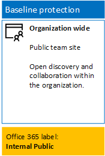
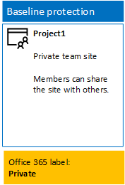
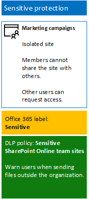
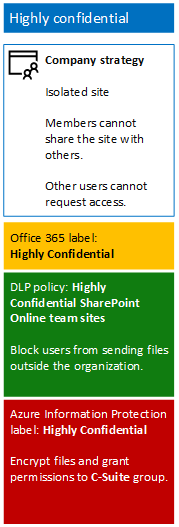
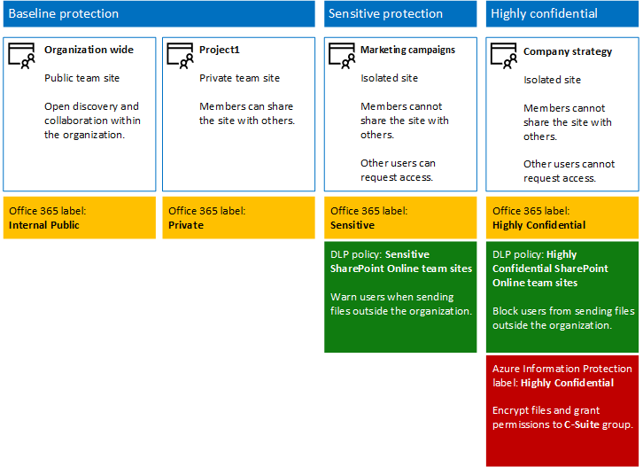

# Secure SharePoint Online sites in a dev/test environment

## Introduction

This article provides step-by-step instructions to create a dev/test environment that includes the four different types of SharePoint Online team sites for the [Secure SharePoint Online sites and files solution](https://technet.microsoft.com/en-us/library/mt842190.aspx). 

Use this dev/test environment to experiment with the information protection behaviors and fine tune settings for your specific needs before deploying SharePoint Online team sites in production.

## Phase 1: Create your dev/test environment
In this phase, you obtain trial subscriptions for Office 365 and Enterprise Mobility + Security for a fictional organization.

First, follow the instructions in **Phase 2** of the [Office 365 dev/test environment](https://technet.microsoft.com/en-us/library/mt736406.aspx).

Next, sign up for the **EMS trial subscription** and add it to the same organization as your Office 365 trial subscription, and then follow these steps:

1. If needed, sign in to the **Office 365 portal** with the credentials of the global administrator account of your trial subscription. For help, see [Where to sign in to Office 365](https://support.office.com/Article/Where-to-sign-in-to-Office-365-e9eb7d51-5430-4929-91ab-6157c5a050b4).
2. Click the **Admin** tile.
3. On the **Office Admin center** tab in your browser, in the left navigation, click **Billing > Purchase services**.
4. On the **Purchase services** page, find the **Enterprise Mobility + Security E5** item, and then hover your mouse pointer over it and click **Start free trial**.
5. On the **Confirm your order** page, click **Try now**.
6. On the **Order receipt** page, click **Continue**.

Next, enable the Enterprise Mobility + Security E5 license for your global administrator account.

1. On the **Office 365 Admin center** tab in your browser, in the left navigation, click **Users > Active users**.
2. Click your global administrator account, and then click **Edit for Product licenses**.
3. On the **Product licenses** pane, turn the product license for **Enterprise Mobility + Security E5** to **On**, click **Save**, and click **Close** two times.


## Phase 2: Create and configure your Azure Active Directory (AD) groups and users
In this phase, you create and configure the Azure AD groups and users for your fictional organization.

First, you must [connect with the Azure Active Directory V2 PowerShell module](https://go.microsoft.com/fwlink/?linkid=842218).

Next, run these commands from the PowerShell command prompt or Integrated Script Environment (ISE):
```
$groupNames=@("C-Suite","IT staff","Research staff","Regular staff","Marketing staff","Sales staff")
ForEach ($element in $groupNames){ New-AzureADGroup -DisplayName $element -MailEnabled $false -SecurityEnabled $true -MailNickName "NotSet" }
```

Next, configure automatic licensing so that members of your groups are automatically assigned licenses for your Office 365 and EMS subscriptions, and then follow these steps:

1. Create a separate tab in your browser, and then go to the **Azure portal** at [https://portal.azure.com](https://portal.azure.com). If needed, sign in with the credentials of the global administrator account for your Office 365 E5 trial subscription.
2. In the Azure portal, click **Azure Active Directory > Licenses > All products**.
3. In the list, select **Enterprise Mobility + Security E5** and **Office 365 Enterprise E5**, and click **Assign**.
4. In the **Assign license** blade, click **Users and groups**.
5. In the list of groups, select the following:
 * C-Suite
 * IT staff
 * Research staff
 * Regular staff
 * Marketing staff
 * Sales staff
6. Click **Select**, and click **Assign**.
7. Close the Azure portal tab in your browser.

Next, fill in your organization name, your location, and a common password. Run the below commands from the PowerShell command prompt or Integrated Script Environment (ISE) to create user accounts. Then, add them to their corresponding groups.

```
$orgName="[organization name, such as contoso for the contoso.onmicrosoft.com trial subscription domain name]"
$location="[the ISO ALPHA2 country code, such as US for the United States]"
$commonPassword="[common password for all the new accounts]"

$PasswordProfile=New-Object -TypeName Microsoft.Open.AzureAD.Model.PasswordProfile
$PasswordProfile.Password=$commonPassword

$groupName="C-Suite"
$userNames=@("CEO","CFO","CIO") 
$groupID=(Get-AzureADGroup | Where { $_.DisplayName -eq $groupName }).ObjectID
ForEach ($element in $userNames){ 
New-AzureADUser -DisplayName $element -PasswordProfile $PasswordProfile -UserPrincipalName ($element + "@" + $orgName + ".onmicrosoft.com") -AccountEnabled $true -MailNickName $element -UsageLocation $location 
Add-AzureADGroupMember -RefObjectId (Get-AzureADUser | Where { $_.DisplayName -eq $element }).ObjectID -ObjectId $groupID
}
$groupName="IT staff"
$userNames=@("ITAdmin1","ITAdmin2") 
$groupID=(Get-AzureADGroup | Where { $_.DisplayName -eq $groupName }).ObjectID
ForEach ($element in $userNames){ 
New-AzureADUser -DisplayName $element -PasswordProfile $PasswordProfile -UserPrincipalName ($element + "@" + $orgName + ".onmicrosoft.com") -AccountEnabled $true -MailNickName $element -UsageLocation $location 
Add-AzureADGroupMember -RefObjectId (Get-AzureADUser | Where { $_.DisplayName -eq $element }).ObjectID -ObjectId $groupID
}
$groupName="Research staff"
$userNames=@("Researcher1") 
$groupID=(Get-AzureADGroup | Where { $_.DisplayName -eq $groupName }).ObjectID
ForEach ($element in $userNames){ 
New-AzureADUser -DisplayName $element -PasswordProfile $PasswordProfile -UserPrincipalName ($element + "@" + $orgName + ".onmicrosoft.com") -AccountEnabled $true -MailNickName $element -UsageLocation $location 
Add-AzureADGroupMember -RefObjectId (Get-AzureADUser | Where { $_.DisplayName -eq $element }).ObjectID -ObjectId $groupID
}
$groupName="Regular staff"
$userNames=@("Regular1", "Regular2") 
$groupID=(Get-AzureADGroup | Where { $_.DisplayName -eq $groupName }).ObjectID
ForEach ($element in $userNames){ 
New-AzureADUser -DisplayName $element -PasswordProfile $PasswordProfile -UserPrincipalName ($element + "@" + $orgName + ".onmicrosoft.com") -AccountEnabled $true -MailNickName $element -UsageLocation $location 
Add-AzureADGroupMember -RefObjectId (Get-AzureADUser | Where { $_.DisplayName -eq $element }).ObjectID -ObjectId $groupID
}
$groupName="Marketing staff"
$userNames=@("Marketing1", "Marketing2") 
$groupID=(Get-AzureADGroup | Where { $_.DisplayName -eq $groupName }).ObjectID
ForEach ($element in $userNames){ 
New-AzureADUser -DisplayName $element -PasswordProfile $PasswordProfile -UserPrincipalName ($element + "@" + $orgName + ".onmicrosoft.com") -AccountEnabled $true -MailNickName $element -UsageLocation $location 
Add-AzureADGroupMember -RefObjectId (Get-AzureADUser | Where { $_.DisplayName -eq $element }).ObjectID -ObjectId $groupID
}
$groupName="Sales staff"
$userNames=@("SalesPerson1") 
$groupID=(Get-AzureADGroup | Where { $_.DisplayName -eq $groupName }).ObjectID
ForEach ($element in $userNames){ 
New-AzureADUser -DisplayName $element -PasswordProfile $PasswordProfile -UserPrincipalName ($element + "@" + $orgName + ".onmicrosoft.com") -AccountEnabled $true -MailNickName $element -UsageLocation $location 
Add-AzureADGroupMember -RefObjectId (Get-AzureADUser | Where { $_.DisplayName -eq $element }).ObjectID -ObjectId $groupID
}
```

>[!Note]
>The use of a common password here is for automation and ease of configuration for a dev/test environment. This is not recommended for production subscriptions.
>

Next, follow the steps below to verify that group-based licensing is working correctly.

1. From the **Microsoft Office Home** tab of your browser, click the **Admin** tile.
2. From the new **Office Admin center** tab of your browser, click **Users**.
3. In the list of users, click **CEO**.
4. In the pane that lists the properties of the **CEO** user account, verify that it has been assigned the **Enterprise Mobility + Security E5** and **Office 365 Enterprise E5** licenses (in **Product licenses**).

## Phase 3: Create Office 365 labels

In this phase, you create the labels for the different levels of security for SharePoint Online team site documents folders.

1. If needed, use a private instance of your Internet browser and sign in to the **Office 365 portal** with the global administrator account of your Office 365 E5 trial subscription. For help, see [Where to sign in to Office 365](https://support.office.com/Article/Where-to-sign-in-to-Office-365-e9eb7d51-5430-4929-91ab-6157c5a050b4).
2. From the **Microsoft Office Home** tab, click the **Admin** tile.
3. From the new **Office Admin center** tab of your browser, click **Admin centers > Security & Compliance**.
4. From the new **Home – Security & Compliance** tab of your browser, click **Classifications > Labels**.
5. From the **Home > Labels** pane, click **Create a label**.
 1. On the **Name your label** pane, type **Internal Public**, and click **Next**.
 2. On the **Label settings** pane, click **Next**.
 3. On the **Review your settings** pane, click **Create this label**, and  click **Close**.
6. Repeat the above steps for these additional labels:
 * Private
 * Sensitive
 * Highly Confidential
7. From the **Home > Labels** pane, click **Publish labels**.
8. On the **Choose labels to publish** pane, click **Choose labels to publish**.
9. On the **Choose labels** pane, click **Add** and select all four labels, and click **Done**.
10. On the **Choose labels to publish** pane, click **Next**.
11. On the **Choose locations** pane, click **Next**.
12. On the **Name your policy** pane, type **Example organization** in **Name**, and click **Next**.
13. On the **Review your settings** pane, click **Publish labels**, and click **Close**.

## Phase 4: Create your SharePoint Online team sites
In this phase, you create and configure the four types of SharePoint Online team sites for your example organization.

### Organization wide team site
To create a baseline public SharePoint Online team site, do the following:

1. If needed, use a browser on your local computer and sign in to the Office 365 portal using your global administrator account. For help, see [Where to sign in to Office 365](https://support.office.com/Article/Where-to-sign-in-to-Office-365-e9eb7d51-5430-4929-91ab-6157c5a050b4).
2. In the list of tiles, click **SharePoint**.
3. On the new **SharePoint** tab in your browser, click **+ Create site**.
4. On the **Create a site** page, click **Team site**.
5. In **Site name**, type **Organization wide**.
6. In **Team site description**, type **SharePoint site for the entire organization**.
7. In **Privacy settings**, select **Public – anyone in the organization can access this site**, and then click **Next**.
8. On the **Who do you want to add?** pane, click **Finish**.

Next, configure the documents folder of the Organization wide team site for the Internal Public label.

1. In the **Organization wide–Home** tab of your browser, click **Documents**.
2. Click the settings icon, and then click **Library settings**.
3. Under **Permissions and Management**, click **Apply label to items in this library**.
4. In **Settings-Apply Label**, select **Internal Public**, and click **Save**.

Below is your resulting configuration.

 

### Project 1 team site
To create a baseline private SharePoint Online team site for a project within the organization, do the following:

1. If needed, use a browser on your local computer and sign in to the **Office 365 portal** using your global administrator account. For help, see [Where to sign in to Office 365](https://support.office.com/Article/Where-to-sign-in-to-Office-365-e9eb7d51-5430-4929-91ab-6157c5a050b4).
2. In the list of tiles, click **SharePoint**.
3. On the new **SharePoint** tab in your browser, click **+ Create site**.
4. On the **Create a site** page, click **Team site**.
5. In **Site name**, type **Project 1**.
6. In **Team site description**, type **SharePoint site for Project 1**.
7. In **Privacy settings**, select **Private – only members can access this site**, and click **Next**.
8. On the **Who do you want to add?** pane, click **Finish**.

Next, configure the documents folder of the Project 1 team site for the Private label.

1. In the **Project 1-Home** tab of your browser, click **Documents**.
2. Click the settings icon, and then click **Library Settings**.
3. Under **Permissions and Management**, click **Apply label to items in this library**.
4. In **Settings-Apply Label**, select **Private**, and click **Save**.

Below is your resulting configuration.

 

### Marketing campaigns team site

To create a sensitive-level isolated SharePoint Online team site for marketing campaign resources, do the following:

1. Using a browser on your local computer, sign in to the **Office 365 portal** using your global administrator account. For help, see [Where to sign in to Office 365](https://support.office.com/Article/Where-to-sign-in-to-Office-365-e9eb7d51-5430-4929-91ab-6157c5a050b4).
2. In the list of tiles, click **SharePoint**.
 1. On the new **SharePoint** tab in your browser, click **+ Create site**.
 2. On the **Create a site** page, click **Team site**.
3. In **Team site name**, type **Marketing campaigns**.
4. In **Team site description**, type **SharePoint site for marketing campaign resources (sensitive)**.
5. In **Privacy settings**, select **Private – only members can access this site**, and click **Next**.
6. On the **Who do you want to add?** pane, click **Finish**.
7. On the new **Marketing campaigns** tab in your browser, in the toolbar, click the settings icon, and click **Site permissions**.
8. In the **Site permissions** pane, click **Advanced permissions settings**.
9. In the new **Permissions** tab in your browser, click **Access Request Settings**.
10. In the **Access Request Settings** dialog box:
  1. Clear the **Allow members to share the site and individual files and folders** and **Allow members to invite others to the site members group** check boxes.
  2. Type **ITAdmin1@[your organization name].onmicrosoft.com** in **Send all requests for access**.
  3. Click **OK**.
11. Click **Marketing campaigns Members** in the list.
12. On the **People and Groups** page, click **New**.
13. In the **Share** dialog box, type **Marketing staff**, select it, and click **Share**.
14. Repeat steps above for the **Researcher1** user account.
15. Click the back button on your browser, and click **Marketing campaigns Owners** in the list.
16. On the **People and Groups** page, click **New**.
17. In the **Share** dialog box, type **IT staff**, select it, and click **Share**.
18. Click the back button on your browser, and close the **People and Groups** tab in your browser, click the **Marketing campaigns-Home** tab in your browser, and close the **Site permissions** pane.

Below are the results of configuring permissions:

* The **Marketing campaigns-Members** SharePoint group contains only the **Marketing campaigns** group (which contains the global administrator user account), the **Marketing staff** group (which contains the Marketing1 and Marketing2 user accounts), and the **Researcher1** user account.
* The **Marketing campaigns-Owners** SharePoint group contains only the **IT staff** group (which contains only the ITAdmin1 and ITAdmin2 user accounts).
* The **Marketing campaigns-Visitors** SharePoint group contains no groups or user accounts.
* Members cannot modify site-level permissions (this can only be done by members of the **Marketing campaigns-Owners** group).
* Other user accounts cannot access the site or its resources, but can request access to the site, which sends an email to the _ITAdmin1_ user account mailbox.

Next, configure the documents folder of the Marketing campaigns team site for the Sensitive label.

1. In the **Marketing campaigns-Home** tab of your browser, click **Documents**.
2. Click the settings icon, and then click **Library Settings**.
3. Under **Permissions and Management**, click **Apply label to items in this library**.
4. In **Settings-Apply Label**, select **Sensitive**, and click **Save**.

Next, configure a data loss prevention (DLP) policy that notifies users when they share a document on a SharePoint Online team site with the Sensitive label, which includes the Marketing campaigns site, outside the organization.

1. From the **Microsoft Office Home** tab in your browser, click the **Security & Compliance** tile.
2. On the new **Security & Compliance** tab in your browser, click **Data loss prevention > Policy**.
3. In the **Data loss prevention** pane, click **+ Create a policy**.
4. In the **Start with a template or create a custom policy** pane, click **Custom**, and click **Next**.
5. In the **Name your policy** pane, type **Sensitive label SharePoint Online team sites** in **Name**, and click **Next**.
6. In the **Choose locations** pane, click **Let me choose specific locations**, and click **Next**.
7. In the list of locations, disable the **Exchange email** and **OneDrive accounts** locations, and click **Next**.
8. In the **Customize the types of sensitive info you want to protect** pane, click **Edit**.
9. In the **Choose the types of content to protect** pane, click **Add** in the drop-down box, and click **Labels**.
10. In the **Labels** pane, click **+ Add**, select the **Sensitive** label, click **Add**, and click **Done**.
11. In the **Choose the types of content to protect** pane, click **Save**.
12. In the **Customize the types of sensitive info you want to protect** pane, click **Next**.
13. In the **What do you want to do if we detect sensitive info?** pane, click **Customize the tip and email**.
14. In the **Customize policy tips and email notifications** pane, click **Customize the policy tip text**.
15. In the text box, type or paste in the following, and click **OK**:
 * To share with a user outside the organization, download the file and then open it. Click **File**, then **Protect Document**, and **Encrypt with Password**, and specify a strong password. Send the password in a separate email or other means of communication.
16. In the **What do you want to do if we detect sensitive info?** pane, clear the **Block people from sharing, and restrict access to shared content** check box, and click **Next**.
17. In the **Do you want to turn on the policy or test things out first?** pane, click **Yes**, turn it on right away, and click **Next**.
18. In the **Review your settings** pane, click **Create**, and click **Close**.

Below is your resulting configuration.

 

### Company strategy team site
To create an isolated SharePoint Online team site at the highly confidential level for strategic company resources of the chief executives of the organization, do the following:

1. If needed, use a browser on your local computer and sign in to the **Office 365 portal** using your global administrator account. For help, see [Where to sign in to Office 365](https://support.office.com/Article/Where-to-sign-in-to-Office-365-e9eb7d51-5430-4929-91ab-6157c5a050b4).
2. In the list of tiles, click **SharePoint**.
3. On the new **SharePoint tab** in your browser, click **+ Create site**.
  1. On the **Create a site** page, click **Team site**.
  2. In **Team site name**, type **Company strategy**.
  3. In **Team site description**, type **SharePoint site for company strategy (highly confidential)**.
4. In **Privacy settings**, select **Private – only members can access this site**, and click **Next**.
5. On the **Who do you want to add?** pane, click **Finish**.
6. On the new **Company strategy** tab in your browser, in the toolbar, click the settings icon, and click **Site permissions**.
7. In the **Site permissions** pane, click **Advanced permissions settings**.
8. In the new **Permissions** tab in your browser, click **Access Request Settings**.
9. In the **Access Request Settings** dialog box, clear **Allow members to share the site and individual files and folders** and **Allow members to invite others to the site members group** (so that all three check boxes are cleared), and click **OK**.
10. Click **Company strategy Members** in the list, and on the **People and Groups** page, click **New**.
11. In the **Share** dialog box, type **C-Suite**, select it, and click **Share**.
12. Click **Company strategy Owners** in the list, and on the **People and Groups** page, click **New**.
13. In the **Share** dialog box, type **IT staff**, select it, and click **Share**.
14. Click the back button on your browser, and close the **People and Groups** tab.
15. Click the **Company strategy-Home** tab in your browser, and then close the **Site permissions** pane.

Below are the results of configuring permissions:

* The **Company strategy-Members** SharePoint group contains only the **C-Suite** group (which contains only the CEO, CFO, and CIO user accounts) and the **Company strategy** group (which contains only the global administrator user account).
* The **Company strategy-Owners** SharePoint group contains only the **IT staff** group (which contains only the _ITAdmin1_ and _ITAdmin2_ user accounts).
* The **Company strategy-Visitors** SharePoint group contains no groups or user accounts.
* Members cannot modify site-level permissions (this can only be done by members of the **Company strategy-Owners** group).
* Other user accounts cannot access the site or its resources or request access to the site. Additional permissions to the site must be done by the global administrator or by a member of the **Company strategy-Owners** group.

Next, configure the documents folder of the Company strategy team site for the Highly Confidential label.

1. In the **Company strategy-Home** tab of your browser, click **Documents**.
2. Click the settings icon, and then click **Library Settings**.
3. Under **Permissions and Management**, click **Apply label to items in this library**.
4. In **Settings-Apply Label**, select **Highly Confidential**, and click **Save**.

Next, configure a DLP policy that blocks users when they share a document on a SharePoint Online team site with the Highly Confidential label, which includes the Company strategy site, outside the organization.

1. If needed, use a browser on your local computer and sign in to the **Office 365 portal** with an account that has the Security Administrator or Company Administrator role. For help, see [Where to sign in to Office 365](https://support.office.com/Article/Where-to-sign-in-to-Office-365-e9eb7d51-5430-4929-91ab-6157c5a050b4).
2. From the **Microsoft Office Home** tab in your browser, click the **Security & Compliance** tile.
3. On the new **Security & Compliance** tab in your browser, click **Data loss prevention > Policy**.
4. In the **Data loss prevention** pane, click **+ Create a policy**.
5. In the **Start with a template or create a custom policy** pane, click **Custom**, and click **Next**.
6. In the **Name your policy** pane, type **Highly Confidential label SharePoint Online team sites** in **Name**, and click **Next**.
7. In the **Choose locations** pane, click **Let me choose specific locations**, and click **Next**.
8. In the list of locations, disable the **Exchange email** and **OneDrive accounts locations**, and click **Next**.
9. In the **Customize the types of sensitive info you want to protect** pane, click **Edit**.
10. In the **Choose the types of content to protect** pane, click **Add** in the drop-down box, and click **Labels**.
11. In the **Labels** pane, click **+ Add**, select the **Highly Confidential label**, click **Add**, and click **Done**.
12. In the **Choose the types of content to protect** pane, click **Save**.
13. In the **Customize the types of sensitive info you want to protect** pane, click **Next**.
14. In the **What do you want to do if we detect sensitive info?** pane, click **Customize the tip and email**.
15. In the **Customize policy tips and email notifications** pane, click **Customize the policy tip text**.
16. In the text box, type or paste in the following, and click **OK**:
 * To share with a user outside the organization, download the file and then open it. Click **File**, then **Protect Document**, then **Encrypt with Password**, and specify a strong password. Send the password in a separate email or other means of communication.
17. In the **What do you want to do if we detect sensitive info?** pane, select **Require a business justification to override**, and click **Next**.
18. In the **Do you want to turn on the policy or test things out first?** pane, click **Yes**, turn it on right away, and click **Next**.
19. In the **Review your settings pane**, click **Create**, and click **Close**.

Next, follow the instructions in [Activate Azure RMS with the Office 365 admin center](https://docs.microsoft.com/information-protection/deploy-use/activate-office365).

Next, configure the Azure Information Protection Highly Confidential label with protection and permissions, and do the following steps:

1. In a separate tab of your browser in which you have signed in with your global administrator account, go to the **Azure portal** ([http://portal.azure.com](http://portal.azure.com/)).
2. In the list pane, click **More services**, type **Information**, and click **Azure Information Protection**.
3. On the **Azure Information protection – Global policy** blade, under the list of labels, click **Highly Confidential**.
4. On the **Label: Highly Confidential** blade, in **Set permissions for documents and emails containing this label**, click **Protect**.
5. In the **Protection** section, click **Azure RMS**.
6. On the **Protection** blade, under **Protection settings**, click **+ Add permissions**.
7. On the **Add permissions** blade, under **Select users and groups**, click **+ Select users and groups**.
8. On the **AAD Users and Groups** pane, select **C-Suite**, and click **Select**.
9. Under **Choose permissions from the preset**, clear the **Print, Copy and extract content**, and **Forward** check boxes.
10. Click **OK** two times.
11. On the **Label: Highly Confidential** blade, click **Save**.
12. On the **Azure Information protection – Global policy** blade, click **Publish**.

To protect a document with Azure Information Protection and the Highly Confidential label, you must [install the Azure Information Protection client](https://docs.microsoft.com/information-protection/rms-client/install-client-app) on a test machine, install Office from the Office 365 portal, and then sign in from Microsoft Word with an account in the C-Suite group of your trial subscription.

Below is your resulting configuration.

 

### Create documents and test access

You are now ready to create documents in these four sites and test access to them with various user accounts in your trial subscription.

Below is the overall configuration for all four SharePoint Online team sites.

 

When you are ready for production deployment of secure SharePoint Online sites, see [Secure SharePoint Online sites and files](https://technet.microsoft.com/en-us/library/mt842190.aspx) for detailed information and links to step-by-step deployment articles.


## Next steps
[Secure SharePoint Online sites and files](https://technet.microsoft.com/en-us/library/mt842190.aspx)
[Security solutions](https://technet.microsoft.com/en-us/library/mt784690.aspx)
[Cloud adoption and hybrid solutions](https://technet.microsoft.com/en-us/library/dn262744.aspx)
[Microsoft Security Guidance for Political Campaigns, Nonprofit Organizations, and Other Agile Organizations](https://technet.microsoft.com/en-us/library/mt493213.aspx)

