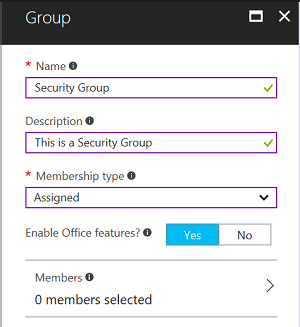

# Policy recommendations for securing SharePoint Sites and files
The following recommendations are provided *in addition to* the [common identity and access policy recommendations](identity-access-policies.md) and [policy recommendations for securing email](secure-email-recommended-policies.md). To safeguard SharePoint Online files, new policies must be created, and existing policies amended, as described here.

The following recommendations are based on three different layers of security and protection for your email that can be applied based on the granularity of your needs:

- **Baseline**: Microsoft recommends you establish a minimum standard for protecting data, as well as the identities and devices that access your data. Microsoft provides strong default protection that meets the needs of many organizations. Some organizations require additional capabilities to meet their baseline requirements.
- **Sensitive**: Some customers have a subset of data that must be protected at higher levels. You can apply increased protection to specific data sets in your Office 365 environment. Microsoft recommends protecting identities and devices that access sensitive data with comparable levels of security. 
- **Highly regulated**: Some organizations may have a very small amount of data that is highly classified, trade secret, or regulated data. Microsoft provides capabilities to help organizations meet these requirements, including added protection for identities and devices.

See the [recommended security policies and configurations introduction](microsoft-365-policies-configurations.md) topic for more details.

> [!IMPORTANT]
> All security groups created as part of these recommendations must be created with Office features enabled. This is specifically important for the deployment of Azure Information Protection (AIP) when securing documents in SharePoint Online.
>
>
>

## Baseline

### Medium and above risk requires MFA
Make the following changes to the existing CA policy created when applying [policy recomendations to secure email](secure-email-recommended-policies.md):

| Category|Type|Properties|Values|Notes|
|:-----|:-----|:-----|:-----|:-----|
|Assignments|Cloud apps|Include|Select apps:    Office 365 Exchange Online    Office 365 SharePoint Online|Select both|

### Require a compliant or domain joined device

To create a conditional access policy for Exchange Online:

1. Go to the [Azure portal](https://portal.azure.com), and sign in with your credentials. After you've successfully signed in, you see the Azure Dashboard.

2. Choose **Azure Active Directory** from the left menu.

3. Under the **Security** section, choose **Conditional access**.

4. Choose **New policy**.

5. Enter a policy name, then choose the **Users and groups** you want to apply the policy for.

6. Choose **Cloud apps**.

7. Choose **Select apps**, select **Office 365 SharePoint Online** from the **Cloud apps** list, click on **Select**. Once the **Office 365 SharePoint Online** app is selected, click **Done**.

8. Choose **Grant** from the **Access controls** section.

9. Choose **Grant access**, select both **Require device to be marked as compliant** and **Require domain joined (Hybrid Azure AD)**, then choose **Select**.

10. Click **Create** to create the Exchange Online conditional access policy.

	> [!NOTE]
	> Beginning with Intune on Azure, you have to create all conditional access policies in the Azure Active Directory workload. Intune provides a link to Azure AD conditional access policies workload from its portal  for convenience.

	> [!IMPORTANT]
	> If you need assistance on migrating conditional access policies previously created in the Intune classic portal to the Intune on Azure portal, see the [reassign conditional access policies from Intune classic portal to the Azure portal](https://docs.microsoft.com/intune/conditional-access-intune-reassign) topic. 

### App-based conditional access for SharePoint Online

You can add one more security layer by setting up an app-based conditional access policy for SharePoint Online in the Intune on Azure portal. When you apply an app-based conditional access for SharePoint Online you require users to use only this app to access corporate resources.

To add an app-based conditional access policy:

1. Go to the [Azure portal](https://portal.azure.com), and sign in with your Intune credentials. After you've successfully signed in, you see the Azure Dashboard.

2. Choose **More services** from the left menu, then type: "**Intune**".

3. Choose **Intune App Protection**.

4. On the **Intune mobile application management** blade choose **All Settings**.

5. Choose **Exchange Online** under the **Conditional access** section.

6. Select **Allow apps that support Intune app policies**, then choose the app (E.g. Microsoft Outlook).

7. Choose **Restricted user groups**, click **Select groups**, select the user or group you want to apply the policy for, then click **Select**.

## Sensitive

### Low and above risk requires MFA

Make the following changes to the existing CA policy created when applying [policy recomendations to secure email](secure-email-recommended-policies.md):

| Category|Type|Properties|Values|Notes|
|:-----|:-----|:-----|:-----|:-----|
|Assignments|Cloud apps|Include|Select apps:    Office 365 Exchange Online    Office 365 SharePoint Online|Select both|

### Require a compliant or domain joined device

(See baseline instructions)

### App-based conditional access for SharePoint Online

(See baseline instructions)

## Highly regulated

### MFA required

Make the following changes to the existing CA policy created when applying [policy recomendations to secure email](secure-email-recommended-policies.md):

| Category|Type|Properties|Values|Notes|
|:-----|:-----|:-----|:-----|:-----|
|Assignments|Cloud apps|Include|Select apps:    Office 365 Exchange Online    Office 365 SharePoint Online|Select both|

### Require a compliant or domain joined device
(See baseline instructions)

### App-based conditional access for SharePoint online
(See baseline instructions)

## Additional configurations
In addition to the above policies, you must also lock down legacy protocols that do not support modern authentication.

### Lock down legacy protocols
Conditional access policies protect access through browser flows and apps using modern authentication; like Office 2016 and the apps on the supported platform list. For older Office desktop applications, like Office 2010, conditional access policy is not applied.

Older apps that don’t use modern authentication can be blocked [using the OneDrive admin portal](https://support.office.com/article/Control-access-based-on-network-location-or-app-59b83701-cefd-4bf8-b4d1-d4659b60da08). The SharePoint admin PowerShell cmdlet can also be used to disable SharePoint legacy protocols. To use PowerShell, just run the [Set-SPOTenant cmdlet](https://technet.microsoft.com/library/fp161390.aspx) and set **-LegacyAuthProtocolsEnabled** to **$false**.  Once set, legacy protocol support is disabled and all access to SharePoint using older client applications will be blocked.

## Next steps
[Learn more about Microsoft 365 services](index.md)
