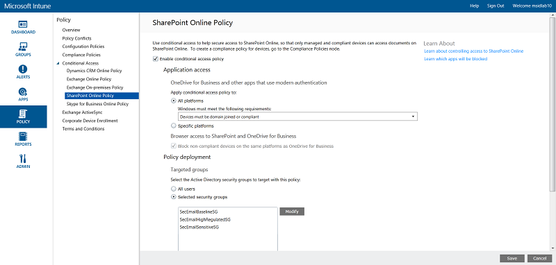

# SharePoint Site and file access policy recommendations

In addition to the polices deployed in the section for secure email; the following new policies must be created, and existing policies amended, as described here.

## Baseline 

### Medium and above risk requires MFA

Make the following changes to the existing CA policy:

| Category|Type|Properties|Values|Notes|
|:-----|:-----|:-----|:-----|:-----|
|Assignments|Cloud apps|Include|Select apps:    Office 365 Exchange Online    Office 365 SharePoint Online|Select both|

### Require a compliant or domain joined device

To create a new Intune Conditional Access Policy for SharePoint Online, log in to the [Microsoft Management portal](http://manage.microsoft.com) with your administrator credentials and then navigate to **Policy** > **Conditional Access** > **SharePoint Online Policy**.

You must set a Conditional Access policy specifically for SharePoint Online in the Intune Management portal to require a compliant or domain joined device.
| Category|Type|Properties|Values|Notes|
|:-----|:-----|:-----|:-----|:-----|
|**Application access**|OneDrive for Business and other apps that user modern authentication|All platforms|True|Selected|
|     |     |Windows must meet the following requirement|Device must be domain joined or compliant|Selected (List)|
|     |     |Specific platforms|False||
|     |Browser access to SharePoint and OneDrive for Business |Block non-compliant devices on same platform as OneDrive for Business|True|Check|
|**Policy deployment**|Targeted groups|Select the Active Directory groups to target with this policy|     |     |
|     |     |All users|False|     |
|     |     |Selected security groups|True|Selected|
|     |     |Modify|Select specific security group containing targeted users.|     |
|     |Exempt groups|Select the Active Directory groups to exempt from this policy (overrides members of the Targeted Groups list).|     |     |    
|     |     |No exempt users|True|Selected|
|     |     |Selected security groups|False|     |

### Mobile application management conditional access for SharePoint online

You must set a Conditional Access policy specifically for SharePoint Online in the Intune Management portal to manage mobile apps.

To manage mobile apps, log in to the Microsoft Azure portal with your administrator credentials, and then navigate to **Intune App Protection** > **Settings** > **Conditional Access** > **SharePoint Online**.

| Category|Type|Properties|Values|Notes|
|:-----|:-----|:-----|:-----|:-----|
|**App access**|Allowed apps|Enable app access|Allow apps that support Intune app policies|Selected (list) – This results in a list of apps/platform combinations supported by Intune app policies.|
|**User access**|     |Restricted user groups|Add user groups – Select specific security group containing targeted users.|Start with security group including pilot users.|
|     |     |Exempt user groups|Exception security groups|     |

### Apply to

Once your pilot project has been completed, these policies should be applied to all users in your organization.

## Sensitive 

### Low and above risk requires MFA

Make the following changes to the existing CA policy:

| Category|Type|Properties|Values|Notes|
|:-----|:-----|:-----|:-----|:-----|
|Assignments|Cloud apps|Include|Select apps:    Office 365 Exchange Online    Office 365 SharePoint Online|Select both|

### Require a compliant or domain joined device

(See baseline instructions)

### Mobile application management conditional access for Exchange online

(See baseline instructions)

## Highly regulated 

### MFA required

Make the following changes to the existing CA policy:
| Category|Type|Properties|Values|Notes|
|:-----|:-----|:-----|:-----|:-----|
|Assignments|Cloud apps|Include|Select apps:    Office 365 Exchange Online    Office 365 SharePoint Online|Select both|

### Require a compliant or domain joined device
(See baseline instructions)

### Mobile application management conditional access for Exchange online
(See baseline instructions)
                                                     

## Next steps
[Learn more about Microsoft 365 services](index.md)
